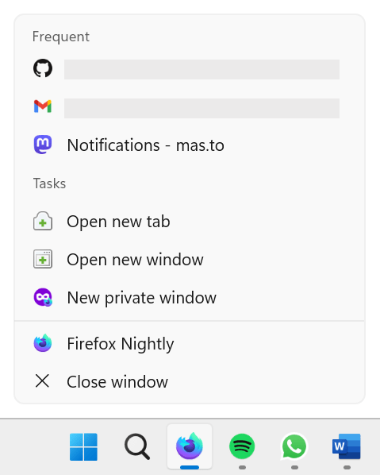
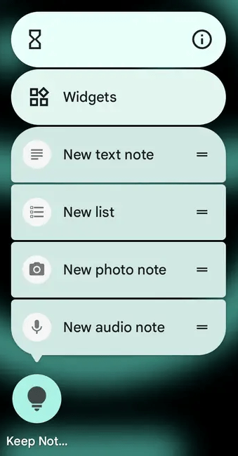

{{PWASidebar}}

Many operating systems support showing shortcut menus, or jump-list, when the user right-clicks or long-presses an app icon. For example, on Windows, right-clicking on any pinned program in the taskbar shows a list of program-specific actions and recently opened files:



On Android, long-pressing an app icon also shows a list of common app actions:



[Progressive Web Apps (PWAs)](/en-US/docs/Web/Progressive_web_apps) can be installed on devices just like platform-native apps and, like their native counterparts, they can also define app shortcut menus to let users access common actions.

Shortcuts are only displayed by right-clicking or long-pressing the app icon, meaning they're only available once the PWA is installed on the user's device. To learn how to make your PWA installable, see [making PWAs installable](/en-US/docs/Web/Progressive_web_apps/Guides/Making_PWAs_installable).

## Why use shortcuts?

Defining shortcuts for your PWA can make users more productive by letting them access your app's main actions directly from their home screen. Additionally, defining shortcuts can help make your PWA feel more platform-native and therefore more familiar to your users.

## Define shortcuts in the web app manifest

To define shortcuts for your PWA, use the [`shortcuts`](/en-US/docs/Web/Manifest/shortcuts) member of the [web app manifest](/en-US/docs/Web/Manifest). This member is an array of objects defining each shortcut's name and URL, as well as the optional short name, description, and icons. For example, here's the web app manifest of a calendar app that defines two shortcuts:

```json
{
  "name": "Calendar",
  "start_url": "/",
  "display": "standalone",
  "icons": [
    {
      "src": "images/icon-256.png",
      "sizes": "256x256",
      "type": "image/png"
    }
  ],
  "shortcuts": [
    {
      "name": "New event",
      "url": "/new-event"
    },
    {
      "name": "View today's events",
      "url": "/today"
    }
  ]
}
```

The most important properties of each shortcut object are:

- `name`
  - : The name of the shortcut, which is displayed in the shortcut menu. Make sure to keep it short but also descriptive enough to let users know what the shortcut does.
- `url`
  - : The URL to launch the PWA with when the user selects the shortcut. This URL can be absolute, in which case it should exist within the [scope](/en-US/docs/Web/Manifest/scope) of the web app manifest. The URL can also be relative, in which case it's resolved relative to the PWA's [start URL](/en-US/docs/Web/Manifest/start_url).

All other shortcut object properties are optional, but you should consider providing them to make the shortcut more useful to users:

- `short_name`
  - : A short name for the shortcut, which is displayed when there's not enough space to display the full name.
- `description`
  - : A description of the shortcut. This string can be accessed by assistive technologies, such as screen readers, to help users understand what the shortcut does.
- `icons`
  - : An array of image objects to display in the shortcut menu. Each image object is processed just like the [`icons`](/en-US/docs/Web/Manifest/icons) member of the web app manifest, and can be used to provide different-sized icons for different device requirements.

## See also

- [`shortcuts` manifest member](/en-US/docs/Web/Manifest/shortcuts)
- [Get things done quickly with app shortcuts](https://web.dev/app-shortcuts/) on web.dev (2022)
- [Define app shortcuts](https://learn.microsoft.com/microsoft-edge/progressive-web-apps-chromium/how-to/shortcuts) on learn.microsoft.com (2023)
