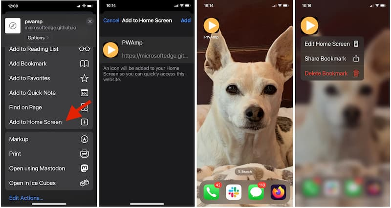
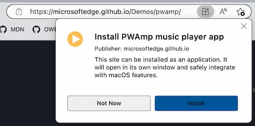
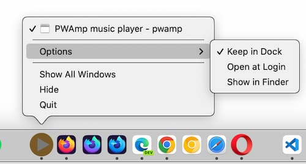
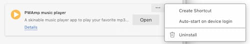

{{QuickLinksWithSubpages("/en-US/docs/Web/Progressive_web_apps/")}}

Browsers have always enabled saving shortcuts to websites, known as "bookmarking." These are just links to websites.

Some operating systems (OS) have enhanced bookmarking capabilities, enabling saving bookmarks to the home screen with an icon launching the site in the OS's default browser. For many websites, this is also just a link to the site. If the site is a [Progressive Web Applications (PWA)](/en-us/docs/web/progressive_web_apps), saving to home screen installs the PWA on the user's device, fully integrating it into the operating systems like native applications on most devices. Just like PWAs can be installed, they can also be uninstalled.

This guide covers how to install and uninstall PWAs. A separate [guide on making PWAs installable](/en-US/docs/Web/Progressive_web_apps/guides/making_pwas_installable) covers how to make web apps installable.

We'll first cover the precursors — saving links to websites.

### Bookmarking websites

All browsers have add-to-favorites bookmark functionality. A bookmark, or favorite, is a clickable shortcut for a web page. Bookmarks enable quick access to websites without the user having to enter a URL or otherwise search for content. Bookmarking is especially useful for long URLs and accessing frequently visited content that is not the site's homepage.

All browsers enable users to view and manage their bookmarks, including renaming and deleting favorites. By default, the bookmark's display includes the text content of the bookmarked page's {{HTMLElement("title")}} element along with an icon consisting of the site's [favicon](/en-US/docs/Glossary/Favicon).

Browsers enable saving, editing, moving, deleting, and otherwise managing bookmarks. The UI for bookmark management menus differ by browser.

### Add to home screen

Smartphones, starting with the iPhone in 2007, added "save to home screen" functionality. For regular (non-PWA) websites feature is similar to bookmarks, but instead of adding the favicon and title of the page to the bookmarks menu — a browser feature — favoriting in this manner [adds an icon](/en-US/docs/Learn/HTML/Introduction_to_HTML/The_head_metadata_in_HTML#adding_custom_icons_to_your_site) to the OS's home screen. Adding a non-PWA site to the home screen does not install the website on the device. Rather, it adds the developer-defined icon to the home screen, that, when clicked, opens the bookmarked link in the default browser.

Deleting the icon from the home screen removes the bookmark.

If the site being added to the home screen is a PWA, the PWA will be installed on the device.

## Installing and uninstalling PWAs

While installing a PWA only takes a couple of clicks, depending on the web application features, the result of installing a PWA usually goes well beyond creating a link to a page on the Internet; installing a PWA actually installs the web application on the user's device.

Depending on the PWA, device, and features of the operating system and browser, installing a PWA may mean installing an essentially fully featured application with operating system integration. This also means uninstalling a PWA, which also only requires a couple of clicks, does more than just removing the PWA's icon.

### Installing PWAs

The UI for installing a PWA from the web varies from one browser to another, and from one platform to another.

As mentioned above, "Add to homes creen" installs PWAs on device/OS combinations that provide that user interface.

For example, a browser might include an "Install" icon in the URL bar when the user navigates to the page:

When the user selects the icon, the browser displays a prompt asking if they want to install the PWA, and if they accept, the PWA is installed.

Once installed, the PWA will behave like other applications that are installed on the OS. For example, on MacOS, the icon will appear in the doc, with the same "Keep in dock" options as other applications:

Installation is supported on all modern desktop and mobile devices. Whether the PWA can be installed by the browser on the operating system differs by browser / operating system combination. Most browsers support installing PWAs on all operating systems—Chrome OS, MacOS, Windows, Android, Linux, etc.—directly or when an extension is installed.

Firefox requires a [PWA extension](https://addons.mozilla.org/en-US/firefox/addon/pwas-for-firefox/).

Apple is unique when it comes to PWAs: PWAs can be installed on macOS from any browser **except** Safari. The opposite is true for iOS, where PWAs can **only** be installed in Safari.

When an installed PWA is launched, it may then manifest as in a chromeless view (without the full browser chrome) but it nevertheless is executing effectively as a tab within the browser. The application will be found where the OS saves other applications, within a folder specific to the browser.

The browser used to install the PWA will know the PWA is installed, but other browsers will not have access to the installed status. For example, if you install a PWA using MS Edge, Edge will prompt you to open the PWA when you visit the site while Chrome will continue to prompt you to install the application. If you install the PWA using Chrome as well, you will have two copies of the PWA: one instance in "Chrome Apps" and a separate instance in "Edge Apps". Even if both are open, data is not shared between instances installed from different browsers.

### Uninstalling

When you tap the web app's icon on the home screen, it opens up in the browser environment that installed the PWA, generally without the browser's UI around it, though that depends on the way the developer configured the web app manifest. Similarly, the method used to uninstall the PWA depends on the browser that was used to install it.

On many mobile operating systems, PWAs appear in the "Add or remove programs" control panel. Uninstalling a PWA is accomplished in the same way as uninstalling other applications.

In most desktop operating systems, To uninstall a PWA, open the PWA. In the top right corner of the opened app, there will be an icon that must be expanded to see more tools. Depending on the browser used to install the PWA, there will either be a link to uninstall the PWA, or a settings link that opens a browser settings page with an uninstall link. Either click on the `Uninstall <app name>` in the drop-down menu, if there, or navigate to the app settings in a browser tab and click uninstall.

Selecting app setting from the opened drop-down menu in Edge, opened the MS Edge browser `edge://apps` tab. There we are provided a list of installed applications with options for each, including `🗑️ Uninstall`.

Confirm the uninstall. That's it!

## See also

- [Install, manage, or uninstall apps in Microsoft Edge](https://support.microsoft.com/en-us/topic/install-manage-or-uninstall-apps-in-microsoft-edge-0c156575-a94a-45e4-a54f-3a84846f6113)
