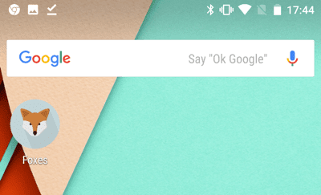

{{QuickLinksWithSubpages("/en-US/docs/Web/Progressive_web_apps/")}}

Browsers have always enabled saving shortcuts to websites within the browser itself. Smartphones enhanced this capablity by enabling saving these bookmarks to the homescreen with an icon launching the site in the operating systems default browser. With [Progressive Web Applications (PWAs)](/en-us/docs/web/progressive_web_apps), web apps can be installed on (and uninstalled from) a user's device, fully integrating into the operating systems in a manner similar to any other native application. 

In this guide, we discuss how to save links to sites, and how to install and uninstall PWAs.

### Bookmarking websites

All browsers have bookmarking functionality. A bookmark, or favorite, is a clickable short cut for a web page, enabling quick access to a web site without the user having to enter a URL or otherwise search for the content. Bookmarking is especially useful for long URLs and accessing frequently visited content that is not the site's homepage.

All browsers enable users to view and manage their bookmarks, including renaming and deleting favorites. By default, the bookmark display includes the text content of a page's {{HTMLElement("title")}} element along with an icon consisting of the site's [favicon](/en-US/docs/Glossary/Favicon). 

### Add to homescreen

Smartphones, starting with the iPhone in 2007, added "Save to homescreen" functionality. This feature is the same as a bookmark, but instead of adding the favicon and title of the page to the browser bookmarks menu, this functionality [adds an icon](/en-US/docs/Learn/HTML/Introduction_to_HTML/The_head_metadata_in_HTML#adding_custom_icons_to_your_site) to the homescreen. 

Adding to homescreen does not install the website on the device. Rather, it just adds the developer defined icon to the homescreen, that, when clicked, opens the bookmarked link in the default browser. 

## Installing and uninstalling PWAs

When the user installs a PWA, the application is actually installed on the users device. This is a step, or several, beyond a link to the site provided via bookmarking or adding to homescreen. Depending on the PWA, device, and features of the operating system and browser, installing a PWA may  mean installing an essentially fully featured application with operating system integration. This also means uninstalling a PWA is more than uninstalling a bookmark or icon. 

### Installing PWAs

When an installed PWA is launched, it may then manifest as in a chromeless view (without the full browser chrome) but it nevertheless is executing effectively as a tab within the browser.

Installation is supported on all modern desktop and mobile devices. Whether the PWA can be installed by the browser on the operating system differs by browser / operating system combination. Most browsers support installing PWAs direction on all operating systems—Chrome OS, MacOS, Windows, Android, Linux, etc.—directly or when an extension is installed. Apple is unique when it comes to PWAs: PWAs can be installed on macOS from any browser **except** Safari. The opposite is true for iOS, where PWAs can **only** be installed in Safari.

## The installation user experience

To experience the installation user experience, try installing a PWA. 

> **Note:** You can find out a lot more about Chrome install banners from the article [How to provide your own in-app installation experience](https://web.dev/customize-install/).

### The installed web application

Regardless of which browser and device you're using, when you choose to add the app to your home screen or app launcher, it'll show up there looking just like any application. Typically this means you'll see the app's icon along with a short title.

When you tap the web app's icon on the home screen, it opens up in a full screen web environment, without the browser's UI around it.

### Uninstalling

To uninstall a PWA, open the PWA. In the top right corner of the opened app, there will be an icon that must be expanded to see more tools. Click on the `Uninstall <app name>`. 

In Edge, navigate to `edge://apps`, and use the `...` > `🗑️ Uninstall` menu on the app list.

## See also

- [Install, manage, or uninstall apps in Microsoft Edge](https://support.microsoft.com/en-us/topic/install-manage-or-uninstall-apps-in-microsoft-edge-0c156575-a94a-45e4-a54f-3a84846f6113)
