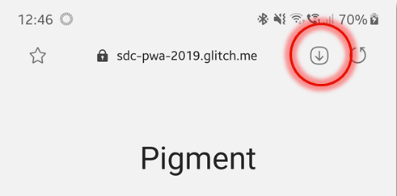
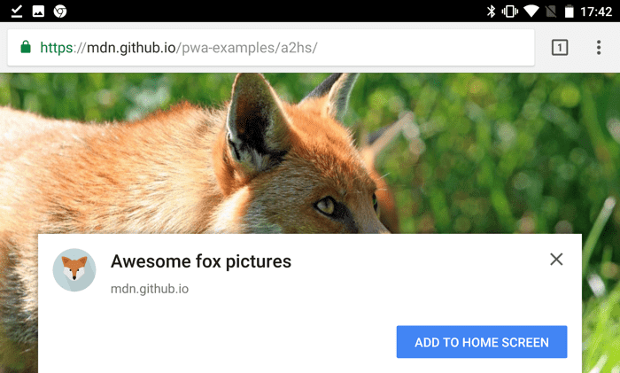
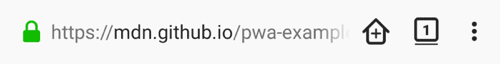
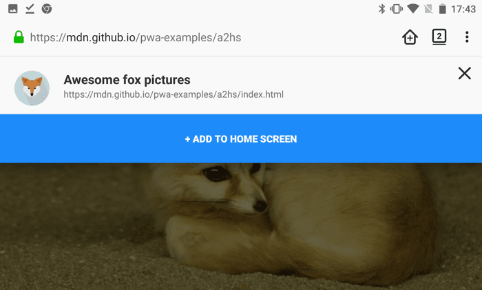
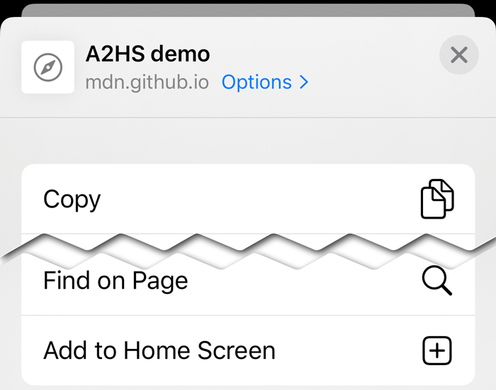
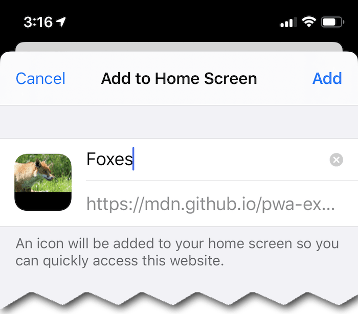

{{QuickLinksWithSubpages("/en-US/docs/Web/Progressive_web_apps/")}}

Web application installation is a feature available in modern browsers that allows users to choose to easily and conveniently "install" a web application on their device so they can access it in the same way they would any other installed app. Depending on the PWA, device, and features of the operating system and browser, installation may be just a shortcut added to a device's home screen all the way to what is essentially a fully featured application with operating system integration and uninstall functionality. 

This guide explains how installation is performed in different browsers on different operating systems and how to uninstall those same PWAs. First, it's important to understand what installation means and what you need to do as a developer to let your users take advantage of it.

## Why installation?

The option to install a web application is part of the [Progressive Web App](/en-US/docs/Web/Progressive_web_apps) philosophy—giving web apps the same user experience advantages as native apps so they can be competitive. Installed applications are more conveniently invoked as they have a presence in a device's home screen or app list or bar. This makes it simple for a user to use a gesture or keystrokes to access an app by tabbing to, tapping, or clicking its icon. 

When the application is launched via the icon, it may then manifest as in a chromeless view (without the full browser chrome) but it nevertheless is executing effectively as a tab within the browser.

For users, the experience of a seemingly-native PWA is more comfortable and convenient than a typical website. By reducing the user experience differential between the web app and native apps on the user's device, you reduce both the loss of any muscle memory they have revolving around the native interface of the device and the sensation of "something isn't quite right" that users can experience when switching between native and web-based apps.

## What browsers support installation?

Installation is supported on all modern desktop and mobile devices. Whether the PWA can be installed by the browser on the operating system differs by browser / operating system combination. Most browsers support installing PWAs direction on all operating systems -- Chrome OS, MacOS, Windows, Android, Linux, etc. -- directly or when an extension is installed. Apple is unique when it comes to PWAs: PWAs can be installed on macOS from any browser **except** Safari. The opposite is true for iOS, where PWAs can **only** be installed in Safari.

## The installation user experience

We've written a very simple example website ([see our demo live](https://mdn.github.io/pwa-examples/a2hs/), and also [see the source code](https://github.com/mdn/pwa-examples/tree/master/a2hs)) that doesn't do much, but was developed with the necessary code to allow it to be installed, as well as a service worker to enable it to be used offline.

The example displays a series of fox pictures. If you have a web application compatible device available, use it to navigate to our demo at [`https://mdn.github.io/pwa-examples/a2hs/`](https://mdn.github.io/pwa-examples/a2hs/). You'll see fox pictures, but more importantly, some form of user interface will be available to let you install the site as a web app. 

The PWA itself includes an "install" button. The button is displayed with JavaScript when the [`beforeinstallprompt`](/en-US/docs/Web/API/Window/beforeinstallprompt_event) event fires in browsers that support the event.

### Samsung Internet Browser

If you have Samsung Internet in your mobile device you will see a different icon.

Tapping that icon should then take you to the same confirmation banner shown in Firefox above.

### Google Chrome for Android

If you have Google Chrome for Android available, the experience is slightly different; upon loading our site, you'll see a banner pop-up asking whether you want to add this app to your Home screen.

> **Note:** You can find out a lot more about Chrome install banners from the article [How to provide your own in-app installation experience](https://web.dev/customize-install/).

If you choose not to add it to your Home screen at this point, you can do so later using the "Add to Home Screen" icon in the main Chrome menu.

### Chrome and Edge for Desktop

### Firefox for Android

On an Android device using Firefox, you'll see a "home" icon with a plus (+) icon inside it—this is the "Add to Home screen" icon displayed for any site that has the necessary features in place.

Tapping this will show a confirmation banner—pressing the banner's big "+ ADD TO HOME SCREEN" button completes the action, adding the app to the Home screen. Note that in Android 8 and higher, a system-level "Add to Home screen" permission dialog will be shown first.

### Safari for iOS / iPhoneOS / iPadOS

On Apple's iOS (including iPhoneOS and iPadOS), the Safari browser built into the device has some support for web applications, including support for the add to home screen feature. To add a web app to the home screen (also known as the launcher or springboard), tap the sharing button at the bottom of the screen:

This calls up the sharing panel. Among the options should be the "Add to Home Screen" option, unless it's been specifically removed from the list by the user editing the options displayed:

Choosing "Add to Home Screen" here presents the confirmation dialog box, which not only confirms that the user wants to add the app to the home screen, but also lets the user customize its name.

Upon clicking "Add," the app is included on the home screen.

### The installed web application

Regardless of which browser and device you're using, when you choose to add the app to your home screen or app launcher, it'll show up there looking just like any application. Typically this means you'll see the app's icon along with a short title.

When you tap the web app's icon on the home screen, it opens up in a full screen web environment, without the browser's UI around it.
