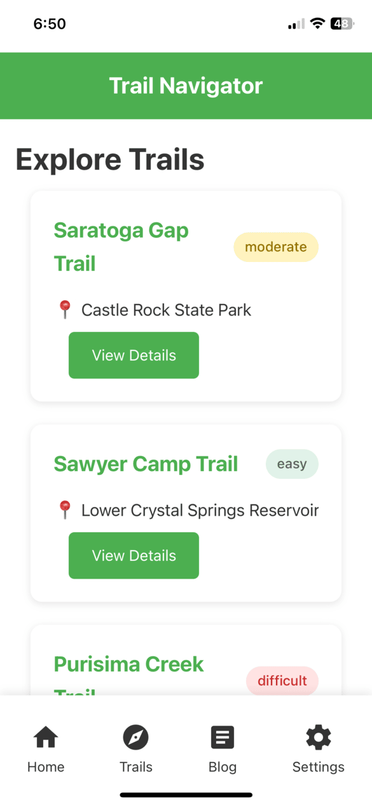
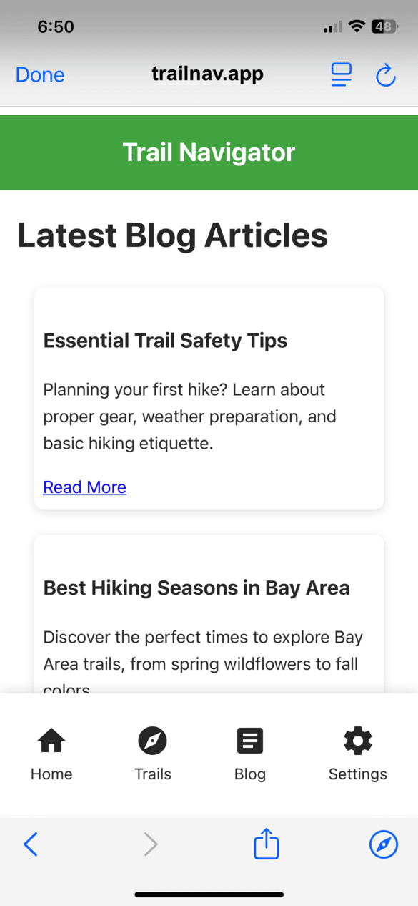

{{QuickLinksWithSubpages("/en-US/docs/Web/Progressive_web_apps/Manifest/Reference")}}

The `scope` manifest member is used to specify the top-level URL path that contains your web application's pages and subdirectories.
When users install and use your web app, pages _within scope_ provide an app-like interface.
When users navigate to pages outside the app's scope, they still experience the app-like interface, but browsers display UI elements like the URL bar to indicate the change in context.

## Syntax

```json-nolint
/* Absolute URL */
"scope": "https://example.com/myapp/"

/* Relative URL */
"scope": "/myapp/"

/* Scope limited to a specific directory */
"scope": "/myapp/dashboard/"
```

### Values

- `scope`

  - : A string that represents a URL.
    The URL can be absolute or relative.
    If the value is relative, it is resolved against the manifest file's URL.

    If `scope` is not specified in the manifest or the value is invalid (i.e., not a string, not a valid URL, or `start_url` is not within the specified `scope`), the effective scope will be set to the `start_url` value after removing its filename, query, and fragment.

## Description

The `scope` member defines the URLs that are part of your web app's installed experience.
Browsers use `scope` to determine if a page is within your web app's {{Glossary("Application_context", "application context")}}.

### In-scope and out-of-scope behavior

A URL is considered to be "within scope" if its path begins with the URL path defined in `scope`.
For example, if the `scope` is set to `/app/`, then the URLs `/app/`, `/app/page.html`, and `/app/dashboard/index.html` are all considered within scope, while `/` or `/page.html` are not.

When users open your installed web app, they experience an app-like interface.
For in-scope pages, browsers maintain the application context and preserve the app-like experience.
When users navigate to pages outside the app's scope, they still broadly experience the app-like interface; however, in these pages, browsers display additional UI elements like the URL bar.
This helps users understand that they're viewing pages outside the app's defined scope.

> [!NOTE]
> The `scope` member doesn't prevent users from navigating to app pages outside of the defined scope.
> Off-scope navigations are not blocked by browsers and are allowed to be opened in a new top-level browsing context.

Consider a web app for exploring hiking trails with the following directory structure:

```plain
web-app/
├── manifest.json
├── trails/
│   ├── index.html
│   ├── trail-list.html
│   ├── settings/
│   │   └── index.html
│   └── saratoga-gap-trail.html
├── blog/
│   └── index.html
```

With the scope set to `/trails/`:

- When viewing pages and subdirectories under `/trails/` (like the `trail-list.html` and `/trails/settings/index.html`), users experience the app-like interface without the browser controls (image on the left).
- When navigating to pages in subdirectories like `/blog/`, which are outside the scope of the app, the app-like interface remains but users see the website address and other browser controls (image on the right).

| Page in scope                                                                             | Page out of scope                                                                                        |
| ----------------------------------------------------------------------------------------- | -------------------------------------------------------------------------------------------------------- |
|  |  |

### Scope's affect on deep-linked pages

Other applications can deep link directly to specific pages of your web app.
The `scope` member affects how these deep-linked pages are displayed, but it is not required for deep linking to work.

Consider the previous example of the web app for exploring hiking trails, where the `scope` set to `/trails/`:

- If a link to `https://trailnav.app/trails/saratoga-gap-trail.html` is shared on social media, users with the Trail Navigator app installed will view this page in the app's interface without browser controls.
- If a link to `https://trailnav.app/blog/trail-safety.html` is shared, these users will view the blog page in the app-like interface but with the website address and browser controls visible, since it's outside the app's defined scope.

This behavior helps users understand whether they're viewing pages within or outside the app's scope, even when accessing the app pages through external links.

### Fallback scope behavior

The `scope` is invalid if `start_url` is not a subset of the `scope` URL. For example:

- **Valid**: `scope` is `/app/`, and `start_url` is `/app/home.html`.
- **Invalid**: `scope` is `/app/`, and `start_url` is `/index.html`.

If `scope` is missing or invalid, it defaults to the `start_url` value after removing its filename, query, and fragment.
Note that if the `start_url` is also undefined (or invalid) it defaults to the page that links to the manifest.
This ensures that by default the scope will start from the page that triggered the installation.

For example:

- If `start_url` is `https://example.com/app/index.html?user=123#home`, the scope will be `https://example.com/app/`.
- If `start_url` is `/pages/welcome.html`, the scope will be `/pages/` on the same origin.
- If `start_url` is `/pages/` (the trailing slash is important), the scope will be `/pages/`.

If you rely on the fallback behavior of `scope`, ensure that URLs of all pages in your app begin with the parent path of `start_url`.
To avoid issues with scope determination in this way, it's recommended to explicitly specify `scope` in your manifest file.

### Scope matching mechanism

String matching for the scope URL uses a simple prefix match, not the path structure.
For example, if the `scope` is set as `/prefix`, it will match URLs starting with `/prefix`, including `/prefix-of/index.html` and `/prefix/index.html`. Note that `/prefix-of/index.html` matches even though `prefix-of` is not an exact match with the scope `/prefix`.

For this reason, it's recommended to define a scope ending with a `/`.
Setting the `scope` as `/prefix/` ensures it will match only the pages within the `/prefix/` directory, preventing unintended matches.

## Examples

### Specifying an absolute URL for scope

Suppose the manifest file for your web app is linked from `https://hikingapp.com/index.html`, and you want the scope to include all the subdirectories. You can specify this scope using an absolute URL that is same-origin with manifest file URL, as shown below. This ensures that pages like `https://hikingapp.com/store` and `https://hikingapp.com/company` are part of your web app.

```json
{
  "scope": "https://hikingapp.com/"
}
```

### Specifying a relative URL for scope

If your manifest file's URL is `https://hikingapp.com/resources/manifest.json`, and you want the scope to be `https://hikingapp.com/app/`, you can define it as a relative URL:

```json
{
  "scope": "../app/"
}
```

### Defining a web app for a specific section of your site

If you have a website with multiple sections, but you want your web app to focus on a specific section, you can define the `scope` as:

```json
{
  "name": "My Hiking Web App",
  "start_url": "https://hikingapp.com/store/",
  "scope": "https://hikingapp.com/store/"
}
```

With this setup, pages like `https://hikingapp.com/store/products` are part of your web app, but `https://hikingapp.com/company/` is out of your web app's scope. For off-scope URLs, browsers may display different UI elements to let users know they've navigated away from the app's scope.

## Specifications

{{Specifications}}

## Browser compatibility

{{Compat}}

## See also

- [`start_url`](/en-US/docs/Web/Progressive_web_apps/Manifest/Reference/start_url) manifest member
- {{Glossary("Application_context", "Application context")}}
