Need some help designing your app's navigation? These patterns are a great place to start. The following present several ways to handle navigation on large and small screens. Top and left navigation menus are common on larger screens, but are often not the optimal way to present information on small screens because of the reduced screen real estate. Therefore, it is necessary to consider the presentation of content and ease of navigation for all screen sizes.

## Pattern 1: Top toggle menu

In this pattern, as the screen width is reduced, the top navigation items rearrange until there is not enough space. At that point, some items move from the top navigation to a drop-down menu. In the smallest screen, all navigation items live in a toggle menu, and the user has to tap to expand the toggle menu.

You could rank the item priorities to ensure the most important items always appear in the top navigation.

### Pros:

- **one button in header** maximizes space for content on a small screen
- **important items stay visible**in most screen sizes and you decide the item priorities
- **legibility of navigation items is maintained** with adequate spacing, by automatically hiding items that don't fit

### Cons:

- **navigation items might be less discoverable** because some items are hidden in the drop-down or toggle menu
- **users may not notice the button** contains a navigation menu in the smallest screen size
- **one more step** is needed to access the hidden navigation items

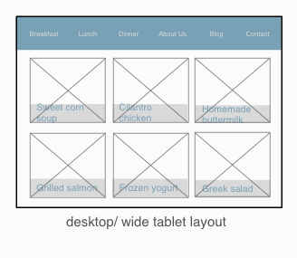

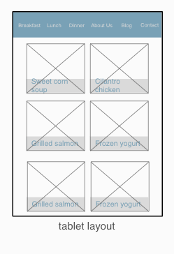

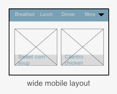

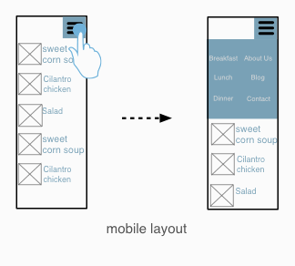

## Pattern 2: Expandable bottom menu

Similar to the first pattern, the top navigation items rearrange for smaller widths until there is not enough space. At that point, some items move from the top navigation to a drop-down menu. You could rank the item priorities to ensure the most important items always appear in the top navigation.

In the smallest screen, several items stay on the bottom of the screen, and the rest of the items are hidden. The user can flip the menu open and select from the rest of the navigation items. You could select the items that remain on the bottom.

### Pros:

- **expandable menu is easy to discover**
- **important items are always visible** and you decide the item priorities
- **legibility of navigation items is maintained** with adequate spacing, by automatically hiding items that don't fit

### Cons:

- **one more step** is needed to access the navigation items that are hidden
- **navigation items might be less discoverable** because some items are hidden
- **less space for content** in the smallest screen size

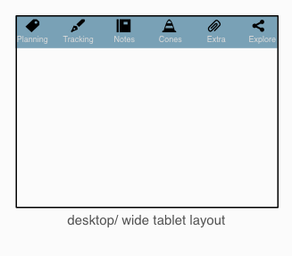

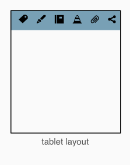

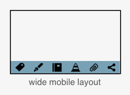

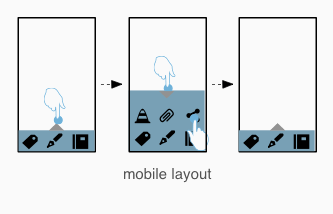

## Pattern 3: Left hidden menu

The main navigation is always on the left except in the smallest screen size, where the navigation menu is hidden in a button by default. In the smallest screen, when the user taps the button, the navigation menu slides into view and displays the navigation items.

### Pros:

- **potentially displays more navigation items** in a left navigation compared to a top navigation
- **most items are always visible** except in the smallest screen size
- **one button in header** maximizes space for content on a small screen

### Cons:

- **navigation items might be less discoverable** because some items are hidden in the drop-down or toggle menu
- **users may not notice the button** contains a navigation menu in the smallest screen size
- **one more step** is needed to access the navigation items that are hidden

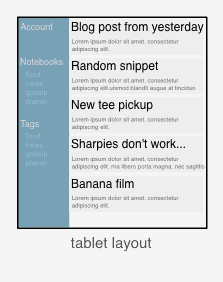

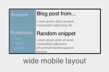

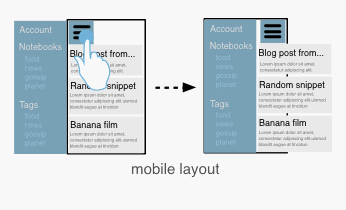
