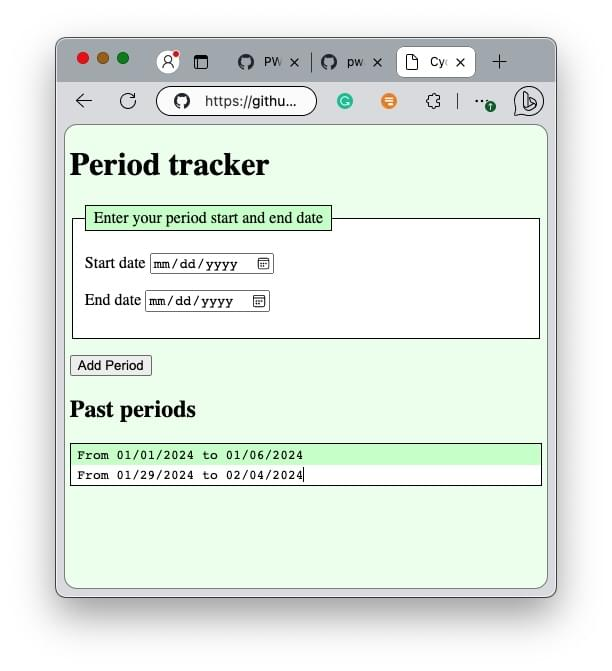

{{PreviousMenuNext("Web/Progressive_web_apps/Tutorials/CycleTracker", "Web/Progressive_web_apps/Tutorials/CycleTracker/Secure_connection", "Web/Progressive_web_apps/Tutorials/CycleTracker")}}

{{PWASidebar}}

To build a PWA, a progressive web application, we need to create a fully-functioning web application. In this section, we will markup the HTML for a static web page and enhance the appearance with CSS.

Our project is to create CycleTracker, a menstrual cycle tracker.
The first step in this introductory [PWA tutorial](/en-US/docs/Web/Progressive_web_apps/Tutorials) is to write the HTML and CSS. The top section of the page is a form for the user to enter the start and end dates of each period. The bottom is a list of previous menstrual cycles.

We create an HTML file, with meta data in the head and a static web page containing a form and a placeholder to display user inputted data. We'll then add an external CSS stylesheet to improve the site's appearance.

To complete this tutorial, it is helpful to have a basic level of understanding of [HTML](/en-US/docs/Learn/Getting_started_with_the_web/HTML_basics), [CSS](/en-US/docs/Learn/Getting_started_with_the_web/CSS_basics), and [JavaScript](/en-US/docs/Learn/Getting_started_with_the_web/JavaScript_basics). If you're not familiar with these, MDN is the home of [Getting Started](/en-US/docs/Learn/Getting_started_with_the_web), an introduction to web development series.

In the next sections, we'll set up a [local development environment](/en-US/docs/Web/Progressive_web_apps/Tutorials/CycleTracker/Secure_connection) and take a look at our progress before adding [JavaScript functionality](/en-US/docs/Web/Progressive_web_apps/Tutorials/CycleTracker/JavaScript_functionality) to convert the static content created in this section into a functional web application. Once we have a functioning app will we have something that we can progressively enhance into a PWA that is installable and works offline.

## Static web content

Our static site HTML, with placeholder {{HTMLElement("link")}} and {{HTMLElement("script")}} elements for yet-to-be-created external CSS and JavaScript files, is:

```html
<!doctype html>
<html lang="en-US">
  <head>
    <meta charset="utf-8" />
    <meta name="viewport" content="width=device-width" />
    <title>Cycle Tracker</title>
    <link rel="stylesheet" href="style.css" />
  </head>
  <body>
    <form>
      <fieldset>
        <legend>Enter your period start and end date</legend>
        <p>
          <label for="start-date">Start date</label>
          <input type="date" id="start-date" required />
        </p>
        <p>
          <label for="end-date">End date</label>
          <input type="date" id="end-date" required />
        </p>
      </fieldset>
      <p>
        <button type="submit">Add Period</button>
      </p>
    </form>
    <section id="past-periods"></section>
    <script src="app.js" defer></script>
  </body>
</html>
```

Copy this HTML and save it in a file called `index.html`.

## HTML content

Even if the HTML in `index.html` is familiar to you, we recommend reading thru this section before adding some [temporary hard-coded data](#temporary-hard-coded-results-text), adding CSS to a [`styles.css`](#css-content) external stylesheet, and creating `app.js`, the [application's JavaScript](/en-US/docs/Web/Progressive_web_apps/Tutorials/CycleTracker/JavaScript_functionality) that makes this web page function.

The HTML's first line is a {{glossary("doctype")}} preamble, which ensures the content behaves correctly.

```html
<!doctype html>
```

The root {{HTMLelement("html")}} tags wrap all the content with the [`lang`](/en-US/docs/Web/HTML/Global_attributes/lang) attribute defining the primary language of the page.

```html
<!doctype html>
<html lang="en-US">
  <!-- the <head> and <body> will go here -->
</html>
```

### Document head

The {{HTMLelement("head")}} contains machine-readable information about the web application that, with the exception of the `<title>`, which may be displayed as the heading of the browser tab, is not visible to the user.

The `<head>` includes all the [meta data](/en-US/docs/Learn/HTML/Introduction_to_HTML/The_head_metadata_in_HTML). The first two bits of information in your `<head>` should always be the character set definition, which defines the [character encoding](/en-US/docs/Glossary/Character_encoding), and the [viewport](/en-US/docs/Web/HTML/Viewport_meta_tag) {{HTMLelement("meta")}} tag, which ensures the page renders at the width of the viewport and isn't shrunken down when loaded on very small screens.

```html
<head>
  <meta charset="utf-8" />
  <meta name="viewport" content="width=device-width" />
</head>
```

We set the title of the page to "Cycle Tracker" with the {{HTMLelement("title")}} element. While the contents of the `<head>` are not displayed within the page, the contents of the `<title>` are seen! The `<title>` element's inner text appears in the browser tab when the page is loaded, in search engine results, and is the default title used when a user bookmarks a web page. The title also provides an accessible name for screen reader users who depend on it to know which tab they're currently on.

While the title could be "Menstrual cycle tracking application", we opted for a shortened name that is more discreet.

```html
<title>Cycle Tracker</title>
```

While officially optional, for better user experience, these two `<meta>` tags and the `<title>` are the three components of the `<head>` that should be considered required components of any HTML document.

For right now, the last component we include in the `<head>` is a {{HTMLelement("link")}} element linking `styles.css`, our yet-to-be-written stylesheet, to our HTML.

```html
<link rel="stylesheet" href="style.css" />
```

The HTML `<link>` element is used to specify a relationship between the current document and an external resource. There are more than 25 defined values for the [`rel`](/en-US/docs/Web/HTML/Attributes/rel) attribute – and many more values that are not in any specification. The most common value, `rel="stylesheet"`, imports an external resource as a stylesheet.

We will revisit the `<link>` element and its `rel` attribute in a future section when we include the [link to the manifest](/en-US/docs/Web/Progressive_web_apps/Tutorials/CycleTracker/Manifest_file#adding_the_manifest_to_the_app) file.

### Document body

The {{HTMLelement("body")}} element contains all the content we want displayed when users visit the site on the Internet.

Within the `<body>`, we include the name of the app as a level-1 heading using [`<h1>`](/en-US/docs/Web/HTML/Element/Heading_Elements) and a {{HTMLelement("form")}}.

```html
<body>
  <h1>Period tracker</h1>
  <form></form>
</body>
```

The form will contain instructions, form controls, a label for each form control, and a submit button. In terms of form controls, we need the user to enter both a start date and an end date for each menstrual cycle submitted.

Within the `<form>`, we include a {{HTMLelement("fieldset")}} with a {{HTMLelement("legend")}} labeling the purpose of that set of form fields.

```html
<form>
  <fieldset>
    <legend>Enter your period start and end date</legend>
  </fieldset>
</form>
```

The date pickers are {{HTMLElement("input")}} elements of type {{HTMLElement("input/date", "date")}}. We include the [`required`](/en-US/docs/Web/HTML/Attributes/required) attribute to reduce user errors by preventing the user from accidetally submitting an incomplete form.

To associate a `<label>` with a form control, each `<input>` has an [`id`](/en-US/docs/Web/HTML/Global_attributes/id) attribute matching the [`for`](/en-US/docs/Web/HTML/Attributes/for) attribute of the associated {{HTMLelement("label")}}. The associated label provides each `<input>` with an {{glossary("accessible name")}}.

```html
<label for="start-date">Start date</label>
<input type="date" id="start-date" required />
```

Putting it altogether, within the `<fieldset>`, we include two paragraphs ({{HTMLelement("p")}}) elements, each with a date picker for the start and end dates of the menstrual cycle currently being entered, along with the date pickers' associated {{HTMLelement("label")}}s. We also include a {{HTMLelement("button")}} element which submits the form and label the button "Add period" by including that text between the opening and closing tags. The `type="submit"` is optional, as `submit` is the default type for `<button>`.

```html
<form>
  <fieldset>
    <legend>Enter your period start and end date</legend>
    <p>
      <label for="start-date">Start date</label>
      <input type="date" id="start-date" required />
    </p>
    <p>
      <label for="end-date">End date</label>
      <input type="date" id="end-date" required />
    </p>
  </fieldset>
  <p>
    <button type="submit">Add Period</button>
  </p>
</form>
```

We encourage you to [learn more about making accessible web forms](/en-US/docs/Learn/Forms).

### Temporary hard-coded results text

We then include an empty {{HTMLElement("section")}}. This container will be populated using JavaScript.

```html
<section id="past-periods"></section>
```

When the user submits the form, we will use JavaScript to capture the data and present a list of past periods along with a header for the section.

For the time being, we temporarily hardcode some content within this `<section>`, including an `<h2>` header and a few past periods, to have something to style as we write the page's CSS.

```html
<section id="past-periods">
  <h2>Past periods</h2>
  <ul>
    <li>From 01/01/2024 to 01/06/2024</li>
    <li>From 01/29/2024 to 02/04/2024</li>
  </ul>
</section>
```

This content, other than the container `<section id="past-periods"></section>`, is temporary. We will remove or comment-out this temporary data once we [complete the CSS](#css-content) and are satisfied with the app's appearance.

### JavaScript link

Before closing the `</body>`, we include a link to the yet-to-be-written `app.js` JavaScript file. We include the [`defer`](/en-US/docs/Learn/JavaScript/First_steps/What_is_JavaScript#async_and_defer) attribute to defer the loading of this script and ensure the JavaScript is executed after the document's HTML has been parsed.

```html
<script src="app.js" defer></script>
```

The `app.js` file will include all the workings of our application, including the event handlers for the `<button>`, saving the data submitted to local storage, and displaying cycled within the content of the body.

The [HTML file for this step](https://github.com/mdn/pwa-examples/tree/master/cycletracker/html_and_css/index.html) is now complete!

## CSS content

We can now style the static HTML using CSS. Our final CSS is:

```css
body {
  margin: 1vh 1vw;
  background-color: #efe;
}
ul,
fieldset,
legend {
  border: 1px solid;
  background-color: #fff;
}
ul {
  padding: 0;
  font-family: monospace;
}
li,
legend {
  list-style-type: none;
  padding: 0.2em 0.5em;
  background-color: #cfc;
}
li:nth-of-type(even) {
  background-color: inherit;
}
```

If every line is familiar to you, you can copy the above CSS, or write your own CSS, and save the file as [`style.css`](https://github.com/mdn/pwa-examples/tree/master/cycletracker/html_and_css/style.css), then [finish up the static HTML and CSS](#finishing-the-static-html-and-css-for-our-pwa). If anything in the above CSS is new to you, keep reading for an explanation.



### CSS explained

We use the {{CSSXref("background-color")}} property to set a light green (`#efe`) background color on the `body`, a white (`#fff`) background color, along with a thin solid border added with the {{CSSXref("border")}} property on the unordered list, fieldset, and legend. We override the `background-color` for the legend, making the legend and the list items a darker green (`#cfc`).

We use the [`:nth-of-type(even)`](/en-US/docs/Web/CSS/:nth-of-type) pseudo-class [selector](/en-US/docs/Web/CSS/CSS_selectors) to set every even-numbered list item to {{CSSXref("inherit")}} the background color from its parent; in this case, inheriting the `#fff` background color from the unordered list.

```css
body {
  background-color: #efe;
}
ul,
fieldset,
legend {
  border: 1px solid;
  background-color: #fff;
}
li,
legend {
  background-color: #cfc;
}
li:nth-of-type(even) {
  background-color: inherit;
}
```

To make the unordered list and list items not look like a list, we remove the padding by setting {{CSSXref("padding", "padding: 0")}} on the `ul` and remove the list markers by setting {{CSSXref("list-style-type", "list-style-type: none")}} on the list items themselves.

```css
ul {
  padding: 0;
}
li {
  list-style-type: none;
}
```

We add a little white space by setting the `body`'s {{CSSXref("margin")}} using the `vw` and `vh` [viewport units](/en-US/docs/Web/CSS/length#relative_length_units_based_on_viewport), making white space on the outside of our app be proportional the viewport's size. We also add a little padding to the `li` and `legend`. Finally, to improve, but not fix, the alignment of the past-periods data, we set the {{CSSXref("font-family")}} of the `ul` results section to be `monospace`, making each glyph have the same fixed width.

```css
body {
  margin: 1vh 1vw;
}
ul {
  font-family: monospace;
}
li,
legend {
  padding: 0.2em 0.5em;
}
```

We can combine the above, putting multiple properties in each selector declaration block. We can even put the styles for the `li` and `legend` together; irrelevant styles, like the `list-style-type` declaration on `legend`, are ignored.

```css
body {
  margin: 1vh 1vw;
  background-color: #efe;
}
ul,
fieldset,
legend {
  border: 1px solid;
  background-color: #fff;
}
ul {
  padding: 0;
  font-family: monospace;
}
li,
legend {
  list-style-type: none;
  padding: 0.2em 0.5em;
  background-color: #cfc;
}
li:nth-of-type(even) {
  background-color: inherit;
}
```

If any of the above CSS still looks unfamiliar to you, you can look up the [CSS properties](/en-US/docs/Glossary/Property/CSS) and [selectors](/en-US/docs/Web/CSS/CSS_selectors), or work through the [getting started with CSS](/en-US/docs/Learn/CSS/First_steps/Getting_started) learning path.

Whether you use the above CSS verbatim, edit the above styles to your preference, or write your own CSS from scratch, include all the CSS in a new file and save it as [`style.css`](https://github.com/mdn/pwa-examples/tree/master/cycletracker/html_and_css/style.css) in the same directory as your `index.html` file.

### Finishing the static HTML and CSS for our PWA

Before moving on, [comment](/en-US/docs/Learn/HTML/Introduction_to_HTML/Getting_started#html_comments) out or delete the fake past period data and header:

```html
<section id="past-periods">
  <!--
  <h2>Past periods</h2>
  <ul>
    <li>From 01/01/2024 to 01/06/2024</li>
    <li>From 01/29/2024 to 02/04/2024</li>
  </ul>
  -->
</section>
```

## Up next

Before adding the [JavaScript functionality](/en-US/docs/Web/Progressive_web_apps/Tutorials/CycleTracker/JavaScript_functionality) to convert this static content into web app and then enhancing it into a progressive web app with a [manifest file](/en-US/docs/Web/Progressive_web_apps/Tutorials/CycleTracker/Manifest_file) and [service worker](/en-US/docs/Web/Progressive_web_apps/Tutorials/CycleTracker/Service_workers), we'll [create a local development environment](/en-US/docs/Web/Progressive_web_apps/Tutorials/CycleTracker/Secure_connection) to view our progress.

Until then, you can view the [static CycleTracker shell](https://mdn.github.io/pwa-examples/cycletracker/html_and_css) and download the [CycleTracker HTML and CSS source code](https://github.com/mdn/pwa-examples/tree/master/cycletracker/html_and_css) from GitHub.

{{PreviousMenuNext("Web/Progressive_web_apps/Tutorials/CycleTracker/", "Web/Progressive_web_apps/Tutorials/CycleTracker/Secure_connection", "Web/Progressive_web_apps/Tutorials/CycleTracker")}}
