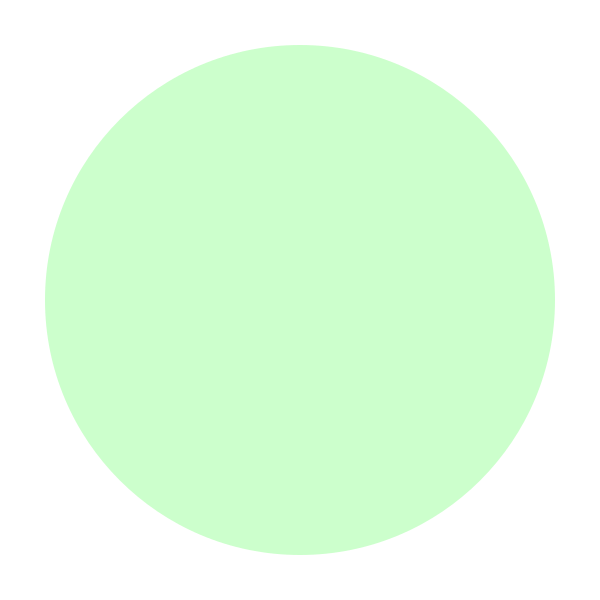
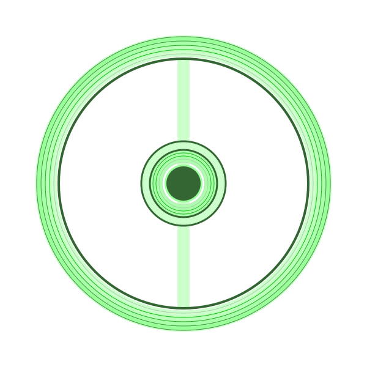
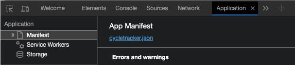
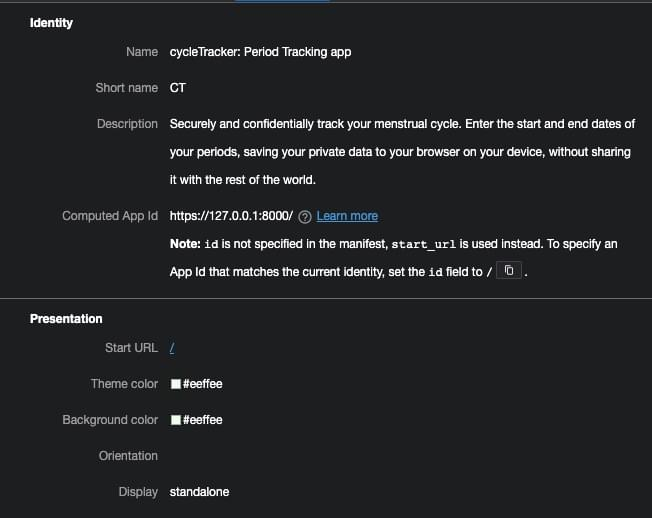
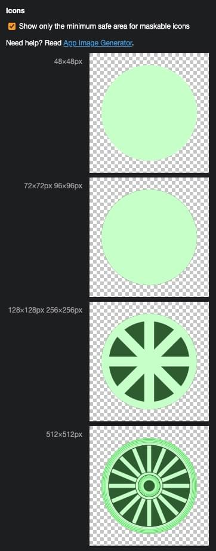
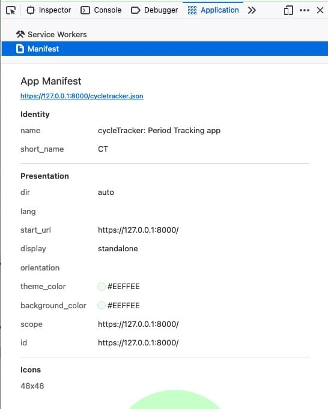

{{PreviousMenuNext("Web/Progressive_web_apps/Tutorials/CycleTracker/JavaScript_functionality", "Web/Progressive_web_apps/Tutorials/CycleTracker/Service_workers", "Web/Progressive_web_apps/Tutorials/CycleTracker")}}

{{PWASidebar}}

A PWA manifest file is a JSON file that provides information about the features of that app to make it look and behave like a native app when installed on the user's device. The manifest contains metadata for your app, including its name, icons, and presentational directives.

While, according to the spec, all of the manifest keys (or members) are optional, some browsers, operating systems, and app distributors have [specific required members](/en-US/docs/Web/Progressive_web_apps/Guides/Making_PWAs_installable#required_manifest_members) for a web app to be a PWA. By including a name or short name, the start URL, an icon meeting some minimum requirements, and the type of application viewport in which the PWA should be viewed, your app will meet the manifest requirements of a PWA.

A minimalist manifest file for our menstrual cycle tracking app could look like this:

```js
{
  "short_name": "CT",
  "start_url" : "/",
  "icons": [
    {
      "src": "icon-512.png",
      "sizes": "512x512"
    }
  ],
  "display": "standalone"
}
```

Before saving the manifest file and linking to it from our HTML file, we can develop a still brief but more informative JSON object to define the identity, presentation, and iconography of the PWA. Yes, the above would work, but let's discuss the members in this example and a few other members that enable manifest files to better define the appearance of our CycleTracker PWA.

## App identity

To identify your PWA, the JSON must include a `name` or `short_name` member, or both, to define the PWA name. It can also include a `description`.

- [`name`](/en-US/docs/Web/Manifest/Reference/name)
  - : The name of the PWA. This is the name used when the operating system lists applications, as the label next to the application icon, etc.
- [`short_name`](/en-US/docs/Web/Manifest/Reference/short_name)
  - : The name of the PWA displayed to the user if there isn't enough space to display the `name`. It is used as the label for icons on phone screens, including in the "Add to Home Screen" dialog on iOS.

When both the `name` and `short_name` are present, the `name` is used in most instances, with the `short_name` used when there is a limited space to display the application name.

- [`description`](/en-US/docs/Web/Manifest/Reference/description)
  - : Explanation of what the application does. It provides an {{glossary("accessible description")}} of the application's purpose and function.

### Task

Write the first few lines of your manifest file. You can use the text below, or more discreet or descriptive values, and a description of your choosing.

### Example solution

```js
{
  "name": "CycleTracker: Period Tracking app",
  "short_name": "CT",
  "description": "Securely and confidentially track your menstrual cycle. Enter the start and end dates of your periods, saving your private data to your browser on your device, without sharing it with the rest of the world."
}
```

## App presentation

The appearance, or presentation, of a PWA's installed and offline experiences are defined in the manifest. Presentation manifest members include `start_url` and `display`, and members which can be used to [customize your app colors](/en-US/docs/Web/Progressive_web_apps/How_to/Customize_your_app_colors), including `theme_color` and `background_color`.

- [`start_url`](/en-US/docs/Web/Manifest/Reference/start_url)

  - : The start page when a user launches the PWA.

- [`display`](/en-US/docs/Web/Manifest/Reference/display)
  - : Controls the app's display mode including `fullscreen`, `standalone`, which displays the [PWA as a standalone application](/en-US/docs/Web/Progressive_web_apps/How_to/Create_a_standalone_app), `minimal-ui`, which is similar to a standalone view but with UI elements for controlling navigation, and `browser`, which opens the app in a regular browser view.

There is also an [`orientation`](/en-US/docs/Web/Manifest/Reference/orientation) member that defines the PWA's default orientation as `portrait` or `landscape`. As our app works well in both orientations, we'll omit this member.

### Colors

- [`theme_color`](/en-US/docs/Web/Manifest/Reference/theme_color)
  - : The default [color of operating system and browser UI elements](/en-US/docs/Web/Progressive_web_apps/How_to/Customize_your_app_colors#define_a_theme_color) such as the status bar on some mobile experiences and the application title bar on desktop operating systems.
- [`background_color`](/en-US/docs/Web/Manifest/Reference/background_color)
  - : A placeholder color to be displayed as the [background of the app](/en-US/docs/Web/Progressive_web_apps/How_to/Customize_your_app_colors#customize_the_app_window_background_color) until the CSS is loaded. To create a smooth transition between app launch and load, it is recommended to use the [`<color>`](/en-US/docs/Web/CSS/color_value) declared as the app's [`background-color`](/en-US/docs/Web/CSS/background-color) color.

### Task

Add presentation definitions to the manifest file you began creating in the previous task.

### Example solution

As the example application is a single page, we can use `"/"` as the `start_url`, or omit the member altogether. For that same reason, we can display the app without the browser UI by setting the `display` to `standalone`.

In [our CSS](/en-US/docs/Web/Progressive_web_apps/Tutorials/CycleTracker/HTML_and_CSS#css_content), the `background-color: #efe;` is set on the `body` element selector. We use `#eeffee` to ensure a smooth transition from placeholder appearance to app load.

```js
{
  "name": "...",
  "short_name": "...",
  "description": "...",
  "start_url": "/",
  "theme_color": "#eeffee",
  "background_color": "#eeffee",
  "display": "standalone"
}
```

## App iconography

PWA icons help users identify your app, make it more visually appealing, and improve discoverability. The PWA app icon appears on home screens, app launchers, or app store search results. The size of the rendered icon and the file requirements varies depending on where it is displayed and by whom. The manifest is where you define your images.

Within the manifest JSON object, the `icons` member specifies an array of one or more icon objects for use in different contexts, each with a `src` and `sizes` member, and optional `type` and `purpose` members. Each icon object's `src` list the source of a single image file. The `sizes` member provides a list of space-separated sizes for which that particular image should be used or the keyword `any`; the value is the same as the {{HTMLElement("link")}} element's [`sizes`](/en-US/docs/Web/HTML/Element/link#sizes) attribute. The `type` member lists the image's MIME type.

```js
{
  "name": "MyApp",
  "icons": [
    {
      "src": "icons/tiny.webp",
      "sizes": "48x48"
    },
    {
      "src": "icons/small.png",
      "sizes": "72x72 96x96 128x128 256x256",
      "purpose": "maskable"
    },
    {
      "src": "icons/large.png",
      "sizes": "512x512"
    },
    {
      "src": "icons/scalable.svg",
      "sizes": "any"
    }
  ]
}
```

All icons should have the same look and feel to ensure users recognize your PWA, but the larger the icon, the greater the detail it can contain. While all icon files are squares, some operating systems render different shapes, cutting sections off, or "masking" the icon, to meet the UI, or shrinking and centering the icon with a background if the icon is not maskable. The [safe zone](/en-US/docs/Web/Progressive_web_apps/How_to/Define_app_icons#support_masking), the area that will render okay if the icon is masked as a circle, is the inner 80% of the image file. Icons are labeled as safe to be masked by the `purpose` member which, when set to `maskable`, defines the [icon as adaptive](https://web.dev/articles/maskable-icon).

In Safari, and therefor for iOS and iPadOS, if you include the [non-standard `apple-touch-icon`](/en-US/docs/Learn_web_development/Core/Structuring_content/Webpage_metadata#adding_custom_icons_to_your_site) in the {{HTMLElement("head")}} of the HTML document via {{HTMLElement("link")}}, they will take precedence over manifest-declared icons.

### Task

Add the icons to the manifest file you have been constructing.

Playing with the words "cycle" and "period" of CycleTracker and the green theme color we've chosen, our icon images could all be light green squares with a green circle. Our smallest size `circle.ico`, and icon file that is just a circle representing the period punctuation mark and app theme color, with our in-between images, `circle.svg`, `tire.svg`, and `wheel.svg`, adding more detail moving from a plain circle to a tire as it gets larger, with our largest icons being a detailed wheel with spokes and shadows. That said, designing icons is beyond the scope of this tutorial.

```html hidden
<div>
  
  
  
</div>
```

```css hidden
div {
  display: flex;
  gap: 5px;
}
img {
  width: 33%;
}
```

{{EmbedLiveSample("PWA iconography", 600, 250)}}

### Example solution

```js
{
  "name": "...",
  "short_name": "...",
  "description": "...",
  "start_url": "...",
  "theme_color": "...",
  "background_color": "...",
  "display": "...",
  "icons": [
        {
      "src": "circle.ico",
      "sizes": "48x48"
    },
    {
      "src": "icons/circle.svg",
      "sizes": "72x72 96x96",
      "purpose": "maskable"
    },
    {
      "src": "icons/tire.svg",
      "sizes": "128x128 256x256"
    },
    {
      "src": "icons/wheel.svg",
      "sizes": "512x512"
    }
  ]
}
```

## Adding the manifest to the app

You now have a fully usable manifest file. Time to save it and link to it from our HTML file.

The manifest file extension can be the specification suggestion `.webappmanifest`. However, being a JSON file, it is most commonly saved with the browser-supported `.json` extension.

PWAs require a manifest file to be linked from the app's HTML document. We have a fully functional app, but it's not yet a PWA because it doesn't link to our external manifest JSON file yet. To include the external JSON resource, we use the `<link>` element, with the `rel="manifest"` attribute, and set the `href` attribute to the location of the resource.

```html
<link rel="manifest" href="cycletracker.json" />
```

The `<link>` element is most commonly used to link to stylesheets and, with PWAs, the required manifest file, but is also used to [establish site icons](/en-US/docs/Web/HTML/Attributes/rel#icon) (both "favicon" style icons and icons for the home screen and apps on mobile devices) among other things.

```html
<link rel="icon" href="icons/circle.svg" />
```

When using the `.webmanifest` extension, set `type="application/manifest+json"` if your server doesn't support that MIME type.

### Task

Save the manifest file that you have created in the steps above, then link to it from the `index.html` file.

Optionally, link to a shortcut icon from your HTML as well.

### Example solution

The {{HTMLelement("head")}} of `index.html` may now look similar to:

```html
<head>
  <meta charset="utf-8" />
  <meta name="viewport" content="width=device-width" />
  <title>Cycle Tracker</title>
  <link rel="stylesheet" href="style.css" />
  <link rel="manifest" href="cycletracker.json" />
  <link rel="icon" href="icons/circle.svg" />
</head>
```

View the [`cycletracker.json` file](https://mdn.github.io/pwa-examples/cycletracker/manifest_file/cycletracker.json) and view the [project source code](https://github.com/mdn/pwa-examples/tree/main/cycletracker/manifest_file) on GitHub.

With a manifest file and when loaded from an `https://` URL (or `localhost`), [most browsers](/en-US/docs/Web/Progressive_web_apps/Guides/Making_PWAs_installable#browser_support) will recognize your site as a PWA and some will prompt to install it. To make our PWA work offline, we'll still need to add a service worker.

## Debugging manifest files

Some browser developer tools provide insight into the app manifest. In Edge, Firefox, and Chrome developer tools, the manifest members and their values are visible under the "Application" panel.



The Manifest App pane provides the name of the manifest file as a link, and identity, presentation, and icons sections.



Supported manifest members are displayed, along with all included values. In this screenshot, while we did not include the `orientation` or `id` members, they are listed. The App panel can be used to see the manifest members and even learn: in this example, we learn that to specify an App Id that matches the current identity, set the `id` field to "/".

Chrome and Edge also provide errors and warnings, protocol handlers, and information to improve the manifest and icons.

Our web app doesn't have any protocol handlers; a topic not covered in this tutorial. Had we included some, they would be found under "Protocol Handlers". As that section is empty, the developer tools link to more information on the topic.



The manifest panel also includes insight into the safe area for maskable icons and a link to a [PWA image generator](https://www.pwabuilder.com/imageGenerator). This tool creates over 100 square PNG images for Android, Apple OSs, and Windows, as well as a JSON object listing all the images and their sizes. The images produced may not serve your needs, but the list of image sizes produced for each OS demonstrates the diversity of where and how PWAs can be served.

The developer tools are useful in identifying which manifest members are supported. Note the Firefox developer tools have entries for `dir`, `lang`, `orientation`, `scope`, and `id`, even though our manifest file did not include these members. Firefox also includes the value of the `purpose` member for each icon, displaying `any` if no the purpose is not explicitly set.



## Up next

To make our PWA work offline, we need to [add a service worker](/en-US/docs/Web/Progressive_web_apps/Tutorials/CycleTracker/Service_workers), which we'll do without using a framework.

{{PreviousMenuNext("Web/Progressive_web_apps/Tutorials/CycleTracker/JavaScript_functionality", "Web/Progressive_web_apps/Tutorials/CycleTracker/Service_workers", "Web/Progressive_web_apps/Tutorials/CycleTracker")}}
