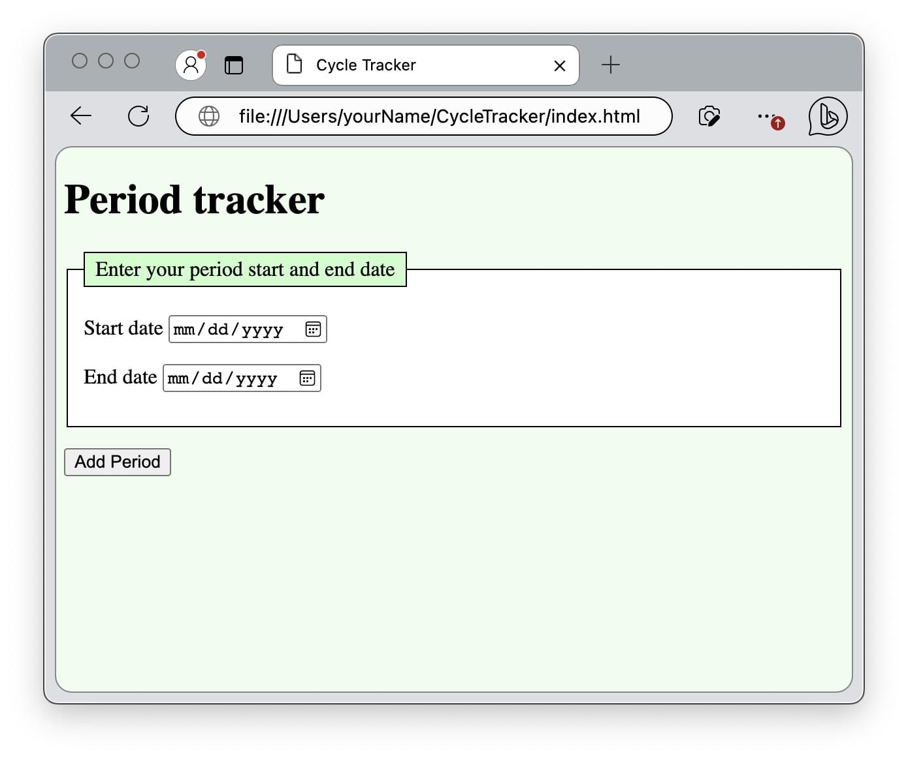

{{PreviousMenuNext("Web/Progressive_web_apps/Tutorials/CycleTracker/HTML_and_CSS", "Web/Progressive_web_apps/Tutorials/CycleTracker/JavaScript_functionality", "Web/Progressive_web_apps/Tutorials/CycleTracker")}}

{{PWASidebar}}

Service workers, and therefore PWAs, are [restricted to secure contexts](/en-US/docs/Web/Security/Secure_Contexts/features_restricted_to_secure_contexts). Secure contexts include SSL contexts served with the `https://` protocol and locally-delivered resources, including `127.0.0.1` and `localhost` URLs served with the `http://` protocol. In this section, we will discuss ways of serving the application locally and remotely with a secure connection.

In the previous section, we used HTML and CSS to create the shell of our period tracking application. In this section, we'll open the CycleTracker static content in a browser, view the content from a locally started development environment, and view the content on a remote, secure server.

## Viewing with the files:// protocol

Any browser will render your HTML. To view the HTML file with the CSS applied you created in the previous section, open the `index.html` file by navigating to it via your computer's file structure or from your browser using the "Open File" menu option.

With the `index.html` updated, and the `style.css` housed in the same directory, viewing the page in a narrow browser window should look similar to this screenshot:



We are viewing our page using the `file://` protocol. This works for the current state of our codebase, and will continue to suffice as we [add JavaScript functionality](/en-US/docs/Web/Progressive_web_apps/Tutorials/CycleTracker/JavaScript_functionality). However, manifest files and services workers, both PWA requirements, require a secure connection, as do several other APIs. PWAs need to be served from a web server over `https` or a local development environment, using `localhost`, `127.0.0.1`, with or without a port number. If we view our finished app using the `files://` protocol, our [manifest file](/en-US/docs/Web/Progressive_web_apps/Tutorials/CycleTracker/Manifest_file) will be ignored and any [service workers](/en-US/docs/Web/Progressive_web_apps/Tutorials/CycleTracker/Service_workers) we add will fail.

> **Note:** Serving your app over `https` isn't only good for PWAs, but for all websites as it ensures the information that transits between your web server and the user's browser is encrypted end to end. Several [Web APIs require secure contexts](/en-US/docs/Web/Security/Secure_Contexts/features_restricted_to_secure_contexts). Even if you aren't creating installable PWAs, as you add features to any web app, you may run into cases where a secure context is required.

We need a local development environment to work thru the tutorial. Part of [making a PWA installable](/en-US/docs/Web/Progressive_web_apps/Guides/Making_PWAs_installable) is a secure server. The files will need to be served over a secure connection on the web to access the benefits PWAs provide and to distribute our application as a PWA.

## localhost

The default method for setting up a local development environment varies by operating system. While the default location for the index and configuration files on your operating system may differ, most desktop operating systems enable a server configuration accessible to you, the developer.

For example, on MacOS, at least on Sierra and Monterey, entering `sudo apachectl start` enables an apache server. Once the server is started, entering `http://localhost` in the browser displays an basic web page that reads "It works!". By default, the HTML file displayed is `Library/WebServer/Documents/index.html.en`. To enable file extensions other than `.html.en` or to change the root directory away from `Library/WebServer/Documents/`, you have to edit the apache http configuration file, located at `/etc/apache2/httpd.conf`. The serve can be stopped with `sudo apachectl stop`.

The OS's default `localhost` has an easy-to-remember URL, but a difficult to remember server root location and configuration process. It also only allows for one local server in one location at a time. Fortunately, there are more intuitive server set up method options to create one or more local development environments on multiple ports.

## localhost with a port number

There are several {{glossary("IDE")}} extensions and programming-language specific packages that enable starting a development environment with a single click or terminal command. You can even start multiple local servers, each with a different port number.

You can run a local HTTP server using a [VSCode plugin](/en-US/docs/Learn/Common_questions/Tools_and_setup/set_up_a_local_testing_server#using_an_extension_in_your_code_editor), which enables running a local server on a single or different port. The [Preview on Web Server extension](https://marketplace.visualstudio.com/items?itemName=yuichinukiyama.vscode-preview-server) for the [VSCode](https://code.visualstudio.com/download) IDE creates a server at the root of the directory currently opened by the editor, with a default port of `8080`. VS Code extensions are configurable. The `previewServer.port` setting is the port number of the web server. The extensions default setting of `8080` can be edited and changed. By default, entering [`localhost:8080`](/) in the browser URL bar will load the page.

Note that the Preview on Web Server extension uses browserSync. When your development environment is started by this extension, [`localhost:3001`](/) provides an overview of the current server environment.

You can also create a [local server with the IntelliJ IDE](https://www.jetbrains.com/help/idea/creating-local-server-configuration.html), which comes with a [configurable built-in PHP web server](https://www.jetbrains.com/help/idea/php-built-in-web-server.html#configuring-built-in-web-server).

Learn how to [set up a local testing server](/en-US/docs/Learn/Common_questions/Tools_and_setup/set_up_a_local_testing_server) using [Python](/en-US/docs/Learn/Common_questions/Tools_and_setup/set_up_a_local_testing_server#using_python) or [local server side language](/en-US/docs/Learn/Common_questions/Tools_and_setup/set_up_a_local_testing_server#running_server-side_languages_locally) like PHP.

## Localhost with npx

If you have node installed, you may have npm and npx installed as well. At the command line, enter `npx -v`. If a version number is returned, you can use [http-server](https://www.npmjs.com/package/http-server), a non-configurable static HTTP server, without needing to install any requirements. Enter `npx http-server [path]` at the command line, where `[path]` is the folder where your index file is stored.

By default, entering `localhost:8080` in the browser URL bar will load the page. If you already started a server at port `8080`, it will automatically change the port number, starting the developer environment using an available port, such at `8081`.

You can choose a different port number. Entering `npx http-server /user/yourName/CycleTracker -p 8787` will start local server at port `8787` if available. If not, if you enter a port number that is already being used, you will get an `address already in use` or similar error. If successful, entering `localhost:8787` in the browser URL bar will render the index file stored as `~/user/yourName/CycleTracker/index.html`, or will display the directory contents of `~/user/yourName/CycleTracker/` if no index file is present.

This non-configurable static HTTP server suffices for our basic app. Apps served via `localhost` and `127.0.0.1` are exempt from https and always considered secure. Browser insecure warnings, if given, can be bypassed. While not necessary, to configurable your local web server to be served over HTTPs, you can [add a built-in SSL certificate](https://github.com/lwsjs/local-web-server/wiki/How-to-get-the-%22green-padlock%22-using-the-built-in-certificate). With the certificate, you will be able to install and run [local-web-server](<https://github.com/lwsjs/local-web-server/wiki/How-to-launch-a-secure-local-web-server-(HTTPS)>) from the command line to serve your project locally over `https`, preventing any security warning.

```
$ npm install -g local-web-server
$ cd ~/user/yourName/CycleTracker/
$ ws --https
Listening on https://YourComputerName.local:8000, https://127.0.0.1:8000, https://192.168.1.7:8000
```

In the above, you may need to prefix the install with `sudo`.

> **Note:** If you are seeking privacy, realize you are building this PWA yourself and it can be installed on your own machine from your own development environment, without ever accessing the Internet. This app has no tracking. It's as private an app as you get.

## Secure external server

The previous options are fine, and necessary, for testing your application as you progress thru this PWA tutorial, or any web development project. While you can host your web app on your device and make it available to anyone with an Internet connection, this is not recommended.

To get the added features of PWAs, including single click installation, a standalone UI, and admission to app stores, it needs to be a PWA, which means it needs a service worker, which means we will need a secure connection. To distribute your app, enabling others to view, use, and install your PWA, you'll want to have your content hosted and available on a secure _remote_ server.

When officially publishing a PWA, you will likely want to invest in a [domain name and web hosting](/en-US/docs/Learn/Common_questions/Tools_and_setup/How_much_does_it_cost#hosting). For open source projects, where developers can learn from the codebase and even contribute back to the project, you can host your progress on [GitHub Pages](https://pages.github.com/).

## GitHub pages

The current state of the CycleTracker application is viewable on GitHub, served securely at [https://mdn.github.io/pwa-examples/cycletracker/html_and_css](https://mdn.github.io/pwa-examples/cycletracker/html_and_css). We've posted the files to the MDN GitHub account. Similarly, if you have a [GitHub](https://github.com) account, you can post it to yours. Just note that while securely served over SSL, actions on GitHub are not necessarily private, and all GitHub pages are public. If you live in an area with a repressive government that tracks menstrual cycles, consider copying and pasting the code rather than forking it.

To create a publicly available secure site, create a [GitHub pages site](https://docs.github.com/en/pages/getting-started-with-github-pages/creating-a-github-pages-site). Create a repository named `<username>.github.io`, where `<username>` is your GitHub username. Create a `gh-pages` branch. This branch of your application will be available at `https://<username>.github.io`.

As noted, all GitHub Pages are publicly available on the internet, even if you set the repository to private. As the period data is saved using localStorage, the application will be available via the GitHub URL, but the user's data is only available in the one browser on the one device where the data was entered. Deleting the localStorage directly, which is done in the browser, will delete all the stored data.

If you don't want your PWA to be top level, you can make your app appear as if it is residing in a subdirectory. You can either create a subdirectory within the `<username>.github.io` repository, or publish from your PWA's separate repository. By [configuring a publishing source](https://docs.github.com/en/pages/getting-started-with-github-pages/configuring-a-publishing-source-for-your-github-pages-site) within your PWA repository, your app will be visible at `https://<username>.github.io/<repository>` where `<repository>` is the repository's name. You can set GitHub to auto-publish your site when changes are [published to a specific branch](https://docs.github.com/en/pages/getting-started-with-github-pages/configuring-a-publishing-source-for-your-github-pages-site#publishing-from-a-branch) within that repository, including `main`.

In the case of the CycleTracker demo app in the various stages of development, the `<username>` is `mdn` and the repository is `pwa-examples`. Because this repository has multiple example PWAs, each with progress at several steps in the development process, the files, and therefore the PWA, are nested a few levels deep.

Note that you can [configure a custom domain for a GitHub pages site](https://docs.github.com/en/pages/configuring-a-custom-domain-for-your-github-pages-site).

## Up next

We are able to view a styled, static version of the CycleTracker application shell. Now that we know how to view the application we are about to build, let's get to building it. Up next, we create `app.js`, the JavaScript that converts our static design into a fully functional web application that stores data locally, on the users machine.

{{PreviousMenuNext("Web/Progressive_web_apps/Tutorials/CycleTracker/HTML_and_CSS", "Web/Progressive_web_apps/Tutorials/CycleTracker/JavaScript_functionality", "Web/Progressive_web_apps/Tutorials/CycleTracker")}}
