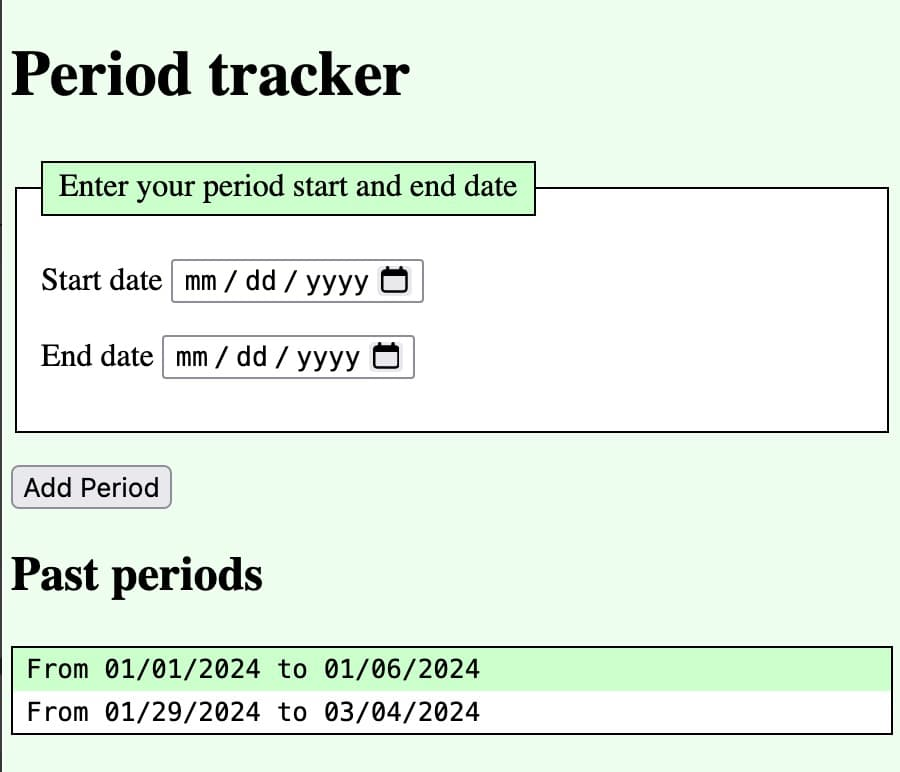

PWAs are progressively enhanced web applications. To build our PWA, we need to start with a fully-functioning web application. In this section, we will markup the HTML for a static web page and enhance the appearance with CSS.

In the next section, we [add JavaScript functionality](/en-US/Docs/Web/Progressive_web_apps/tutorials/intro/javascript) to create a functional web application. In subsequent sections, we progressively enhance the application to make a PWA that is installable and works offline.

## HTML static web content

Our project is to create a menstrual cycle tracker. The first step in this introductory [PWA tutorial](/en-US/Docs/Web/Progressive_web_apps/tutorials/) is to write the HTML and CSS.

We create an HTML file, with meta data in the head and a static web page containing a form and a placeholder to display user inputted data. We'll then add an external CSS stylesheet to improve the site's appearance.

To complete this tutorial, it is helpful to have a basic level of understanding of [HTML](/en-US/docs/Learn/Getting_started_with_the_web/HTML_basics), [CSS](/en-US/docs/Learn/Getting_started_with_the_web/CSS_basics), and [JavaScript](/en-US/docs/Learn/Getting_started_with_the_web/JavaScript_basics). If you're not familiar with these, MDN is the home of [Getting Started](/en-US/docs/Learn/Getting_started_with_the_web/), an introduction to web development series.

Our static site HTML, with placeholders for yet to be created external CSS and JavaScript files, is:

```html
<!DOCTYPE html>
<html lang="en-US">
  <head>
    <meta charset="utf-8" />
    <meta name="viewport" content="width=device-width" />
    <title>Cycle Tracker</title>
    <link rel="stylesheet" href="style.css" />
  </head>
  <body>
    <fieldset>
      <legend>Enter your period start and end date</legend>
      <p>
        <label for="start-date">Start date</label>
        <input type="date" id="start-date" required />
      </p>
      <p>
        <label for="end-date">End date</label>
        <input type="date" id="end-date" required />
      </p>
    </fieldset>
    <p>
      <button type="submit">Add Period</button>
    </p>
    <section id="past-periods"></section>
    <script src="app.js" defer></script>
  </body>
</html>
```

Copy this HTML and save it in a file called `index.html`.

### HTML content explained

Even if the HTML in `index.html` is familiar to you, we recommend reading the thru this section before adding the [placeholder data](#Placeholder_text) and [`styles.css`](#css-file), and creating `app.js`, the [application's JavaScript](/en-US/Docs/Web/Progressive_web_apps/tutorials/intro/javascript) that makes this web page function.

The HTML's first line is a {{glossary("doctype")}} preamble, which ensures the content behaves correctly.

```html
<!DOCTYPE html>
```

The root {{HTMLelement("html")}} tags wrap all the content with the [`lang`](/en-US/docs/Web/HTML/Global_attributes/lang) attribute defining the primary language of the page.

 ```html
<!DOCTYPE html>
<html lang="en-US">
</html>
```

### Document head

The {{HTMLelement("head")}} contains machine-readable information about the web application that, with the exception of the `<title>` contents which may be displayed as the heading of the browser tab, is not visible to the user.

The `<head>` includes all the [meta data](/en-US/docs/Learn/HTML/Introduction_to_HTML/The_head_metadata_in_HTML), including the character set definition which defines the [character encoding](/en-US/docs/Glossary/Character_encoding) and the [viewport](/en-US/docs/Web/HTML/Viewport_meta_tag) {{HTMLelement("meta")}} tag which ensures the page renders at the width of the viewport and isn't shrunken down when loaded on very small screens.

```html
  <head>
    <meta charset="utf-8" />
    <meta name="viewport" content="width=device-width" />
  </head>
```

We set the title of the page to "Cycle Tracker" with the {{HTMLelement("title")}} element. The title appears in the browser tab when the page is loaded, in search engine results, and is the default title used when a user bookmarks a web page. While this is a menstrual cycle tracking application, the shortened title is more discreet.

```html
<title>Cycle Tracker</title>
```

We include a {{HTMLelement("link")}} element for our yet-to-be-written stylesheet.

```html
<link rel="stylesheet" href="style.css" />
```

The HTML `<link>` element is used to specify a relationship between the current document and an external resource. There are more than 25 defined values for the [`rel`](/en-US/docs/Web/HTML/Attributes/rel) attribute – and many more values that are not in any specification. The most common value, `rel="stylesheet"`, imports an external resource as a stylesheet.

### Document contents

The {{HTMLelement("body")}} element contains all the content we want displayed when users visit the site on the Internet.

Within the `<body>`, we include the name of the app as a level-1 heading using {{HTMLelement("h1")}} and a {{HTMLelement("form")}}.

```html
<body>
  <h1>Period tracker</h1>
  <form>
  </form>
</body>
```

Within the `<form>`, we include a {{HTMLelement("fieldset")}} with a {{HTMLelement("legend")}} labeling the purpose of that set of form fields. Within the `<fieldset>`, we include two paragraphs ({{HTMLelement("p")}}), each with a date picker for the start and end dates of each menstrual cycle, along with their associated {{HTMLelement("label")}}.

The date pickers are {{HTMLElement("input")}} elements of type {{HTMLElement("input/date", "date")}}. We include the [`required`](/en-US/docs/Web/HTML/Attributes/required) attribute to reduce user errors by preventing the user from accidetally submitting an incomplete form.

To associate a `<label>` with a form control, each `<input>` has an [`id`](/en-US/docs/Web/HTML/Attributes/id) attribute matching the [`for`](/en-US/docs/Web/HTML/Attributes/for) attribute of the associated {{HTMLelement("label")}}. The associated label provides each `<input>` with an accessible name.

```html
<label for="start-date">Start date</label>
<input type="date" id="start-date" required />
```

We include a {{HTMLelement("button")}} element which submits the form and label the button "Add period" by including that text between the opening and closing tags. The `type="submit"` is optional, as `submit` is the default type for `<button>`.

```html
<form>
  <fieldset>
    <legend>Enter your period start and end date</legend>
    <p>
      <label for="start-date">Start date</label>
      <input type="date" id="start-date" required />
    </p>
    <p>
      <label for="end-date">End date</label>
      <input type="date" id="end-date" required />
    </p>
  </fieldset>
  <p>
    <button type="submit">Add Period</button>
  </p>
</form>
```

We encourage you to [learn more about making accessible web forms](/en-US/docs/Learn/Forms).

When creating an [offline experience](/en-US/Docs/Web/Progressive_web_apps/tutorials/intro/offline) we will add another `<button>` that will be programmed to provide an alternative to the default browser PWA installation UI.

### Placeholder and placeholder text

We then include an empty {{HTMLElement("section")}}. This container will be populated using JavaScript.

```html
<section id="past-periods"></section>
```

When the user submits the form, we will use JavaScript to capture the data and present a list of past periods along with a header for the section.

We temporarily hardcode placeholder content within the placeholder `<section>` to have something to style as we write the page's CSS. Remove or comment out the temporary content once you are satisfied with the content's appearance.

```html
<section id="past-periods">
  <h2>Past periods</h2>
  <ul>
    <li>From 01/01/2024 to 01/06/2024</li>
    <li>From 01/29/2024 to 03/04/2024</li>
  </ul>
</section>
```

### JavaScript placeholder

Before closing the `</body>`, we include a link to the `app.js` JavaScript file. We include the [`defer`](/en-US/docs/Learn/JavaScript/First_steps/What_is_JavaScript#async_and_defer) attribute to defer the loading of this script and ensure the JavaScript is executed after the document's HTML has been parsed.

```html
<script src="app.js" defer></script>
```

The `app.js` file will include all the workings of our application, including the event handlers for the `<button>`, saving the data submitted to local storage, and displaying cycled within the content of the body.

The [HTML file for this step](step.html) is complete.

## CSS file

Copy the following CSS in a new file and save the file as [`style.css`](style.css):

```css
body {
  margin: 1vh 1vw;
  background-color: #efe;
}
ul, fieldset, legend {
  border: 1px solid;
  background-color: #fff;
}
ul {
  padding: 0;
  font-family: monospace;
}
li,
legend {
  list-style-type: none;
  padding: 0.2em 0.5em;
  background-color: #cfc;
}
li:nth-of-type(even) {
  background-color: inherit;
}
```

If any of the above CSS looks unfamiliar to you, look up the [CSS property](/en-US/docs/Glossary/Property/CSS), or the [type](/en-US/docs/Web/CSS/Type_selectors) or [`:nth-of-type()`](/en-US/docs/Web/CSS/:nth-of-type) pseudo-class [selector](/en-US/docs/Web/CSS/CSS_Selectors).

With the `index.html` updated, and the `style.css` housed in the same directory, viewing the page in a narrow browser window should look similar to this screenshot:



Before moving on, [comment](/en-US/docs/Learn/HTML/Introduction_to_HTML/Getting_started#html_comments) out or delete the placeholder text:

```html
<section id="past-periods">
  <!--
  <h2>Past periods</h2>
  <ul>
    <li>From 01/01/2024 to 01/06/2024</li>
    <li>From 01/29/2024 to 03/04/2024</li>
  </ul>
  -->
</section>
```

### Up next

Before converting a web app into a progressive web app — before adding the [manifest file](/en-US/Docs/Web/Progressive_web_apps/tutorials/intro/manifest), [secure connection](/en-US/Docs/Web/Progressive_web_apps/tutorials/intro/secure), and [service worker](/en-US/Docs/Web/Progressive_web_apps/tutorials/intro/service_worker) that define a PWA — we have to make our application work. Up next, we write the [JavaScript functionality](/en-US/Docs/Web/Progressive_web_apps/tutorials/intro/html) for `app.js` so we have a functioning application that can be progressively enhanced into a PWA.
