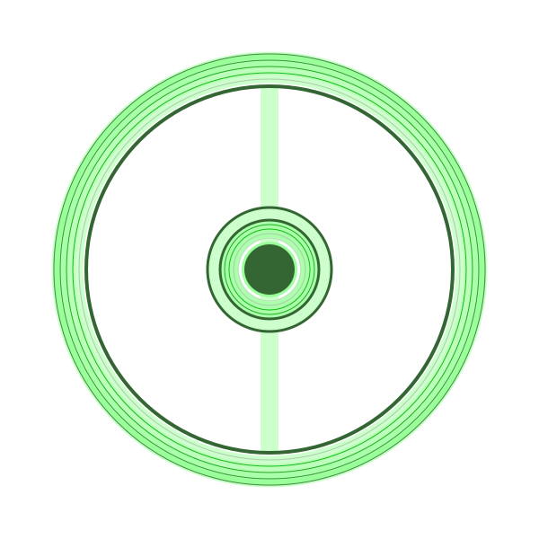

{{PreviousMenuNext("Web/Progressive_web_apps/Tutorials/Intro/JavaScript_functionality", "Web/Progressive_web_apps/Tutorials/Intro/Secure", "Web/Progressive_web_apps/Tutorials/Intro")}}

{{PWASidebar}}

A PWA manifest file is a JSON file that provides information about the features of that app to make it look and behave like a native app when installed on the user's device. The manifest contains metadata for your app, including its name, icons, and presentational directives.

The manifest file contains information about the PWA's identity, presentation, and iconography. While the only requirement is to include a name using the `name` or `short_name` key, you should also include icon information, the URL to be opened when the PWA is launched, and type of application viewport in which the PWA should be viewed.

A minimalist manifest file for our menstrual cycle tracking app could look like this:

```js
{
  "short_name": "CT",
  "icons": [
    {
      "src": "icon-512.png",
      "sizes": "512x512"
    }
  ]
}
```

Before saving the manifest file and linking to it from our HTML file, let's discuss we can develop a still brief but more informative JSON object to define the identity, presentation, and iconography of the PWA. Yes, the above would work, but let's discuss a few more keys that enable manifest files to better define the appearance of our PWA.

## App identity

To identity your PWA the JSON must include a `name` or `short_name` key, or both, to define the PWA name. It can also include a `description`.

- [`name`](/en-US/docs/Web/Manifest/name)
  - : The name of the PWA. This is the name used when the operating system lists applications, as the label next to the application icon, etc.
- [`short_name`](/en-US/docs/Web/Manifest/short_name)
  - : The name of the PWA displayed to the user if there isn't enough space to display the `name`. It is used as the label for icons on phone screens, including in the "Add to Home Screen" dialog on iOS.

When both the `name` and `short_name` are present, the `name` is used in most instances, with the `short_name` used when there is a limited space to display the application name.

- [`description`](/en-US/docs/Web/Manifest/description)
  - : Explanation of what the application does. It provides an [accessible description](/en-US/docs/Web/Accessibility/ARIA/Attributes/aria-description) of the application's purpose and function.

### Task

Write the first few lines of your manifest file. You can use the text below or more discreet values and a description of your choosing.

### Example solution

```js
{
  "name": "Menstrual Cycle Tracker",
  "short_name": "CT",
  "description": "Securily and confidentially track your menstrual cycle. Enter the start and end dates of your periods, saving the data to your browser."
}
```

## App presentation

The appearance, or presentation, of a PWA's installed and offline experiences are defined in the manifest. Presentation manifest include the `start_url` and `display` keys, and keys which can be used to [customize your app colors](/en-US/docs/Web/Progressive_web_apps/How_to/Customize_your_app_colors), including `theme_color` and `background_color`.

- [`start_url`](/en-US/docs/Web/Manifest/start_url)

  - : The start page when a user launches the PWA.

- [`display`](/en-US/docs/Web/Manifest/display)
  - : Controls the app's display mode including `fullscreen`, `standalone`, which displays the [PWA as a standalone application](/en-US/docs/Web/Progressive_web_apps/How_to/Create_a_standalone_app), `minimal-ui`, which is similar to a standalone view but with UI elements for controlling navigation, and `browser`, which opens the app in a regular browser view.

There is also an `orientation` key to define the PWA's default orientation as `portrait` or `landscape`. As our app works either way, we'll omit this key.

### Colors

- [`theme_color`](/en-US/docs/Web/Manifest/theme_color)
  - : The default [color of operating system and browser UI elements](/en-US/docs/Web/Progressive_web_apps/How_to/Customize_your_app_colors#define_a_theme_color) such as the status bar on some mobile experiences and the application title bar on desktop operating systems.
- [`background_color`](/en-US/docs/Web/Manifest/background_color)
  - : A placeholder color to be displayed as the [background of the app](/en-US/docs/Web/Progressive_web_apps/How_to/Customize_your_app_colors#customize_the_app_window_background_color) until the CSS is loaded. To create a smooth transition between app launch and load, it is recommended to use the [`<color>`](/en-US/docs/Web/CSS/color_value) declared as the app's [`background-color`](/en-US/docs/Web/CSS/background-color) color.

### Task

Add presentation definitions to the manifest file you began creating in the previous task.

### Example solution

As the example application is a single page, we can use `"/"`, or omit the key altogether. For that same reason, we can display our period tracker without browser tools, setting the `display` to `standalone`.

In [our CSS](/en-US/Docs/Web/Progressive_web_apps/Tutorials/Intro/HTML_and_CSS#CSS_file), the `background-color: #efe;` is set on the `body` element selector. We use `#eeffee` to ensure a smooth transition from placeholder appearance to app load.
}

```js
{
  "name": "...",
  "short_name": "...",
  "description": "...",
  "start_url": "/",
  "theme_color": "#eeffee",
  "background_color": "#eeffee",
  "display": "standalone"
}
```

## App iconography

PWA icons help users identify your app, make it more visually appealing, and improve discoverability. The PWA app icon appears on home screens, app launchers, browser address bars, in app store search results: When users search for apps in the app store, the PWA icon will be displayed in the search results. The size of the rendered icon and the file requirements varies depending on where it is displayed and by whom. The manifest is where you define your images.

Within the manifest JSON object, the `icons` key specifies an array of one or more icon objects for use in different contexts, each with a `src` and `sizes` key, and optional `type` and `purpose` keys. Each icon object's' `src` list the source of a single image file. The `sizes` key provides a list of space-separated sizes for which that particular image should be used or the keyword `any`; the value is the same as the {{HTMLElement("link")}} element's [`sizes`](/en-US/docs/Web/HTML/Element/link#sizes) attribute. The `type` key lists the image's MIME type.

```js
{
  "name": "MyApp",
  "icons: [
    {
      "src": "icon/tiny.webp",
      "sizes": "48x48"
    },
    {
      "src": "icon/small.png",
      "sizes": "72x72 96x96 128x128 256x256",
      "purpose": "maskable"
    },
    {
      "src": "icon/large.png",
      "sizes": "512x512"
    },
    {
      "src": "icon/scalable.svg",
      "sizes": "any"
    }
  ]
}
```

The `purpose` keys should be set to `maskable` defining [icona as adaptive](https://web.dev/maskable-icon/).

All icons should have the same look and feel to ensure users recognize your PWA, but the larger the icon, the greater the detail it can contain. All icon files are squares. Include safe zones so that when the image is masked by the operating system, it renders okay as a circle.

### Task

Add the icons to the manifest file you have been constructing.

Playing with the words "cycle" and "period" of our period cycle tracker and the green theme color we've chosen, our icon images could all be light green squares with a green circle. Our smallest size `circle.ico`, and icon file that is just a circle representing the period punctuation mark and app theme color, with our in-between images, `circle.svg`, `tire.svg`, and `wheel.svg`, adding more detail moving from a plain circle to a tire as it gets larger, with our largest icons being a detailed wheel with spokes and shadows. That said, designing icons is beyond the scope of this tutorial.

```html hidden
<div>
  
  
  
</div>
```

```css hidden
div {
  display: flex;
  gap: 5px;
}
img {
  width: 33%;
}
```

{{EmbedLiveSample("PWA iconography", 600, 250)}}

### Example solution

```js
{
  "name": "...",
  "short_name": "...",
  "description": "...",
  "start_url": "...",
  "theme_color": "...",
  "background_color": "...",
  "display": "...",
  "icons": [
        {
      "src": "circle.ico",
      "sizes": "48x48"
    },
    {
      "src": "icon/circle.svg",
      "sizes": "72x72 96x96",
      "purpose": "maskable"
    },
    {
      "src": "icon/tire.svg",
      "sizes": "128x128 256x256"
    },
    {
      "src": "icon/wheel.svg",
      "sizes": "512x512"
    }
  ]
}
```

## Adding the manifest to the app

You now have a fully usable manifest file. Time to save it and link to it from our HTML file.

The manifest file extension can be the specification suggestion `.webappmanifest`. However, being a JSON file, it is most commonly saved with the browser-supported `.json` extension.

PWAs require a manifest file. We have a fully functional app, but it's not yet a PWA. We have to add the manifest the app. The web manifest is an external JSON file. To include the external JSON resource, the `rel="manifest"` is used. The `href` attribute of the `<link>` points to the location of the resource.

```html
<link rel="manifest" href="cycletracker.json" />
```

The `<link>` element is most commonly used to link to stylesheets and, with PWAs, the required manifest file, but is also used to establish site icons (both "favicon" style icons and icons for the home screen and apps on mobile devices) among other things.

```html
<link rel="shortcut icon" href="icons/circle.svg" />
```

When using the `.webmanifest` extension, set `type="application/manifest+json"` if your server doesn't support that MIME type.

#### Task

Save the manifest file that you have created in the steps above, then link to it from the `index.html` file.

#### Example solution

View the [`cycletracker.manifest` file](https://mdn.github.io/pwa-examples/Intro/Manifest_file/cycletracker.manifest) and view the [project source code](https://github.com/mdn/pwa-examples/tree/master/Intro/Manifest_file) on GitHub.

## Up next

Now that we have a PWA manifest file, let's [create a secure connection](/en-US/Docs/Web/Progressive_web_apps/Tutorials/Intro/Secure). While no frameworks are needed to create a PWA, we will use X to create a secure connection; a PWA requirement.

{{PreviousMenuNext("Web/Progressive_web_apps/Tutorials/Intro/JavaScript_functionality", "Web/Progressive_web_apps/Tutorials/Intro/Secure", "Web/Progressive_web_apps/Tutorials/Intro")}}
