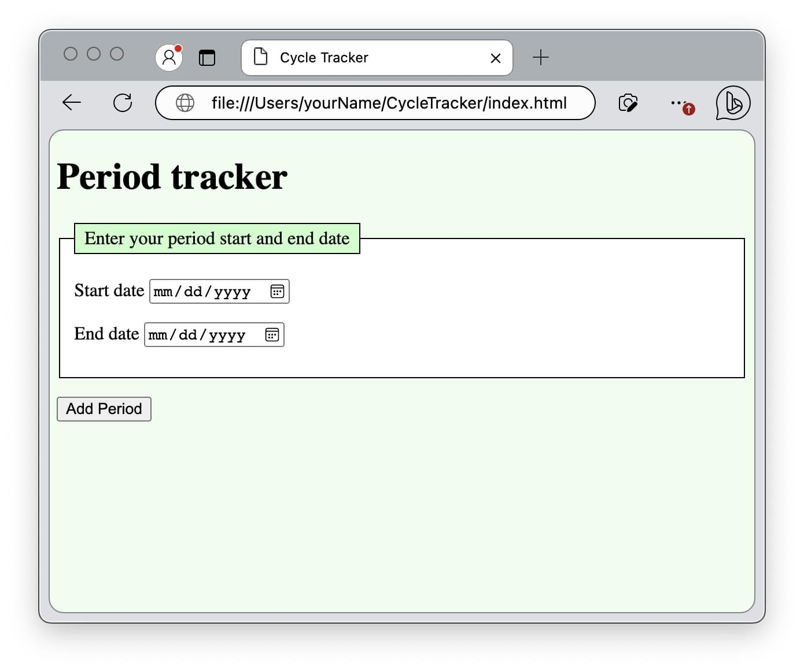

{{PreviousMenuNext("Web/Progressive_web_apps/Tutorials/Intro/HTML_and_CSS", "Web/Progressive_web_apps/Tutorials/Intro/JavaScript_functionality", "Web/Progressive_web_apps/Tutorials/Intro")}}

{{PWASidebar}}

Sevice workers, and therefore PWAs, are [restricted to secure contexts](/en-US/docs/Web/Security/Secure_Contexts/features_restricted_to_secure_contexts). Secure contexts include SSL contexts served with the `https://` protocol and locally-delivered resources, including `127.0.0.1` and `localhost` URLs served with the `http://` protocol. In this section, we will discuss ways of serving the application locally and remotely with a secure connection.

In the previous section, we used HTML and CSS to create the shell of our period tracking application. In this section, we'll open the CycleTracker static content in a browser, view the content from a locally started development environment, and view the content on a remote, secure server.

## Opening files with a browser

To view the HTML file with the CSS applied you created in the previous section, open the `index.html` file by navigating to it via your computer's file structure or from your browser using the "Open File" menu option.

With the `index.html` updated, and the `style.css` housed in the same directory, viewing the page in a narrow browser window should look similar to this screenshot:



We are viewing our page using the `file://` protocol. However, manifest files and services workers require apps to run on a web server over `https` or a local development environment, using `localhost`, `127.0.0.1`, with or without a port number. While we can add JS functionality without this, when viewed via the `file://` protocal, our [manifest file]() will be ignored and any [service workers]() we add will fail.

We need a local development environment to work thru the tutorial. To enable others to access CycleTracker as a PWA, we will need a secure server. The files will need to be served over a secure connection on the web to access the benefits PWAs provide and to distribute our application as a PWA.

## localhost

The default method for setting up a local development environment varies by operating system. While the default location for the index and configuration files on your operating system may differ, most desktop operating systems enable a server configuration accessible to you, the developer.

For example, on MacOS, at least on Sierra and Monterey, entering `sudo apachectl start` enables an apache server. Once the server is started, entering `http://localhost` in the browser displays an basic web page that reads "It works!". By default, the HTML file displayed is `Library/WebServer/Documents/index.html.en`. To enable file extensions other than `.html.en` or to change the root directory away from `Library/WebServer/Documents/`, you have to edit the apache http configuration file, located at `/etc/apache2/httpd.conf`.

The OS's default `localhost` has an easy-to-remember URL, but a difficult to remember server root location and configuration process. It also only allows for one local server in one location at a time. Fortunately, there are more intuitive server set up method options to create one or more local development environments on multiple ports

## localhost with a port number

You can run a local HTTP server using a [VSCode plugin](/en-US/docs/Learn/Common_questions/Tools_and_setup/set_up_a_local_testing_server#using_an_extension_in_your_code_editor), which enables running a local server on a single or different port. The [Preview on Web Server extension](https://marketplace.visualstudio.com/items?itemName=yuichinukiyama.vscode-preview-server) for the [VSCode](https://code.visualstudio.com/download) {{glossary("IDE")}} creates a server at the root of the directory currently opened by the editor, with a default port of `8080`. VS Code exttensions are configurable. The `previewServer.port` setting is the port number of the web server. The default setting of `8080` can be changed.

You can also create a [local server with the IntelliJ IDE](https://www.jetbrains.com/help/idea/creating-local-server-configuration.html), which comes with a [configurable built-in PHP web server](https://www.jetbrains.com/help/idea/php-built-in-web-server.html#configuring-built-in-web-server)

Learn how to [set up a local testing server](/en-US/docs/Learn/Common_questions/Tools_and_setup/set_up_a_local_testing_server) using [Python](/en-US/docs/Learn/Common_questions/Tools_and_setup/set_up_a_local_testing_server#using_python), or [local server side language](/en-US/docs/Learn/Common_questions/Tools_and_setup/set_up_a_local_testing_server#running_server-side_languages_locally) like PHP.

## Localhost and secure local servers with node and npm

If you have node installed, you may have npm and npx installed as well. At the command line, enter `npx -v`. If a version number is returned, you can use [http-server](https://www.npmjs.com/package/http-server), a non-configurable static HTTP server, without needing to install any requirements. Enter `npx http-server [path]` at the command line, where `[path]` is the folder where your index file is stored. By default, entering `localhost:8080` in the browser URL bar will load the page.

You can choose a different port number. Entering `npx http-server /user/yourName/CycleTracker -p 8787` will start local server at port 8787. Entering `localhost:8787` will render the index file stored as `~/user/yourName/CycleTracker/index.html`, or will display the directory contents of `~/user/yourName/CycleTracker/` if no index file is present.

This non-configurable static HTTP server suffices for our basic app. For a configurable secure local web server served over HTTPs, you will need to [add a built-in SSL certificate](https://github.com/lwsjs/local-web-server/wiki/How-to-get-the-%22green-padlock%22-using-the-built-in-certificate) to be able to serve https. With a certificate, you can now install and run[local-web-server](<https://github.com/lwsjs/local-web-server/wiki/How-to-launch-a-secure-local-web-server-(HTTPS)>) from the command line to serve your project locally over https without a security warning.

```
$ npm install -g local-web-server
$ cd ~/user/yourName/CycleTracker/
$ ws --https
Listening on https://YourComputerName.local:8000, https://127.0.0.1:8000, https://192.168.1.7:8000
```

In the above, you may need to prefix the install with `sudo` if you don't have permissions.

## Secure external server

The previous options are fine, and necessary, for testing your application as you progress thru this CycleTracker tutorial, or any web development project. While you can host your web app on your device, making it available to anyone with an Internet connection, but it is not recommended.

To get the added features of PWAs, including single click installation, a standalone UI, and admission to app stores, it needs to be a PWA, which means it needs a service worker, which means we will need a secure connection. To distribute your app, enabling others to view, use, and install your PWA, you'll want to have your content hosted and available on a secure _remote_ server.

When officially publishing a PWA, you will likely want to invest in a [domain name and web hosting](/en-US/docs/Learn/Common_questions/Tools_and_setup/How_much_does_it_cost#hosting). For open source projects, where developers can learn from what the codebase and even contribute back to the project, you can host your progress on [GitHub Pages](https://pages.github.com/).

## Github pages

The current state of the cycleTracker application is viewable on Github, served securely at [https://mdn.github.io/pwa-examples/cycletracker/html_and_css]. We've posted the files to the MDN Github account. Similarly, if you have a [Github](https://github.com) account, you can post it to yours.

To create a publically available secure site, create a [Github pages site](https://docs.github.com/en/pages/getting-started-with-github-pages/creating-a-github-pages-site). Create a repository named `<username>.github.io`, where `<username>` is your github username. Create a `gh-pages` branch. This branch of your application will be available at `https://<username>.github.io`.

This page, as all GitHub Pages sites, are publicly available on the internet, even if you set the repository to private. As the period data is saved using localStorage, the application will be available via the github URL, but a user's data is only available in the one browser on the one device where the data was entered.

If you don't want your PWA to be top level, you can make your app appear as if it is residing in a subdirectory. You can either create a subdirectory within the `<username>.github.io` repository, or publish from your PWA's separate repository. By [configuring a publishing source](https://docs.github.com/en/pages/getting-started-with-github-pages/configuring-a-publishing-source-for-your-github-pages-site) within your PWA repository, your app will be visible at `https://<username>.github.io/<repository>` where `<repository>` is the respository's name. You can set Github to auto-publish your site when changes are [published to a specific branch](https://docs.github.com/en/pages/getting-started-with-github-pages/configuring-a-publishing-source-for-your-github-pages-site#publishing-from-a-branch) within that repository, including `main`.

In the case of the CycleTracker demo app in the various stages of development, the `<username>` is `mdn` and the repository is `pwa-examples`. Because this repository has mutiple example PWAs, each with progress at several steps in the development process, the files, and therefore the PWA, are nested a few levels deep.

Note that you can [configure a custom domain for a GitHub pages site](https://docs.github.com/en/pages/configuring-a-custom-domain-for-your-github-pages-site).

## Up next

We are able to view a styled, working version of the CycleTracker application that can store and retrieve data by opening the `index.html` using the `file://` protocol on our local directory structure, PWAs must be served of `https://` or `localhost`.

Now that we have a working application, a manifest file, and a [secure connection](/en-US/docs/Web/Progressive_web_apps/Tutorials/Intro/Secure_connection), all we have left to do is create the service worker.

set up a secure development environment. Up next, we write the for `app.js` so we have a functioning application that can be progressively enhanced into a PWA.

{{PreviousMenuNext("Web/Progressive_web_apps/Tutorials/Intro/HTML_and_CSS", "Web/Progressive_web_apps/Tutorials/Intro/JavaScript_functionality", "Web/Progressive_web_apps/Tutorials/Intro")}}
