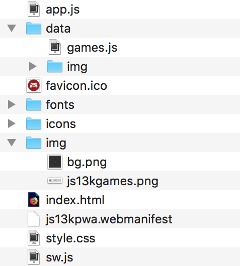

{{PreviousMenuNext("Web/Progressive_web_apps/Tutorials/js13kGames", "Web/Progressive_web_apps/Tutorials/js13kGames/Offline_Service_workers", "Web/Progressive_web_apps/Tutorials/js13kGames")}}

{{PWASidebar}}

In this article, we will analyze the [js13kPWA](https://mdn.github.io/pwa-examples/js13kpwa/) application, why it is built that way, and what benefits it brings.

The [js13kPWA](https://mdn.github.io/pwa-examples/js13kpwa/) website structure is quite simple: it consists of a single HTML file ([index.html](https://github.com/mdn/pwa-examples/blob/master/js13kpwa/index.html)) with basic CSS styling ([style.css](https://github.com/mdn/pwa-examples/blob/master/js13kpwa/style.css)), and a few images, scripts, and fonts. The folder structure looks like this:



### The HTML

From the HTML point of view, the app shell is everything outside the content section:

```html
<!doctype html>
<html lang="en">
  <head>
    <meta charset="utf-8" />
    <title>js13kGames A-Frame entries</title>
    <meta
      name="description"
      content="A list of A-Frame entries submitted to the js13kGames 2017 competition, used as an example for the MDN articles about Progressive Web Apps." />
    <meta name="author" content="end3r" />
    <meta name="theme-color" content="#B12A34" />
    <meta name="viewport" content="width=device-width, initial-scale=1" />
    <meta
      property="og:image"
      content="https://js13kgames.com/img/js13kgames-banner.png" />
    <link rel="icon" href="favicon.ico" />
    <link rel="stylesheet" href="style.css" />
    <link rel="manifest" href="js13kpwa.webmanifest" />
    <script src="data/games.js" defer></script>
    <script src="app.js" defer></script>
  </head>
  <body>
    <header>
      <p>
        <a class="logo" href="https://js13kgames.com">
          
        </a>
      </p>
    </header>
    <main>
      <h1>js13kGames A-Frame entries</h1>
      <p class="description">
        List of games submitted to the
        <a href="https://js13kgames.com/aframe">A-Frame category</a> in the
        <a href="https://2017.js13kgames.com">js13kGames 2017</a> competition.
        You can
        <a href="https://github.com/mdn/pwa-examples/blob/master/js13kpwa"
          >fork js13kPWA on GitHub</a
        >
        to check its source code.
      </p>
      <button id="notifications">Request dummy notifications</button>
      <section id="content">// Content inserted in here</section>
    </main>
    <footer>
      <p>
        © js13kGames 2012-2018, created and maintained by
        <a href="https://end3r.com">Andrzej Mazur</a> from
        <a href="https://enclavegames.com">Enclave Games</a>.
      </p>
    </footer>
  </body>
</html>
```

The {{htmlelement("head")}} section contains some basic info like title, description and links to CSS, web manifest, games content JS file, and app.js — that's where our JavaScript application is initialized. The {{htmlelement("body")}} is split into the {{htmlelement("header")}} (containing linked image), {{htmlelement("main")}} page (with title, description and place for a content), and {{htmlelement("footer")}} (copy and links).

The app's only job is to list all the A-Frame entries from the js13kGames 2017 competition. As you can see it is a very ordinary, one page website — the point is to have something simple so we can focus on the implementation of the actual PWA features.

### The CSS

The CSS is also as plain as possible: it uses {{cssxref("@font-face")}} to load and use a custom font, and it applies some simple styling of the HTML elements. The overall approach is to have the design look good on both mobile (with a responsive web design approach) and desktop devices.

### The main app JavaScript

The app.js file does a few things we will look into closely in the next articles. First of all it generates the content based on this template:

```js
const template = `<article>
  
  <h3>#POS. NAME</h3>
  <ul>
  <li><span>Author:</span> <strong>AUTHOR</strong></li>
  <li><span>Twitter:</span> <a href='https://twitter.com/TWITTER'>@TWITTER</a></li>
  <li><span>Website:</span> <a href='http://WEBSITE/'>WEBSITE</a></li>
  <li><span>GitHub:</span> <a href='https://GITHUB'>GITHUB</a></li>
  <li><span>More:</span> <a href='http://js13kgames.com/entries/SLUG'>js13kgames.com/entries/SLUG</a></li>
  </ul>
</article>`;
let content = "";
for (let i = 0; i < games.length; i++) {
  let entry = template
    .replace(/POS/g, i + 1)
    .replace(/SLUG/g, games[i].slug)
    .replace(/NAME/g, games[i].name)
    .replace(/AUTHOR/g, games[i].author)
    .replace(/TWITTER/g, games[i].twitter)
    .replace(/WEBSITE/g, games[i].website)
    .replace(/GITHUB/g, games[i].github);
  entry = entry.replace("<a href='http:///'></a>", "-");
  content += entry;
}
document.getElementById("content").innerHTML = content;
```

Next, it registers a service worker:

```js
if ("serviceWorker" in navigator) {
  navigator.serviceWorker.register("/pwa-examples/js13kpwa/sw.js");
}
```

The next code block requests permission for notifications when a button is clicked:

```js
const button = document.getElementById("notifications");
button.addEventListener("click", () => {
  Notification.requestPermission().then((result) => {
    if (result === "granted") {
      randomNotification();
    }
  });
});
```

The last block creates notifications that display a randomly-selected item from the games list:

```js
function randomNotification() {
  const randomItem = Math.floor(Math.random() * games.length);
  const notifTitle = games[randomItem].name;
  const notifBody = `Created by ${games[randomItem].author}.`;
  const notifImg = `data/img/${games[randomItem].slug}.jpg`;
  const options = {
    body: notifBody,
    icon: notifImg,
  };
  new Notification(notifTitle, options);
  setTimeout(randomNotification, 30000);
}
```

### The service worker

The last file we will quickly look at is the service worker: sw\.js — it first imports data from the games.js file:

```js
self.importScripts("data/games.js");
```

Next, it creates a list of all the files to be cached, both from the app shell and the content:

```js
const cacheName = "js13kPWA-v1";
const appShellFiles = [
  "/pwa-examples/js13kpwa/",
  "/pwa-examples/js13kpwa/index.html",
  "/pwa-examples/js13kpwa/app.js",
  "/pwa-examples/js13kpwa/style.css",
  "/pwa-examples/js13kpwa/fonts/graduate.eot",
  "/pwa-examples/js13kpwa/fonts/graduate.ttf",
  "/pwa-examples/js13kpwa/fonts/graduate.woff",
  "/pwa-examples/js13kpwa/favicon.ico",
  "/pwa-examples/js13kpwa/img/js13kgames.png",
  "/pwa-examples/js13kpwa/img/bg.png",
  "/pwa-examples/js13kpwa/icons/icon-32.png",
  "/pwa-examples/js13kpwa/icons/icon-64.png",
  "/pwa-examples/js13kpwa/icons/icon-96.png",
  "/pwa-examples/js13kpwa/icons/icon-128.png",
  "/pwa-examples/js13kpwa/icons/icon-168.png",
  "/pwa-examples/js13kpwa/icons/icon-192.png",
  "/pwa-examples/js13kpwa/icons/icon-256.png",
  "/pwa-examples/js13kpwa/icons/icon-512.png",
];
const gamesImages = [];
for (let i = 0; i < games.length; i++) {
  gamesImages.push(`data/img/${games[i].slug}.jpg`);
}
const contentToCache = appShellFiles.concat(gamesImages);
```

The next block installs the service worker, which then actually caches all the files contained in the above list:

```js
self.addEventListener("install", (e) => {
  console.log("[Service Worker] Install");
  e.waitUntil(
    (async () => {
      const cache = await caches.open(cacheName);
      console.log("[Service Worker] Caching all: app shell and content");
      await cache.addAll(contentToCache);
    })(),
  );
});
```

Last of all, the service worker fetches content from the cache if it is available there, providing offline functionality:

```js
self.addEventListener("fetch", (e) => {
  e.respondWith(
    (async () => {
      const r = await caches.match(e.request);
      console.log(`[Service Worker] Fetching resource: ${e.request.url}`);
      if (r) {
        return r;
      }
      const response = await fetch(e.request);
      const cache = await caches.open(cacheName);
      console.log(`[Service Worker] Caching new resource: ${e.request.url}`);
      cache.put(e.request, response.clone());
      return response;
    })(),
  );
});
```

### The JavaScript data

The games data is present in the data folder in a form of a JavaScript object ([games.js](https://github.com/mdn/pwa-examples/blob/master/js13kpwa/data/games.js)):

```js
const games = [
  {
    slug: "lost-in-cyberspace",
    name: "Lost in Cyberspace",
    author: "Zosia and Bartek",
    twitter: "bartaz",
    website: "",
    github: "github.com/bartaz/lost-in-cyberspace",
  },
  {
    slug: "vernissage",
    name: "Vernissage",
    author: "Platane",
    twitter: "platane_",
    website: "github.com/Platane",
    github: "github.com/Platane/js13k-2017",
  },
  // ...
  {
    slug: "emma-3d",
    name: "Emma-3D",
    author: "Prateek Roushan",
    twitter: "",
    website: "",
    github: "github.com/coderprateek/Emma-3D",
  },
];
```

Every entry has its own image in the data/img folder. This is our content, loaded into the content section with JavaScript.

## Next up

In the next article we will look in more detail at how the app shell and the content are cached for offline use with the help from the service worker.

{{PreviousMenuNext("Web/Progressive_web_apps/Tutorials/js13kGames", "Web/Progressive_web_apps/Tutorials/js13kGames/Offline_Service_workers", "Web/Progressive_web_apps/Tutorials/js13kGames")}}
