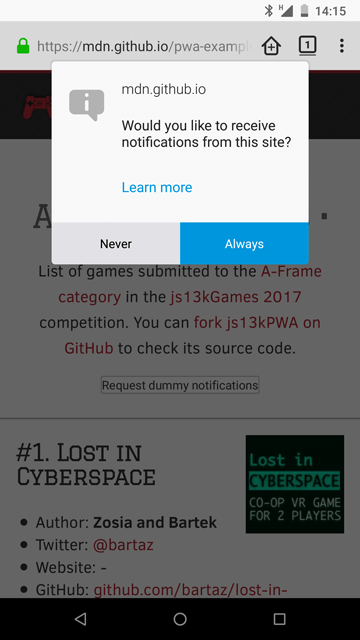

{{PreviousMenuNext("Web/Progressive_web_apps/Tutorials/js13kGames/Installable_PWAs", "Web/Progressive_web_apps/Tutorials/js13kGames/Loading", "Web/Progressive_web_apps/Tutorials/js13kGames")}}

{{PWASidebar}}

Having the ability to cache the contents of an app to work offline is a great feature. Allowing the user to install the web app on their device is even better. But instead of relying only on user actions, we can do more, using push messages and notifications to automatically re-engage and deliver new content whenever it is available.

## Two APIs, one goal

The [Push API](/en-US/docs/Web/API/Push_API) and [Notifications API](/en-US/docs/Web/API/Notifications_API) are two separate APIs, but they work well together when you want to provide engaging functionality in your app. Push is used to deliver new content from the server to the app without any client-side intervention, and its operation is handled by the app's service worker. Notifications can be used by the service worker to show new information to the user, or at least alert them when something has been updated.

They work outside of the browser window, just like service workers, so updates can be pushed and notifications can be shown when the app's page is out of focus or even closed.

## Notifications

Let's start with notifications — they can work by themselves, but become more useful when combined with push. Let's look at notifications in isolation to begin with.

### Request permission

To show a notification, we have to request permission to do so first. Instead of showing the notification immediately though, best practice dictates that we should show the popup when the user requests it by clicking on a button:

```js
const button = document.getElementById("notifications");
button.addEventListener("click", () => {
  Notification.requestPermission().then((result) => {
    if (result === "granted") {
      randomNotification();
    }
  });
});
```

This shows a popup using the operating system's own notifications service:



When the user confirms to receive notifications, the app can then show them. The result of the user action can be default, granted or denied. The default option is chosen when the user won't make a choice, and the other two are set when the user clicks yes or no respectively.

When accepted, the permission works for both notifications and push.

### Create a notification

The example app creates a notification out of the available data — a game is picked at random, and the chosen one feeds the notification with the content: it sets the game's name as the title, mentioning the author in the body, and showing the image as an icon:

```js
function randomNotification() {
  const randomItem = Math.floor(Math.random() * games.length);
  const notifTitle = games[randomItem].name;
  const notifBody = `Created by ${games[randomItem].author}.`;
  const notifImg = `data/img/${games[randomItem].slug}.jpg`;
  const options = {
    body: notifBody,
    icon: notifImg,
  };
  new Notification(notifTitle, options);
  setTimeout(randomNotification, 30000);
}
```

A new random notification is created every 30 seconds until it becomes too annoying and is disabled by the user. (For a real app, the notifications should be much less frequent, and more useful.) The advantage of the Notifications API is that it uses the operating system's notification functionality. This means that notifications can be displayed to the user even when they are not looking at the web app, and the notifications look similar to ones displayed by native apps.

## Push

Push is more complicated than notifications — we need to subscribe to a server that will then send the data back to the app. The app's Service Worker will receive data from the push server, which can then be shown using the notifications system, or another mechanism if desired.

The technology is still at a very early stage — some working examples use the Google Cloud Messaging platform, but are being rewritten to support [VAPID](https://blog.mozilla.org/services/2016/08/23/sending-vapid-identified-webpush-notifications-via-mozillas-push-service/) (Voluntary Application Identification), which offers an extra layer of security for your app.
You can examine the [Service Workers Cookbook examples](https://github.com/mdn/serviceworker-cookbook/tree/master/push-payload), try to set up a push messaging server using [Firebase](https://firebase.google.com/), or build your own server (using Node.js for example).

As mentioned before, to be able to receive push messages, you have to have a service worker, the basics of which are already explained in the [Making PWAs work offline with Service workers](/en-US/docs/Web/Progressive_web_apps/Tutorials/js13kGames/Offline_Service_workers) article. Inside the service worker, a push-service subscription mechanism is created by calling the [`getSubscription()`](/en-US/docs/Web/API/PushManager/getSubscription) method of the [`PushManager`](/en-US/docs/Web/API/PushManager) interface.

```js
navigator.serviceWorker.register("service-worker.js").then((registration) => {
  return registration.pushManager.getSubscription().then(/* ... */);
});
```

Once the user is subscribed, they can receive push notifications from the server.

From the server-side, the whole process has to be encrypted with public and private keys for security reasons — allowing everyone to send push messages unsecured using your app would be a terrible idea. See the [Web Push data encryption test page](https://jrconlin.github.io/WebPushDataTestPage/) for detailed information about securing the server. The server stores all the information received when the user subscribed, so the messages can be sent later on when needed.

To receive push messages, we can listen to the {{domxref("ServiceWorkerGlobalScope.push_event", "push")}} event in the Service Worker file:

```js
self.addEventListener("push", (e) => {
  /* ... */
});
```

The data can be retrieved and then shown as a notification to the user immediately. This, for example, can be used to remind the user about something, or let them know about new content being available in the app.

### Push example

Push needs the server part to work, so we're not able to include it in the js13kPWA example hosted on GitHub Pages, as it offers hosting of static files only. It is all explained in the [Service Worker Cookbook](https://github.com/mdn/serviceworker-cookbook) — see the [Push Payload Demo](https://github.com/mdn/serviceworker-cookbook/tree/master/push-payload).

This demo consists of three files:

- [index.js](https://github.com/mdn/serviceworker-cookbook/blob/master/push-payload/index.js), which contains the source code of our app
- [server.js](https://github.com/mdn/serviceworker-cookbook/blob/master/push-payload/server.js), which contains the server part (written in Node.js)
- [service-worker.js](https://github.com/mdn/serviceworker-cookbook/blob/master/push-payload/service-worker.js), which contains the Service Worker-specific code.

Let's explore all of these

#### index.js

The `index.js` file starts by registering the service worker:

```js
navigator.serviceWorker
  .register("service-worker.js")
  .then((registration) => {
    return registration.pushManager
      .getSubscription()
      .then(async (subscription) => {
        // registration part
      });
  })
  .then((subscription) => {
    // subscription part
  });
```

It is a little bit more complicated than the service worker we saw in the [js13kPWA demo](https://mdn.github.io/pwa-examples/js13kpwa/). In this particular case, after registering, we use the registration object to subscribe, and then use the resulting subscription object to complete the whole process.

In the registration part, the code looks like this:

```js
async (subscription) => {
  if (subscription) {
    return subscription;
  }
};
```

If the user has already subscribed, we then return the subscription object and move to the subscription part. If not, we initialize a new subscription:

```js
const response = await fetch("./vapidPublicKey");
const vapidPublicKey = await response.text();
const convertedVapidKey = urlBase64ToUint8Array(vapidPublicKey);
```

The app fetches the server's public key and converts the response to text; then it needs to be converted to a Uint8Array (to support Chrome). To learn more about VAPID keys you can read the [Sending VAPID identified WebPush Notifications via Mozilla's Push Service](https://blog.mozilla.org/services/2016/08/23/sending-vapid-identified-webpush-notifications-via-mozillas-push-service/) blog post.

The app can now use the {{domxref("PushManager")}} to subscribe the new user. There are two options passed to the {{domxref("PushManager.subscribe()")}} method — the first is `userVisibleOnly: true`, which means all the notifications sent to the user will be visible to them, and the second one is the `applicationServerKey`, which contains our successfully acquired and converted VAPID key.

```js
registration.pushManager.subscribe({
  userVisibleOnly: true,
  applicationServerKey: convertedVapidKey,
});
```

Now let's move to the subscription part — the app first sends the subscription details as JSON to the server using Fetch.

```js
fetch("./register", {
  method: "post",
  headers: {
    "Content-type": "application/json",
  },
  body: JSON.stringify({ subscription }),
});
```

Then the {{domxref("Element.click_event", "onclick")}} function on the _Subscribe_ button is defined:

```js
document.getElementById("doIt").onclick = () => {
  const payload = document.getElementById("notification-payload").value;
  const delay = document.getElementById("notification-delay").value;
  const ttl = document.getElementById("notification-ttl").value;

  fetch("./sendNotification", {
    method: "post",
    headers: {
      "Content-type": "application/json",
    },
    body: JSON.stringify({
      subscription,
      payload,
      delay,
      ttl,
    }),
  });
};
```

When the button is clicked, `fetch` asks the server to send the notification with the given parameters: `payload` is the text that to be shown in the notification, `delay` defines a delay in seconds until the notification will be shown, and `ttl` is the time-to-live setting that keeps the notification available on the server for a specified amount of time, also defined in seconds.

Now, onto the next JavaScript file.

#### server.js

The server part is written in Node.js and needs to be hosted somewhere suitable, which is a subject for an entirely separate article. We will only provide a high-level overview here.

The [web-push module](https://www.npmjs.com/package/web-push) is used to set the VAPID keys, and optionally generate them if they are not available yet.

```js
const webPush = require("web-push");

if (!process.env.VAPID_PUBLIC_KEY || !process.env.VAPID_PRIVATE_KEY) {
  console.log(
    "You must set the VAPID_PUBLIC_KEY and VAPID_PRIVATE_KEY " +
      "environment variables. You can use the following ones:",
  );
  console.log(webPush.generateVAPIDKeys());
  return;
}

webPush.setVapidDetails(
  "https://example.com",
  process.env.VAPID_PUBLIC_KEY,
  process.env.VAPID_PRIVATE_KEY,
);
```

Next, a module defines and exports all the routes an app needs to handle: getting the VAPID public key, registering, and then sending notifications.
You can see the variables from the `index.js` file being used: `payload`, `delay` and `ttl`.

```js
module.exports = (app, route) => {
  app.get(`${route}vapidPublicKey`, (req, res) => {
    res.send(process.env.VAPID_PUBLIC_KEY);
  });

  app.post(`${route}register`, (req, res) => {
    res.sendStatus(201);
  });

  app.post(`${route}sendNotification`, (req, res) => {
    const subscription = req.body.subscription;
    const payload = req.body.payload;
    const options = {
      TTL: req.body.ttl,
    };

    setTimeout(() => {
      webPush
        .sendNotification(subscription, payload, options)
        .then(() => {
          res.sendStatus(201);
        })
        .catch((error) => {
          console.log(error);
          res.sendStatus(500);
        });
    }, req.body.delay * 1000);
  });
};
```

#### service-worker.js

The last file we will look at is the service worker:

```js
self.addEventListener("push", (event) => {
  const payload = event.data?.text() ?? "no payload";
  event.waitUntil(
    self.registration.showNotification("ServiceWorker Cookbook", {
      body: payload,
    }),
  );
});
```

All it does is add a listener for the {{domxref("ServiceWorkerGlobalScope.push_event", "push")}} event, create the payload variable consisting of the text taken from the data (or create a string to use if data is empty), and then wait until the notification is shown to the user.

Feel free to explore the rest of the examples in the [Service Worker Cookbook](https://github.com/mdn/serviceworker-cookbook) if you want to know how they are handled.
There's a big collection of working examples showing general use, but also web push, caching strategies, performance, working offline, and more.

{{PreviousMenuNext("Web/Progressive_web_apps/Tutorials/js13kGames/Installable_PWAs", "Web/Progressive_web_apps/Tutorials/js13kGames/Loading", "Web/Progressive_web_apps/Tutorials/js13kGames")}}
