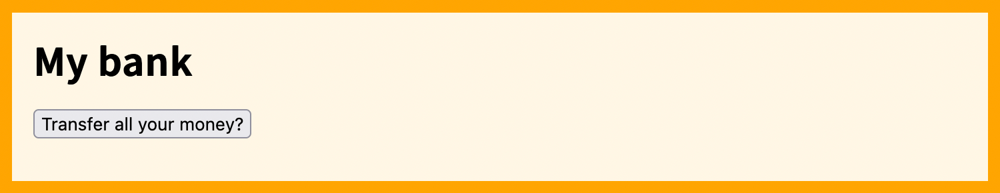
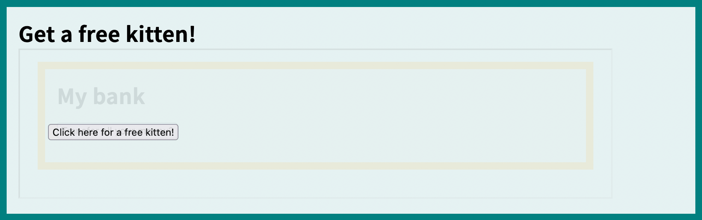

In a **clickjacking** attack, an attacker tricks the user into interacting with a target site in a way that they didn't intend.

To do this, the attacker creates a decoy site which embeds the user's target site inside an {{htmlelement("iframe")}} element. The attacker's site hides the `<iframe>`, and aligns some decoy elements so they appear in the same place as elements in the target site that trigger sensitive actions. When the user tries to interact with these decoy elements, they are inadvertently interacting with the target site instead, and may be tricked into performing actions with the target site which they did not intend.

## A clickjacking example

Suppose the website for the user's bank is `https://my-bank.example.com`. The user typically stays logged into this site. For simplicity we'll say that the site has a page with a button which transfers all the user's funds to the attacker — although this is obviously unrealistic, it's plausible that the site would have some interactive elements that perform some sensitive operation.



The attacker creates a web page which contains:

- a {{htmlelement("button")}} element whose contents encourage the user to click it
- an {{htmlelement("iframe")}} element embedding the bank's page.

```html
<button id="fake-button">Click here for a free kitten!</button>
<iframe width="800" height="200" src="https://my-bank.example.com"></iframe>
```

In the CSS for the page, the attacker:

- hides the `<iframe>`, for example by setting its {{cssxref("opacity")}} to zero
- positions the button so it is in the same place as the "Transfer all your money?" button.

```css
iframe {
  opacity: 0;
}

#fake-button {
  position: absolute;
  top: 185px;
  left: 90px;
}
```

The result looks like this (we have set the `<iframe>` opacity to `0.1`, so you can see the overlay):



If the user tries to click "Click here for a free kitten!", they will actually be clicking on the invisible "Transfer all your money?" button in the bank's website. If the user is already signed in, then the request that this makes to the bank's server will include the user's real credentials, and the request will succeed.

## Clickjacking defenses

Clickjacking depends on the target website being embedded in the attacker's decoy site inside an `<iframe>`. The main defense is to disallow or at least control this capability.

There are two relevant tools here:

- The [`frame-ancestors` directive](/en-US/docs/Web/HTTP/CSP#clickjacking_protection) in a [content security policy](/en-US/docs/Web/HTTP/CSP)
- The {{httpheader("X-Frame-Options")}} response header.

The `frame-ancestors` directive is a replacement for `X-Frame-Options`. By setting `X-Frame-Options` as well as `frame-ancestors`, you can prevent embedding in browsers that don't support `frame-ancestors`. As [browser support for `frame-ancestors` is very good](/en-US/docs/Web/HTTP/Headers/Content-Security-Policy/frame-ancestors#browser_compatibility), this is not a major concern.

If `frame-ancestors` and `X-Frame-Options` are both set, then browsers that support `frame-ancestors` will ignore `X-Frame-Options`.

As an additional partial mitigation, sites should set the [`SameSite`](/en-US/docs/Web/HTTP/Headers/Set-Cookie#samesitesamesite-value) cookie attribute for session cookies to `Lax` or `Strict`. Requests from embedded contexts such as `<iframe>` elements that are not {{glossary("Site", "same-site")}} with the top-level document will not include these cookies, and the server will therefore not treat the request as coming from a logged-in user.

## See also

- [Clickjacking Defense Cheat Sheet](https://cheatsheetseries.owasp.org/cheatsheets/Clickjacking_Defense_Cheat_Sheet.html) at [owasp.org](https://owasp.org/)

<section id="Quick_links">
{{ListSubpages("/en-US/docs/Web/Security", "1", "0", "1")}}
</section>
