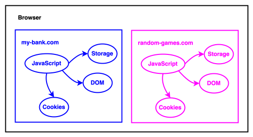
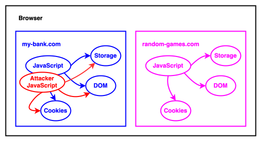

A cross-site scripting (XSS) attack is one in which an attacker is able to get a target site to execute malicious code as though it was part of the website.

## Overview

A web browser downloads code from many different websites and runs it on the user's computer. Some of these websites will be highly trustworthy, and the user may use them for sensitive operations, such as financial transactions or medical advice. With others, such as a casual gaming site, the user may have no such trust relationship. The foundation of the browser's security model is that these sites should be kept separate from each other, so code from one site should not be able to access objects or {{glossary("credential", "credentials")}} in another site. This is called the [same-origin policy](/en-US/docs/Web/Security/Same-origin_policy).



In a successful XSS attack, the attacker is able to subvert the same-origin policy by tricking the target site into executing malicious code within its own context, as though it were same-origin. The code can then do anything that the site's own code can do, including, for example:

- Access and/or modify all the content of the site's loaded pages, and any content in local storage
- Make HTTP requests with the user's credentials, enabling them to impersonate the user or access sensitive data



All XSS attacks depend on a website doing two things:

1. Accepting some input that could have been crafted by an attacker
2. Including this input in a page without _sanitizing_ it: that is, without ensuring that it won't be executable as JavaScript.

## Two XSS examples

In this section we'll go through two example pages that are vulnerable to an XSS attack.

### Code injection in the browser

In this example, suppose the website for the user's bank is `my-bank.example.com`. The user is typically signed into it, and code in the website can access the user's account details and perform transactions. The website wants to display a welcome message, personalized for the current user. It displays the welcome in a {{htmlelement("Heading_Elements", "heading")}} element:

```html
<h1 id="welcome"></h1>
```

The page expects to find the current user's name in a [URL parameter](/en-US/docs/Learn/Common_questions/Web_mechanics/What_is_a_URL#parameters). It extracts the parameter value, and uses the value to create a personalized greeting message:

```js
const params = new URLSearchParams(window.location.search);
const user = params.get("user");
const welcome = document.querySelector("#welcome");

welcome.innerHTML = `Welcome back, ${user}!`;
```

Let's say this page is served from `https://my-bank.example.com/welcome`. To exploit the vulnerability, an attacker sends the user a link like this:

```html
<a
  href="https://my-bank.example.com/welcome?user=">
  Get a free kitten!</a
>
```

When the user clicks the link:

1. The browser loads the page.
2. The page extracts the URL parameter named `user`, whose value is ``.
3. The page then assigns this value to the `welcome` element's `innerHTML` property, which creates a new {{htmlelement("img")}} element, which has a `src` attribute value of `x`.
4. Since the `src` value generates an error, the `onerror` [event handler property](/en-US/docs/Learn/JavaScript/Building_blocks/Events#inline_event_handlers_—_dont_use_these) is executed, and the attacker gets to run its code in the page.

In this case the code just displays an alert, but in a real banking website, the attacker code would be able to do anything that the bank's own front-end code could.

### Code injection in the server

In this example, consider a website with a search function. The HTML for the search page might look like this:

```html
<h1>Search</h1>

<form action="/results">
  <label for="mySearch">Search for an item:</label>
  <input id="mySearch" type="search" name="search" />
  <input type="submit" />
</form>
```

When the user enters a search term and clicks "Submit", the browser makes a GET request to "/results", including the search term as a URL parameter, like this:

```plain
https://example.org/results?search=bananas
```

The server wants to display a list of search results, with a title indicating what the user searched for. It extracts the search term from the URL parameter. Here's what this might look like in [Express](/en-US/docs/Learn/Server-side/Express_Nodejs):

```js
app.get("/results", (req, res) => {
  const searchQuery = req.query.search;
  const results = getResults(searchQuery); // Implementation not shown
  res.send(`
   <h1>You searched for ${searchQuery}</h1>
   <p>Here are the results: ${results}</p>`);
});
```

To exploit this vulnerability, an attacker sends the user a link like this:

```html
<a href="http://example.org/results?search=
  Get a free kitten!</a
>
```

When the user clicks the link:

1. The browser sends a GET request to the server. The request's URL parameter contains the malicous code.
2. The server extracts the URL parameter value and embeds it in the page.
3. The server returns the page to the browser, which runs it.

## Anatomy of an XSS attack

Like all XSS attacks, these two examples are possible because the website:

1. Uses input that could have been crafted by an attacker
2. Includes the input in the page without sanitizing it.

Both these examples use the same vector for the malicious input: the URL parameter. However, there are other vectors that attackers can use.

For example, consider a blog with comments. In a case like this, the website:

1. Allows anyone to submit comments using a {{htmlelement("form")}} element
2. Stores the comments in a database
3. Includes the comments in pages that the website serves to other users.

If the comments are not sanitized, then they are potential vectors for XSS. This kind of attack is sometimes called _stored_ or _persistent_ XSS, and is particularly severe, because the infected content will be served to all users who access the page, every time they access it.

### Client and server XSS

One big difference between the two examples is that the malicious code is injected in different parts of the website's codebase, and this is a reflection of each website's architecture.

A website that uses client-side rendering, such as an {{glossary("SPA", "single-page app")}}, modifies pages in the browser, using web APIs such as {{domxref("document.createElement()")}} to do so, either directly, or indirectly through a framework like React. It's in the course of this process that XSS injection will happen. That's what we see in the first example: the malicious code is injected in the browser, by a script running in the page assigning the URL parameter value to the {{domxref("Element.innerHTML")}} property, which interprets its value as HTML code.

A website that uses server-side rendering builds pages on the server, using a framework like Django or Express, most commonly by inserting values into page templates. XSS injection, if it happens, will happen in the server during the templating process. That's what we see in the second example: the code is injected in the server, by the Express code inserting the URL parameter value into the document it's returning. The XSS attack code then runs when the browser evaluates the page.

In both cases, the general approach to defense is the same, and we'll go into this in detail in the next section. However, the specific tools and APIs you'll use will be different.

## Defenses against XSS

If you need to include external input in your site's pages, there are two main defenses against XSS:

1. Use _output encoding_ and _sanitization_ to prevent input from becoming executable. If you're rendering content in the browser, you can use the [Trusted Types API](/en-US/docs/Web/API/Trusted_Types_API) to ensure that input is being passed through a sanitization function before being included in the page.
2. Use a [Content Security Policy](/en-US/docs/Web/HTTP/CSP) (CSP) to tell the browser which JavaScript or CSS resources it should be allowed to execute. This is a backup defense: if the first defense fails and executable input makes it into a page, then a properly configured CSP should prevent the browser from executing it.

### Output encoding

_Output encoding_ is the process by which characters in the input string that potentially make it dangerous are escaped, so they are treated as text instead of being treated as part of a language like HTML.

This is the appropriate choice when you want to treat input as text, for example, because your website uses templates that interpolate input into content, as in this [Django template](https://docs.djangoproject.com/en/5.1/ref/templates/language/) excerpt:

```django
<p>You searched for \{{ search_term }}.</p>
```

Most modern templating engines automatically perform output encoding. For example, Django's templating engine performs the following conversions:

- `<` is converted to `&lt;`

- `>` is converted to `&gt;`

- `'` is converted to `&#x27;`

- `"` is converted to `&quot;`

- `&` is converted to `&amp;`

This means that if you pass `` into the Django template above, it will be converted to `&lt;img src=x onerror=alert(&#x27;XSS!&#x27;)&gt;`, which is displayed as the following text:

> You searched for &lt;img src=x onerror=alert('XSS!')&gt;.

Similarly, if you're doing client-side rendering with React, values embedded in JSX are automatically encoded. For example, consider a JSX component like this:

```jsx
import React from "react";

export function App(props) {
  return <div>Hello, {props.name}!</div>;
}
```

If we pass `` into `props.name`, it will be rendered as:

> Hello, &lt;img src=x onerror=alert('XSS!')&gt;!

One of the most important parts of preventing XSS attacks is to use a well-regarded templating engine which performs robust output encoding, and read its documentation to understand any caveats about the protection it offers.

#### Document contexts

Even if you're using a templating engine which automatically encodes HTML, you need to be aware of where in the document you are including untrusted content. For example, suppose you have a Django template like this:

```django
<div>\{{ my_input }}</div>
```

In this context, the input is inside `<div>` tags, so the browser evaluates it as HTML. So you need to protect against the case where `my_input` is HTML that defines executable code, such as ``. The output encoding built into Django prevents this attack, by encoding characters like `<` and `>` as the HTML entities `&lt;` and `&gt;`.

However, suppose the template is like this:

```django
<div \{{ my_input }}></div>
```

In this context the browser will treat the `my_input` variable as an HTML attribute. If `my_input` is `onmouseover="alert('XSS')"`, the output encoding provided by Django won't prevent the attack.

The browser uses different rules to process different parts of a web page — HTML elements and their content, HTML attributes, inline styles, inline scripts. The type of encoding that needs to be done is different depending on the context in which the input is being interpolated.

What's safe in one context may be unsafe in another, and it's necessary to understand the context in which you are including untrusted content, and to implement any special handling that this demands.

- **HTML contexts**: input inserted between the tags of most HTML elements (except for {{htmlelement("style")}} or {{htmlelement("script")}}) is interpreted as HTML. The encoding applied by template engines is mostly concerned with this context.
- **HTML attribute contexts**: inserting input as HTML attribute values is sometimes safe and sometimes not, depending on the attribute. In particular, event handler attributes like `onblur` are unsafe, as is the [`src`](/en-US/docs/Web/HTML/Element/iframe#src) attribute of the {{htmlelement("iframe")}} element.

  It's also important to quote placeholders for inserted attribute values, or an attacker may be able to insert an additional unsafe attribute in the value provided. For example, this template does not quote an inserted value:

  ```django example-bad
  <div class=\{{ my_class }}>...</div>
  ```

  An attacker can exploit this to inject an event handler attribute, by using input like `some_id onmouseover="alert('XSS!')"`. To prevent the attack, quote the placeholder:

  ```django example-good
    <div class="\{{ my_class }}">...</div>
  ```

- **JavaScript and CSS contexts**: inserting input inside {{htmlelement("script")}} or {{htmlelement("style")}} tags is almost always unsafe.

### Sanitization

Templating engines typically allow developers to disable output encoding. This is necessary when developers want to insert untrusted content as HTML, not text. For example, in Django, the [`safe`](https://docs.djangoproject.com/en/5.0/ref/templates/language/#how-to-turn-it-off) filter disables output encoding, and in React, [`dangerouslySetInnerHTML`](https://react.dev/reference/react-dom/components/common#dangerously-setting-the-inner-html) has the same effect.

In this case it's up to the developer to ensure that the content is safe, by sanitizing it.

_Sanitization_ is the process of removing unsafe features from a string of HTML: for example, {{htmlelement("script")}} tags or inline event handlers. Since sanitization, like output encoding, is difficult to get right, it's advisable to use a reputable third-party library for it. [DOMPurify](https://github.com/cure53/DOMPurify) is recommended by many experts including [OWASP](https://cheatsheetseries.owasp.org/cheatsheets/Cross_Site_Scripting_Prevention_Cheat_Sheet.html#html-sanitization).

For example, consider a string of HTML like:

```html
<div>
  
  <script>
    alert("hello!");
  </script>
</div>
```

If we pass this to DOMPurify, it will return:

```html
<div>
  
</div>
```

### Trusted types

Having a function that can sanitize a given input string is one thing, but finding all the places in a codebase where input strings need to be sanitized can in itself be a very hard problem.

If you're implementing client-side rendering in the browser, there are a number of Web APIs that are unsafe if called with unsanitized untrusted content.

For example, the following APIs interpret their string arguments as HTML and use it to update the page DOM:

- {{domxref("Element.innerHTML")}} (which is also used internally by React's `dangerouslySetInnerHTML`)
- {{domxref("Element.outerHTML")}}
- {{domxref("Element.insertAdjacentHTML()")}}
- {{domxref("Document.write()")}}

Other APIs directly execute their arguments as JavaScript. For example:

- [`eval()`](/en-US/docs/Web/JavaScript/Reference/Global_Objects/eval)
- {{domxref("Window.setTimeout()")}} and {{domxref("Window.setInterval()")}}

The [Trusted Types API](/en-US/docs/Web/API/Trusted_Types_API) enables a developer to be sure that input is always sanitized before being passed to one of these APIs.

The key to enforcing the use of trusted types is the [`require-trusted-types-for`](/en-US/docs/Web/HTTP/Headers/Content-Security-Policy/require-trusted-types-for) CSP directive. If this directive is set, then passing string arguments to unsafe APIs will throw an exception:

```js example-bad
const userInput = "I might be XSS";
const element = document.querySelector("#container");

element.innerHTML = userInput; // Throws a TypeError
```

Instead, a developer must pass a _trusted type_ to one of these APIs. A trusted type is an object created from a string by a {{domxref("TrustedTypePolicy")}} object, whose implementation is defined by the developer. For example:

```js example-good
// Create a policy that can create TrustedHTML values
// by sanitizing the input strings with DOMPurify library.
const sanitizer = trustedTypes.createPolicy("my-policy", {
  createHTML: (input) => DOMPurify.sanitize(input),
});

const userInput = "I might be XSS";
const element = document.querySelector("#container");

const trustedHTML = sanitizer.createHTML(userInput);
element.innerHTML = trustedHTML;
```

> [!NOTE]
> The Trusted Types API does not provide a sanitization function: it is a framework in which a developer can be sure that a sanitization function that they provide has been called. In the example above, the developer uses DOMPurify as the sanitizer for HTML sinks, within the Trusted Types framework.

The Trusted Types API does not yet have good cross-browser support, but when it does it will be an important defense against DOM-based XSS attacks.

### Deploying a CSP

Output encoding and sanitization are all about preventing malicious scripts from getting into a site's pages. One of the main functions of a content security policy is to prevent malicious scripts from being executed even if they are in a site's pages. That is, it is a backup in case the other defenses fail.

The recommended approach to mitigating XSS with a CSP is a [strict CSP](/en-US/docs/Web/HTTP/CSP#strict_csp), which uses a [nonce](/en-US/docs/Web/HTTP/CSP#nonces) or a [hash](/en-US/docs/Web/HTTP/CSP#hashes) to indicate to the browser which scripts it expects to see in the document. If an attacker manages to insert malicious `<script>` elements, then they won't have the correct nonce or hash, and the browser will not execute them. Additionally, various common XSS vectors are disallowed completely: inline event handlers, `javascript:` URLs, and APIs like `eval()` that execute their arguments as JavaScript.

### Defense summary checklist

We can summarise the defenses above as follows:

- When interpolating input into a page, either in the browser or in the server, use a templating engine that performs output encoding.
- Be aware of the context in which you are interpolating input, and ensure that the appropriate output encoding will be performed in that context.
- If you need to include input as HTML, sanitize it using a reputable library. If you're doing this in the browser, use the trusted types framework to ensure that input is being processed by your sanitization function.
- Implement a strict CSP.

## See also

- [Cross Site Scripting Prevention Cheat Sheet](https://cheatsheetseries.owasp.org/cheatsheets/Cross_Site_Scripting_Prevention_Cheat_Sheet.html) at [owasp.org](https://owasp.org/)

<section id="Quick_links">
{{ListSubpages("/en-US/docs/Web/Security", "1", "0", "1")}}
</section>
