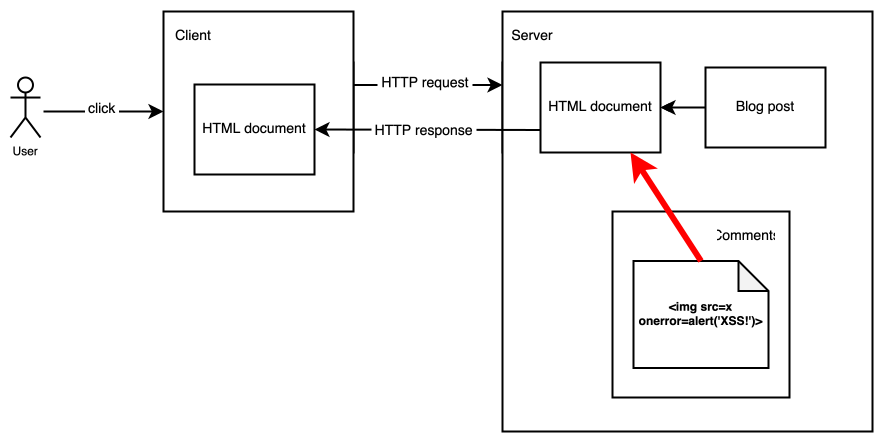
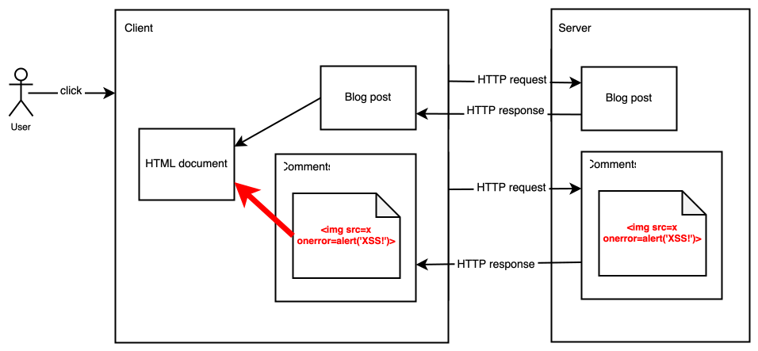
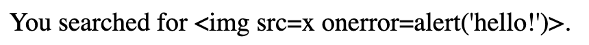

A cross-site scripting (XSS) attack is one in which an attacker is able to get a target site to execute malicious code as though it was part of the website.

## Overview

A web browser downloads code from many different websites and runs it on the user's computer. Some of these websites will be highly trustworthy, and the user may use them for sensitive operations, such as financial transactions or medical advice. With others, such as a casual gaming site, the user may have no such trust relationship. The foundation of the browser's security model is that these sites should be kept separate from each other, so code from one site should not be able to access objects or {{glossary("credential", "credentials")}} in another site. This is called the [same-origin policy](/en-US/docs/Web/Security/Same-origin_policy).


In a successful XSS attack, the attacker is able to subvert the same-origin policy by tricking the target site into executing malicious code within its own context, as though it were same-origin. The code can then do anything that the site's own code can do, including, for example:

- access and/or modify all the content of the site's loaded pages, and any content in local storage
- make HTTP requests with the user's credentials, enabling them to impersonate the user or access sensitive data


All XSS attacks depend on a website doing two things:

1. accepting some input that could have been crafted by an attacker
2. including this input in a page without _sanitizing_ it: that is, without ensuring that it won't be executable as JavaScript.

## An XSS example

Suppose the website for the user's bank is `my-bank.com`. The user is typically signed into it, and code in the website can access the user's account details and perform transactions. The website wants to display a welcome message, personalized for the current user. It displays the welcome in a {{htmlelement("Heading_Elements", "heading")}} element:

```html
<h1 id="welcome"></h1>
```

The page expects to find the current user's name in a [URL parameter](/en-US/docs/Learn/Common_questions/Web_mechanics/What_is_a_URL#parameters). It extracts the parameter value, and uses the value to create a personalized greeting message:

```js
const params = new URLSearchParams(window.location.search);
const user = params.get("user");
const welcome = document.querySelector("#welcome");

welcome.innerHTML = `Welcome back, ${user}!`;
```

Let's say this page is served from `https://my-bank.com/welcome`. To exploit the vulnerability, an attacker sends the user a link like this:

```html
<a href="https://my-bank.com/welcome?user=">
  Win a free iPad!</a
>
```

When the user clicks the link:

1. The browser loads the page.
2. The page extracts the URL parameter named `user`, whose value is ``.
3. The page then assigns this value to the `welcome` element's `innerHTML` property, which creates a new {{htmlelement("img")}} element, which has a `src` attribute value of `x`.
4. Since the `src` value generates an error, the `onerror` [event handler property](/en-US/docs/Learn/JavaScript/Building_blocks/Events#inline_event_handlers_—_dont_use_these) is executed, and the attacker gets to run its code in the page.

In this case the code just displays an alert, but in a real banking website, the attacker code would be able to do anything that the bank's own front-end code could.

There are two features of this code that make it vulnerable to XSS, and these two features are common to all XSS vulnerabilities:

1. it uses input that could have been crafted by an attacker: in this case, the URL parameter
2. it includes the input in the page without sanitizing it: in this case, by directly assigning the URL parameter value to the {{domxref("Element.innerHTML")}} property.

To prevent this attack, the page should sanitize the input. It could do this by explicitly encoding characters like <kbd><</kbd> before assigning the input to `innerHTML`. Alternatively (and more likely, if HTML is not required), the website could assign the input to the element's {{domxref("Node.textContent", "textContent")}} property instead, which will just assign the value as text.

In this page we'll explore the different types of XSS attacks, and the different methods that can be used to counter them.

## Types of XSS

XSS attacks are commonly divided into three categories: _reflected XSS_, _stored XSS_, and _DOM-based XSS_. We'll describe them here: however, knowing or defining the categories is not as important as understanding where and how XSS attacks can originate, as this affects the ways they can be countered. Another useful taxonomy, which is related to this categorization but a little different, is whether they are client-side or server-side: that is whether the vulnerability is in the server or in the front-end code.

### Reflected XSS

A reflected XSS attack is one in which an HTTP request contains the malicious JavaScript, and the server mistakenly includes that JavaScript in the page it returns to the client. The client then loads the page and runs the JavaScript, and the attack succeeds.

For example, consider a website with a search function. The HTML for the search page might look like this:

```html
<h1>Search</h1>

<form action="/results">
  <label for="mySearch">Search for an item:</label>
  <input id="mySearch" type="search" name="search" />
  <input type="submit" />
</form>
```

When the user enters a search term and clicks "Submit", the browser makes a GET request to "/results", including the search term as a URL parameter, like this:

```plain
https://example.org/results?search=bananas
```

The server wants to display a list of search results, with a title indicating what the user searched for. It extracts the search term from the URL parameter. Here's what this might look like in [Express](/en-US/docs/Learn/Server-side/Express_Nodejs):

```js
app.get("/results", (req, res) => {
  const searchQuery = req.query.search;
  const results = getResults(searchQuery); // Implementation not shown
  res.send(`
   <h1>You searched for ${searchQuery}</h1>
   <p>Here are the results: ${results}</p>`);
});
```

To exploit this vulnerability, an attacker sends the user a link like this:

```html
<a href="http://example.org/results?search=
  Win a free iPad!</a
>
```

When the user clicks the link:

1. The browser sends a GET request to the server. The request's URL parameter contains the malicous code.
2. The server extracts the URL parameter value and embeds it in the page.
3. The server returns the page to the browser, which runs it.

This is a lot like our first example, except the vulnerability is in the server, not the front-end code. The same pattern applies here though: the website accepts input that could have been crafted by the attacker, and includes that input in the page without sanitizing it.

### Stored XSS

A stored XSS attack is functionally just like a reflected XSS attack, except the malicious JavaScript injected by the attacker is stored by the website, and served up to every user who accesses the page.

For example, a website might include a blog that allows comments. Since anyone can make comments, they constitute input that may be crafted by an attacker. If the website does not sanitize blog comments, then when a user accesses a page in the blog that includes these comments, the code in the comment may be executed in the user's context.

### DOM-based XSS

A DOM-based XSS attack happens when a website's front-end takes some input that could have been crafted by an attacker, and without sanitizing it, passes it to an API that could result in the input becoming executable. APIs like this are referred to as _injection sinks_.

The first XSS example we saw in this page is an example of DOM-based XSS, in which the injection sink is the {{domxref("Element.innerHTML")}} property.

Some injection sinks modify the DOM, and can make input executable by injecting {{htmlelement("script")}} tags, `javascript:` URLs, or inline event handlers. For example:

- {{domxref("Element.innerHTML")}}
- {{domxref("Element.outerHTML")}}
- {{domxref("Element.insertAdjacentHTML()")}}
- {{domxref("Document.write()")}}

Other injection sinks directly execute their arguments as JavaScript. For example:

- [`eval()`](/en-US/docs/Web/JavaScript/Reference/Global_Objects/eval)
- {{domxref("Window.setTimeout()")}} and {{domxref("Window.setInterval()")}}

APIs provided by third-party frameworks or libraries can also contain injection sinks. For example:

- [`dangerouslySetInnerHTML()`](https://react.dev/reference/react-dom/components/common#dangerously-setting-the-inner-html) in React
- [`html()`](https://api.jquery.com/html/) in jQuery

### Client versus server XSS

Alongside the three categories described above — reflected, stored, and DOM-based XSS — is a different but overlapping taxonomy, which distinguishes attacks based on whether they take place in the server side or the client side of a website.

DOM-based XSS is always a client-side attack, but reflected and stored XSS may be either server-side or client-side, depending on the website's architecture.

For example, consider a stored XSS attack which uses blog post comments to inject malicous code.

In one architecture, the user navigates to the blog post by following a normal link. The browser makes an HTTP GET request to the server, which retrieves the blog post and comments from a database, then feeds them into a template to construct the response as an HTML document. The browser receives the HTML document containing the malicious code, and renders it.



In an alternative architecture, the website is implemented as a {{glossary("SPA", "single-page app")}}. When the user navigates to the blog post, the navigation is handled by the front-end JavaScript code. This code might get the blog post and comments from the server as JSON using the {{domxref("Window.fetch()", "fetch()")}} API, and then render them as HTML client-side.



Although the attack and the result are the same in both cases, the point at which the malicious code is introduced into the HTML document is different: in the first case, it's the server code that is failing to sanitize the blog post comments before including them in the document, and in the second case, it's the front-end code. Note that in the second case, the attack is a stored XSS attack _and_ a DOM-based attack: in fact, all client-side attacks are DOM-based attacks.

The distinction between server and client XSS matters because effective defenses against XSS are different depending on where the vulnerability is.

## Defenses against XSS

If you need to include external input in your site's pages, there are two main defenses against XSS:

1. Using _output encoding_ and _sanitization_ to prevent input from becoming executable.
2. Using a [Content Security Policy](/en-US/docs/Web/HTTP/CSP) (CSP) to tell the browser which JavaScript or CSS resources it should be allowed to execute. This is a backup defense: if the first defense fails, so executable input makes it into a page, then a properly configured CSP should prevent the browser from executing it.

### Output encoding

_Output encoding_ is the process by which characters in the input string that potentially make it dangerous are escaped, so they are treated as text instead of being treated as part of a language like HTML.

This is the appropriate choice when you want to treat input as text, for example, because your website uses templates that interpolate input into content, as in this [Django template](https://docs.djangoproject.com/en/5.1/ref/templates/language/) excerpt:

```django
<p>You searched for \{{ search_term }}.</p>
```

Most modern templating engines automatically perform output encoding. For example, if you pass `` into the Django template above, it will be rendered as text:



One of the most important parts of preventing XSS attacks is to use a well-regarded templating engine which performs robust output encoding, and read its documentation to understand any caveats about the protection it offers.

#### Document contexts

Even if you're using a templating engine, like Django, which automatically encodes HTML, you need to be aware of where in the document you are including untrusted content. For example, suppose you have a Django template like this:

```django
<div>\{{ my_input }}</div>
```

In this context, the browser is evaluating the input as HTML. So you need to protect against the case where `my_input` is something like ``. That is, where `my_input` is something that is treated as HTML by the browser. The output encoding built into Django prevents this attack, by encoding characters like `<` and `>`.

However, suppose the template is like this:

```django
<div \{{ my_input }}></div>
```

The `my_input` variable will be treated as an HTML attribute by the browser. In this case, if `my_input` is `onmouseover="alert('XSS')"`, then the output encoding that Django provides won't prevent the attack.

The browser uses different rules to process different parts of a web page — HTML elements and their content, HTML attributes, inline styles, inline scripts. The type of encoding that needs to be done is different depending on the context in which the input is being interpolated.

What's safe in one context may be unsafe in another, and it's necessary to understand the context in which you are including untrusted content, and to implement any special handling that this demands.

- **HTML contexts**: input inserted between the tags of most HTML elements (except for {{htmlelement("style")}} or {{htmlelement("script")}}) is in the HTML context, and the encoding applied by template engines is mostly concerned with this context.
- **HTML attribute contexts**: inserting input as HTML attribute values is sometimes safe and sometimes not, depending on the attribute. In particular, event handler attributes like `onblur` are unsafe, as is the [`src`](/en-US/docs/Web/HTML/Element/iframe#src) attribute of the {{htmlelement("iframe")}} element.

  It's also important to quote placeholders for inserted attribute values, or an attacker may be able to insert an additional unsafe attribute in the value provided. For example, this template does not quote an inserted value:

  ```django example-bad
  <div class=\{{ my_class }}>...</div>
  ```

  An attacker can exploit this to inject an event handler attribute, by using input like `some_id onmouseover="alert('XSS!')"`. To prevent the attack, quote the placeholder:

  ```django example-good
    <div class="\{{ my_class }}">...</div>
  ```

- **JavaScript and CSS contexts**: inserting input inside {{htmlelement("script")}} or {{htmlelement("style")}} tags is almost always unsafe.

### Sanitization

Templating engines typically allow developers to disable output encoding. This is necessary when developers want to insert untrusted content as HTML, not text. In this case it's up to the developer to ensure that the content is safe: for example, by sanitizing it.

_Sanitization_ is the process of removing unsafe features from a string of HTML: for example, {{htmlelement("script")}} tags or inline event handlers. Since sanitization, like output encoding, is difficult to get right, it's advisable to use a reputable third-party library for it. [DOMPurify](https://github.com/cure53/DOMPurify) is recommended by many experts including [OWASP](https://cheatsheetseries.owasp.org/cheatsheets/Cross_Site_Scripting_Prevention_Cheat_Sheet.html#html-sanitization).

For example, consider a string of HTML like:

```html
<div>
  
  <script>
    alert("hello!");
  </script>
</div>
```

If we pass this to DOMPurify, it will return:

```html
<div>
  
</div>
```

### Trusted types

Having a function that can sanitize a given input string is one thing, but finding all the places in a codebase where input strings need to be sanitized can in itself be a very hard problem.

As we saw when we looked at [DOM-based XSS](#dom-based_xss) attacks, browsers provide a number of APIs that can result in XSS if used with untrusted input. The [Trusted Types API](/en-US/docs/Web/API/Trusted_Types_API) enables a developer to be sure that on the client side, input is always sanitized before being passed to one of these APIs.

The key to enforcing the use of trusted types is the [`require-trusted-types-for`](/en-US/docs/Web/HTTP/Headers/Content-Security-Policy/require-trusted-types-for) CSP directive. If this directive is set, then passing string arguments to unsafe APIs will throw an exception:

```js example-bad
const userInput = "I might be XSS";
const element = document.querySelector("#container");

element.innerHTML = userInput; // Throws a TypeError
```

Instead, a developer must pass a _trusted type_ to one of these APIs. A trusted type is an object created from a string by a {{domxref("TrustedTypePolicy")}} object, whose implementation is defined by the developer. For example:

```js example-good
// Create a policy that can create TrustedHTML values
// by sanitizing the input strings with DOMPurify library.
const sanitizer = trustedTypes.createPolicy("my-policy", {
  createHTML: (input) => DOMPurify.sanitize(input),
});

const userInput = "I might be XSS";
const element = document.querySelector("#container");

const trustedHTML = sanitizer.createHTML(userInput);
element.innerHTML = trustedHTML;
```

> [!NOTE]
> The Trusted Types API does not provide a sanitization function: it is a framework in which a developer can be sure that a sanitization function that they provide has been called. In the example above, the developer uses DOMPurify as the sanitizer for HTML sinks, within the Trusted Types framework.

The Trusted Types API does not yet have good cross-browser support, but when it does it will be an important defense against DOM-based XSS attacks.

### Deploying a CSP

Output encoding and sanitization are all about preventing malicious scripts from getting into a site's pages. One of the main functions of a content security policy is to prevent malicious scripts from being executed even if they are in a site's pages. That is, it is a backup in case the other defenses fail.

The recommended approach to mitigating XSS with a CSP is a [strict CSP](/en-US/docs/Web/HTTP/CSP#strict_csp), which uses a [nonce](/en-US/docs/Web/HTTP/CSP#nonces) or a [hash](/en-US/docs/Web/HTTP/CSP#hashes) to indicate to the browser which scripts it expects to see in the document. If an attacker manages to insert malicious `<script>` elements, then they won't have the correct nonce or hash, and the browser will not execute them. Additionally, various common XSS vectors are disallowed completely: inline event handlers, `javascript:` URLs, and APIs like `eval()` that execute their arguments as JavaScript.

## See also

- [Cross Site Scripting Prevention Cheat Sheet](https://cheatsheetseries.owasp.org/cheatsheets/Cross_Site_Scripting_Prevention_Cheat_Sheet.html) at [owasp.org](https://owasp.org/)

<section id="Quick_links">
{{ListSubpages("/en-US/docs/Web/Security", "1", "0", "1")}}
</section>
