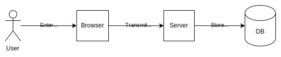
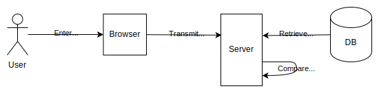

The original authentication method on the web, and still the most common, is the password.

In this guide we'll:

- Give a quick [overview](#overview) of password-based authentication
- Highlight [the main attacks you'll face, and corresponding defenses](#attacks_and_defenses)
- Give a more detailed account of the three main flows: [registration](#registration), [login](#login), and [password reset](#password_reset), showing how to integrate the defenses.

Finally, we'll discuss how even with the best practices, [password-based authentication should be considered a relatively weak form of authentication](#weaknesses_of_password-based_authentication), and should be supplemented with other methods or replaced entirely, if possible.

## Overview

In a password authentication system, when the user registers:

1. The user supplies a new username and password, for example by entering it in a {{htmlelement("form")}} element in the website.
2. The web page sends the username and password to a server, for example, by submitting the form data in a {{httpmethod("POST")}} request.
3. The server creates a new record for this user in its database. The key is the username and the password is stored under it.



When the user signs in:

1. The user supplies the username and password.
2. The web page sends the username and password to the server.
3. The server retrieves the stored password for the user, and compares the stored password with the one it just received.
4. If the passwords match, the user is signed in.



## Attacks and defenses

Looking at this overview, we can see some of the ways an attacker can impersonate the user.

- **Guessing**
  - : An attacker could try many different possible passwords for a user. Attackers typically use password lists that contain many of the most common passwords.

- **Credential stuffing**
  - : An attacker could buy a collection of username/password pairs from a previous data breach on a different site, and then try them on the target site in the hope that a user has used the same password for both sites.

- **Interception**
  - : An attacker could intercept the username and password while it is in transit from the browser to the server. One practical way to do this is to set up free Wifi hotspots in cafes or airports, and wait for victims to connect and then sign in to the target website.

- **Database compromise**
  - : An attacker could break into the server and retrieve the database of stored records.

- **Phishing**
  - : An attacker could trick the user into handing their password to the attacker. For example, an attacker might create a page that looks just like the target site's login page, and send the target user an email containing a link to the fake page, asking them to sign in to check an order status or receive a message.

### Defenses

- **Supporting password managers**
  - : A password manager is an application that enables users to store passwords, so users don't have to remember them. Password managers may also autofill passwords in login forms, and generate strong passwords for users. Password managers are often implemented as browser extensions, and browsers also provide their own built-in password managers.

    Password managers help reduce the threat of [guessing](#guessing) and [credential stuffing](#credential_stuffing) attacks, by making it much easier for users to have strong passwords and reducing the degree of password reuse. They also help counter [phishing](/en-US/docs/Web/Security/Attacks/Phishing#password_managers), because they will not autofill login details in the "lookalike" web pages used in phishing attacks, and this helps the user realise that the site is not legitimate.

    In our guidelines for the [registration](#registration) and [login](#login) flows, we outline how to ensure password managers will be able to work with your site.

- **Choosing strong passwords**
  - : To help defend against [guessing](#guessing) and [credential stuffing](#credential_stuffing) attacks, when the user creates a new password in [registration](#registration) or [password reset](#password_reset), you can check whether it is weak or appears on lists of passwords known to be compromised.

- **Secure password transmission**
  - : To defend against [interception](#interception) attacks, passwords must always be transmitted over {{glossary("HTTPS")}}. This should not be a specific requirement for password transmission, though: all your site's pages should always be transmitted over HTTPS, to mitigate [Manipulator in the Middle (MITM)](/en-US/docs/Web/Security/Attacks/MITM) attacks.

- **Secure password storage**
  - : To defend against [database compromise](#database_compromise), the server must store passwords in a form that makes it impractical for an attacker to retrieve the original password, even if they get access to the server's database. We'll cover the requirements for this in our guidelines for the [registration](#registration) flow.

In the next three sections we'll look in more detail about how to implement the main flows needed for a password-based authentication system:

- [Registration](#registration)
- [Login](#login)
- [Password reset](#password_reset)

In each section, we'll highlight practices that help to minimize the threat posed by the attacks listed, but as we'll see, it is impossible to eliminate them completely.

## Registration

In registration, a new user supplies a new username and password. The site is very likely to ask for an email address as well, and may choose to use the email address as the username.

The site should ask for this information using an HTML {{htmlelement("form")}}.

### Form design

Well-designed forms help users work with passwords effectively, and also help password managers integrate with a site.

Typically, on a registration form, a password manager will:

- Recognize when a user is being asked to create a new password and offer to generate one. This helps protect against [guessing](#guessing) and [credential stuffing](#credential_stuffing) attacks.
- Recognize when a user submits a registration form and offer to store the username and password, associated with the site.

Following the practices below helps password managers recognize forms they need to interact with, the elements they contain, and the points at which they need to be involved.

- The `<form>` element should be dedicated to registration.
- Forms should give a clear indication that the form has been submitted. This means either navigating to another page on submission, or simulating a navigation with `History.pushState()` or `History.replaceState()`.
- Individual `<input>` elements should use the correct `type`:
  - `"text"` or `"email"` for usernames
  - `"password"` for passwords.
- Individual `<input>` elements should use the correct `autocomplete` attribute:
  - `"username"` for username
  - `"new-password"` for creating a new password, in registration or password reset forms
  - `"current-password"` for entering an existing password, in login or password reset forms
- Forms should use hidden fields for information that the user does not have to enter, but that can provide a hint to password managers. For example, the user may not have to enter the username in a change password form, but the username can help a password manager know which password to enter.

For more information, see:

- [Sign-in form best practices](https://web.dev/articles/sign-in-form-best-practices#new-password)
- [Making password managers play ball with your login form](https://hidde.blog/making-password-managers-play-ball-with-your-login-form/)
- [Create Amazing Password Forms](https://www.chromium.org/developers/design-documents/create-amazing-password-forms/)

The registration form typically asks the user to enter the password twice.

### Form submission

When the user submits the form, the website front end sends the username, both copies of the password, and the email address to the server, using an HTTP {{httpmethod("POST")}} request. This must take place over {{glossary("HTTPS")}}, to prevent attackers from [intercepting](#interception) the password in transit.

### Username and password validation

When the server receives the `POST` request, it validates the username and password. The username must not match an existing username, and the copies of the password must match each other.

The risk of [guessing](#guessing) attacks can be reduced if users choose stronger passwords, and the policies websites follow can help with this.

When users choose new passwords, websites should:

- Have a generous maximum password length (at least 64 characters).
- Allow any Unicode characters.
- Not require specific character types (for example, don't require a mix of upper and lower case, or punctuation). Rules like this can exclude many strong password choices (for example, passphrases), and users typically follow such rules in highly predictable ways.

Additionally, websites can:

- Reduce the risk of [guessing](#guessing) attacks by rejecting passwords found on common password lists.
- Reduce the risk of [credential stuffing](#credential_stuffing) attacks by rejecting passwords that have been included in data breaches. For example, the [Have I Been Pwned](https://haveibeenpwned.com) website provides lists of passwords found in data breaches, and makes it available through an [API](https://haveibeenpwned.com/API/v3#PwnedPasswords).

Note, though, that this is far from a complete defense for these attacks: for example, data breaches may not be public, or may happen after the password was chosen.

Websites should also consider using a password strength tool like [zxcvbn](https://github.com/zxcvbn-ts/zxcvbn): note that this particular tool also checks passwords against the Have I Been Pwned data.

For more information, see:

- [OWASP Authentication Cheat Sheet](https://cheatsheetseries.owasp.org/cheatsheets/Authentication_Cheat_Sheet.html#implement-proper-password-strength-controls)
- [NIST Digital Identity Guidelines: Authentication and Lifecycle Management](https://pages.nist.gov/800-63-3/sp800-63b.html)
- [Passwords Evolved: Authentication Guidance for the Modern Era - Troy Hunt](https://www.troyhunt.com/passwords-evolved-authentication-guidance-for-the-modern-era/)

The client may also validate data before sending it to the server, but this is only as a convenience to users: the server must still validate the data as well.

### Storing passwords

If any errors occur the server responds with an error message. Otherwise the server stores the password as a record in its database, keyed by the username.

#### Hashing passwords

Websites must not store passwords in plaintext form. Instead, when the user registers with a new password (or changes their password), the password is hashed and the hash is stored. When the user presents their password on login, the site:

- retrieves the hash from the database
- hashes the password provided by the user
- compares the hashes.

A hash is a _one-way function_, meaning that it's not possible to derive the original input to a hash function from its output.

This means that if an attacker gets access to the database, they will typically try to extract passwords by hashing lists of common passwords and comparing the results with the entries in the database. For this reason the hash functions chosen for password storage are intentionally slow and difficult to optimize.

Hash functions that are designed for hashing passwords typically allow you to configure the amount of work involved to create the hash, so they can be made slower or faster depending on the expected capabilites of the attacker.

#### Precomputed hash tables

Rather than calculate hash tables themselves, attackers can look up the password corresponding to a hash in a precomputed table (also known as a [rainbow table](https://en.wikipedia.org/wiki/Rainbow_table)) mapping possible passwords to their hashes:

| Password | Hash        |
| -------- | ----------- |
| pa55w0rd | 56965E2A... |
| abcdef   | BEF57EC7... |
| letmein  | 1C8BFE8F... |

Although these tables may be very large, such attacks can be effective because table lookup is a fast operation.

#### Salt and pepper

To defeat attacks that use precomputed hash tables, _salt_ must be added to the password before it is hashed. Salt is a random value unique to each password. It does not have to be secret: salt is stored alongside the hashed password. However, it prevents an attacker from using precomputed hash values, because the salt means that a given password will hash to a different value.

As an additional defense, websites may also add _pepper_ to the hash function's input. Unlike salt, pepper is:

- Not unique: the same value is used for all the passwords in the database.
- A secret: it must not be stored in the database itself but in a separate location such as a hardware security module (HSM).

#### Hashing algorithms

Websites should use standard algorithms to hash passwords. These algorithms support all the features discussed above. The [OWASP guide to password storage](https://cheatsheetseries.owasp.org/cheatsheets/Password_Storage_Cheat_Sheet.html#password-hashing-algorithms) recommends, in order of preference:

1. [Argon2id](https://en.wikipedia.org/wiki/Argon2)
2. [scrypt](https://en.wikipedia.org/wiki/Scrypt)
3. [bcrypt](https://en.wikipedia.org/wiki/Bcrypt)
4. [PBKDF2](https://en.wikipedia.org/wiki/PBKDF2)

Websites should use password storage and verification functions provided by a reputable framework, rather than trying to implement their own. For example, [Django](https://docs.djangoproject.com/en/5.0/topics/auth/passwords/) uses PBKDF2 by default but enables you to use a different algorithm if you choose.

#### Using web frameworks

Web frameworks typically provide functions to store passwords securely, which includes features such as hashing and salting. As a rule, you should use a reputable web framework and use the functions that it provides, rather than implementing your own secure password storage mechanism.

### Email verification

If the website is intending to use email in the password reset flow, then the server must also check that the email address belongs to the user signing up. To do this, the server typically generates a random token and sets it as a parameter to a verification URL:

```plain
https://example.org/verify?<random-token>
```

The server then sends an email to the address the user gave. The email asks the user to click a link to the verification URL. The page can then extract that token and use it to find the user's record in the database. It can then mark the email address as verified.

## Login

To sign in, the user enters their username and password using an HTML `<form>` dedicated to sign-in.

Just like the registration form, the login form should be designed to work with (and be tested to work with) password managers. To do this, the form should follow the practices previously described in [Form design](#form_design).

When the user submits the form, the website front end sends the username and password to the server, using an HTTP `POST` request. Again, this must take place over TLS, to prevent attackers from intercepting the password in transit.

When the server receives the `POST` request, the server:

- Retrieves the record for the supplied username.
- If a record exists, compares the supplied password with the value in the record.

If the comparison succeeds, the server signs the user in and returns success.

If the record was not found or the comparison fails, the server must return the same error message in both cases. Otherwise, attackers can determine whether an account exists and can use this information to execute further attacks.

## Password reset

The password reset flow enables a user to reset the password, when they have forgotten or lost it. This usually relies on the user having supplied (and then verified) their email address when they registered.

When the user asks to reset their password, the website asks the user to enter their email address. The website may ask the user to solve a CAPTCHA at this point, to make it harder for a malicious third party to spam a legitimate user with multiple password reset requests.

The website back end then checks whether it has a record for this email address. _Whether or not it does have a record_, the website gives the same message to the user: that it has sent an email to the address given, with further instructions. Providing the same message in both cases prevents an attacker from finding out whether a given email address is associated with an account: this information could be used in further attacks (such as targeted [phishing](/en-US/docs/Web/Security/Attacks/Phishing), or _spearphishing_, attacks).

- If the website does not have a record, it sends an email to the address, telling the addressee that someone entered this email in a "password reset" form, but that the site did not have a record for this email address. This helps a legitimate account-holder who has multiple email addresses, and entered the wrong address in the password reset form.

- If the website does have a record for this email, then the website:
  - Generates a reset token, which is a random number, and stores the token alongside the record. The token is given an expiry timestamp.
  - Sets the token value as a URL parameter to the reset URL, like: `https://example.org/reset?<reset-token>`.
  - Sends an email to the address the user gave, containing the link and asking the user to click it.

When the user clicks the link, the reset page extracts the URL parameter and looks for a matching stored reset token. If a reset token is found and has not expired, the website allows the user to enter a new password. This flow follows similar rules to the [registration](#registration) form, to enable the new password to be recognized by a password manager.

Finally, the website emails the user confirmation that their password has been changed.

For more information, see:

- [Everything you ever wanted to know about building a secure password reset feature](https://www.troyhunt.com/everything-you-ever-wanted-to-know/)
- [Forgot Password Cheat Sheet](https://cheatsheetseries.owasp.org/cheatsheets/Forgot_Password_Cheat_Sheet.html)

## Weaknesses of password-based authentication

The practices described above help reduce the risks of a password-based authentication system, but passwords remain an inherently vulnerable authentication method:

- Although password managers and good password policies can help users choose strong passwords and not reuse passwords, they can't guarantee either outcome, leaving users vulnerable to credential stuffing and guessing attacks.

- Even if users have strong passwords and do not reuse them, users remain vulnerable to phishing attacks.

To address these weaknesses, consider using alternative methods, either instead of passwords or as {{glossary("multi-factor authentication", "additional authentication factors")}}. For example, websites sometimes use passwords with a [one-time password](/en-US/docs/Web/Security/Authentication/OTP) as a second factor, and some websites support [passkeys](/en-US/docs/Web/Security/Authentication/Passkeys), which are resistant to phishing attacks.
