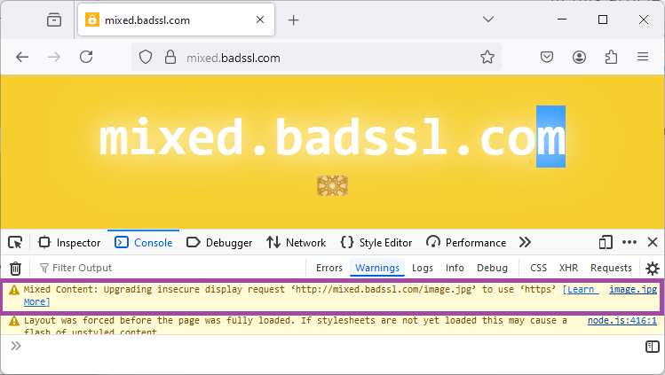
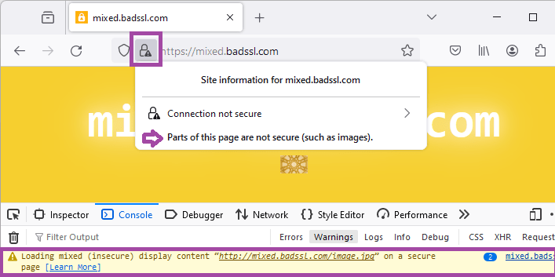

{{QuickLinksWithSubpages("/en-US/docs/Web/Security")}}

When a web page is loaded from a secure origin, over a secure channel such as {{Glossary("HTTPS")}}, the connection with the web server is encrypted, and is therefore protected from eavesdropping and modification by man-in-the-middle attacks.
If the securely loaded web page only includes images, scripts, and other resources that are also hosted on secure origins, users can be confident that the whole page is safe from these kinds of attacks.

"Mixed content" refers to securely loaded web pages that use resources to be fetched via HTTP or another insecure protocol.
This kind of web page is potentially unsafe because any resources that are sent insecurely can be viewed, possibly revealing sensitive information, and/or modified by an attacker.
Scripts are particularly dangerous because they can modify any aspect of the page, but all types of resources have some risk.
For example, images can be modified to give the user false or misleading information, or to change the apparent function of a button.

"Mixed downloads" refer to resource downloads initiated from a secure context, but fetched over an insecure connection.
These share the same risks as mixed content: downloads appear to come from a secure origin, but could have been modified or viewed en-route.

You should avoid using mixed content and mixed downloads in your websites!
Browsers mitigate the risks of mixed content by auto-upgrading image, video, and audio mixed content requests from HTTP to HTTPS, and block insecure requests for all other resource types.
They should also block _mixed downloads_ by default.

## Types of mixed content

Mixed content in a web page is divided into two categories: "upgradable content" and "blockable content".
Browsers should automatically upgrade requests for upgradable content from HTTP to HTTPS, and block requests for the blockable content.

This approach ensures that all content in a secure context is either loaded via a secure channel or blocked, which is safer for users than displaying a mix of secure and insecure content, and less disruptive than breaking web pages by blocking absolutely all insecure content.

> [!NOTE]
> Earlier versions of the specification divided mixed content into "blockable" and "optionally blockable" categories:
>
> - Blockable content types, also referred to as "active mixed content", were those that could modify other parts of the web page, such as scripts and stylesheets.
>   The potential risk if these files are modified is very high, and browsers were required to block them.
> - Optionally blockable content types, also known as "passive mixed content", were those that could not modify other content in the web page, such as images, videos, and audio files.
>   The potential risk of allowing these files was lower, so browsers could choose to block or display them, or defer the decision to the user.

The set of resource types that comprise "upgradable content" was seeded from the set of "optionally blockable" mixed content.
The expectation is that any new file types will be defined as blockable content, and some upgradable content may become blockable in future.

### Upgradable content

Upgradable content requests are those where an insecure request will automatically be upgraded to a secure request, by modifying the origin scheme from `http` to `https`.
The remote server will either respond with the resource, or a status code indicating that it was not found.

The resource types in this category are those where the blocking the request would risk of breaking significant portions of the web.
These currently correspond to the mixed content types that were previously "optionally blockable", as these are still used on some websites.

The following elements are upgradable (except where the URL host is specified as an IP address — see the following section):

- {{HTMLElement("img")}} where origin is set via `src` attribute, including SVG documents (but not when setting resources with `srcset` or `<picture>`).
- CSS image elements such as: `background-image`, `border-image`, etc.
- {{HTMLElement("audio")}} where origin is set with `src` attribute.
- {{HTMLElement("video")}} where origin is set with `src` attribute
- {{HTMLElement("source")}} where video or origin resource is set.

### Blockable content

Blockable content is defined as "all mixed content that is not upgradable".

This includes HTTP requests resulting from the following elements (this list is not exhaustive):

- {{HTMLElement("script")}} where origin is set via `src` attribute
- {{HTMLElement("link")}} where the origin is set in the `href` attribute, and includes stylesheets
- {{HTMLElement("iframe")}} where origin is set via `src` attribute
- {{domxref("Window/fetch", "fetch()")}} requests
- {{domxref("XMLHttpRequest")}} requests
- All cases in CSS where a {{CSSXref("url_value", "&lt;url&gt;")}} value is used ({{cssxref("@font-face")}}, {{cssxref("cursor")}}, {{cssxref("background-image")}}, and so forth).
- {{HTMLElement("object")}} (`data` attribute)
- {{domxref("Navigator.sendBeacon")}} (`url` attribute)
- {{HTMLElement("img")}} where origin is set via `srcset` or `<picture>`.
- Web fonts

Mixed content requests that would otherwise be upgraded are blocked if the URL's host is an IP address rather than a domain name.
So `` will be upgraded, but `` is blocked.

## Examples of mixed content requests

Mixed content requests are insecure requests for resources from a [secure context](/en-US/docs/Web/Security/Secure_Contexts):

The following examples demonstrate secure, insecure, and mixed content requests:

- `http://insecure.com` loads `http://also.insecure.com` — is not a mixed content request because both origins are insecure.
- `https://secure.com` loads `http://insecure.com` — is a mixed content request because the insecure resource `http://insecure.com` is loaded into the secure context `https://secure.com`.
- `http://insecure.com` loads `https://secure.com` in an `<iframe>`, which in turn loads `http://also.insecure.com` — loading `https://secure.com` into `http://insecure.com` is not a mixed content request (there is no restriction on loading a secure context into an insecure context).
  However loading `http://also.insecure.com` into the secure frame `https://secure.com` is a mixed content request.
- `https://secure.com` frames a `data:` URL, which loads `http://insecure.com` — this is a mixed content request, because `https://secure.com` (and hence `data:`) were securely loaded and `http://insecure.com` is insecure.

Mixed context requests can also be made from secure contexts such as plugins or workers, and will be upgraded/blocked in the same way.

Note however that navigation requests from a secure context that target insecure target top-level browsing contexts are not considered mixed content as they create a new context that will either be secure or insecure independent of the origin of the request.

### Loading locally delivered mixed-resources

Local resources are considered to be from secure origins, just like HTTPS origins.
This includes `file:` URLs, and content accessed from loopback addresses such as `http://127.0.0.1/` or `http://localhost/`.

You can load these files from secure contexts, and you will still have a secure context.
However if a local file loads insecure resource via `http:`, it would be a mixed content request.

Support for loading local content can be checked in the [Browser compatibility](#browser_compatibility) section.

## Mixed downloads

A mixed download is a resource download from a secure context over an insecure connection.
They are problematic for the same reasons as mixed content — content may be intercepted and/or modified by an attacker, and it is not obvious to users that this might happen on a secure site.

For example, the following code defines an [`<a>`](/en-US/docs/Web/HTML/Element/a#download) element that could be used to download the page at the insecure origin `http://example.com/`.
If this code is in a page that is served over HTTPS, saving the link results in a mixed download.

```html
<a href="http://example.com/" download>Download</a>
```

Browsers are expected to block mixed downloads, and secure sites should not include them.

> [!NOTE]
> Browsers commonly block mixed downloads by default, but inform users of the risk and allow them to keep or discard the download.

## Developer console

The developer console shows warnings when mixed content is upgraded or blocked.
These can be used to debug and fix mixed-content in your websites.

The screenshot below shows the console warning when an image is upgraded on Firefox (Chrome has a similar warning).



On browser versions that still display "optionally blockable" content, an icon is used to indicate that there is mixed content in the displayed content, along with a console warning.
The screenshot below shows the icon and console warning for Firefox starting supporting upgradable mixed-content.



## Fixing mixed content issues

The best strategy to avoid issues with mixed content is to serve all the content as HTTPS:

- Serve all content from your domain as HTTPS.
- Make all references to resources hosted on your domain into relative links or HTTPS links, including for downloads.
- If using resource on other sites use HTTPS versions, if available.

  Most sites provide HTTPS versions of shared resources.
  Often the easiest approach is to replace all `http://` links with `https://` and then use tools such as [LinkChecker](https://linkchecker.github.io/linkchecker/) to verify that the links all work.

There are a number of ways to verify that your site is free of mixed content including:

- Navigate your site, and check your browser's [developer console](#developer_console) for mixed content warnings.
- Disable all mixed content on your browser and test that pages work as expected.
  This is the default for Safari, but most browsers support some mechanism for blocking all mixed content (see [compatibility data](#browser_compatibility)).
- Use a desktop-based web crawler like [HTTPSChecker](https://httpschecker.net/how-it-works), or a CLI tool like [mcdetect](https://github.com/agis/mcdetect), to check your website recursively and find links to insecure content.
- Use an online tool like [Mixed Content Checker](https://www.crawlcenter.com/mixed-content-checker) to check your site.

## Specifications

{{Specifications}}

## Browser compatibility

{{Compat}}

## See also

- [CSP: `upgrade-insecure-requests`](/en-US/docs/Web/HTTP/Headers/Content-Security-Policy/upgrade-insecure-requests) upgrades all requests to HTTPS, including blockable mixed content
