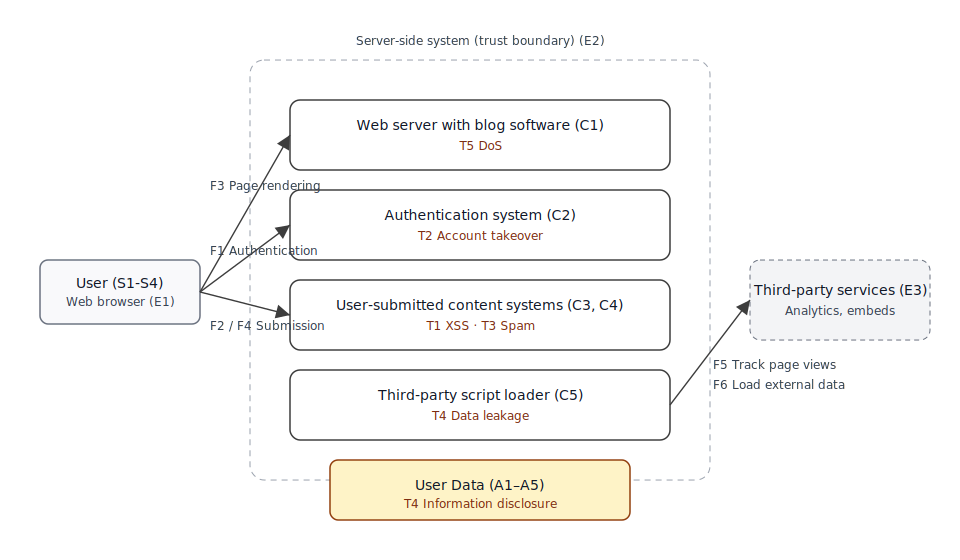

This page shows an example threat model for a website. You are encouraged to copy it and change it to suit your own project. You can remove components your projects does not have, add different data flows, etc. Go through each of the four key questions and modify them as needed.
For more information and guidance on how to create a threat model, see the main [threat modeling page](/en-US/docs/Web/Security/Threat_modeling).

## Overview

- Project: Blog website
- Description: Public-facing blog serving static pages, with user comments, a contact form, analytics scripts, and a map embed.
- Version: 1.0
- Last updated: 2026-02-23

## 1. What are we working on?

### Assumptions and scope

This threat model covers the blog website itself, including user interaction and backend services. The following are considered **out of scope**, but assumed to provide baseline protections:

- Web browser and web platform
- Operating system
- Hosting provider infrastructure

Threats targeting those layers are not modeled here unless they directly affect this project.

### Trust boundaries

This threat model assumes a trust boundary between:

- The user's browser and the server
- First-party server components and third-party scripts

Threats are most likely to occur where data crosses these boundaries.

### Components

| ID  | Component                     | Description                                |
| --- | ----------------------------- | ------------------------------------------ |
| C1  | Web server with blog software | Serves static pages and API endpoints      |
| C2  | Authentication system         | Handles user login and sessions            |
| C3  | Comment system                | Stores and displays user-submitted content |
| C4  | Contact form                  | Allows users to send emails                |
| C5  | Third-party scripts           | Analytics and embedded map                 |

### Assets

| ID  | Asset                  | Description                                                          |
| --- | ---------------------- | -------------------------------------------------------------------- |
| A1  | User credentials       | Passkeys and passwords                                               |
| A2  | Session information    | Cookies                                                              |
| A3  | Personal data          | Email addresses, usernames, personally identifying information (PII) |
| A4  | User-generated content | Blog comments                                                        |
| A5  | Draft content          | Unpublished blog posts                                               |

### Data flows

| ID  | Flow                | Description                                  |
| --- | ------------------- | -------------------------------------------- |
| F1  | Authentication flow | User login and session establishment         |
| F2  | Comment submission  | User submits content to server               |
| F3  | Page rendering      | Server delivers HTML to browser              |
| F4  | Contact form        | Message submission to administrators         |
| F5  | Analytics flow      | Track page views                             |
| F6  | Map embed           | Page loads external data for interactive map |

### External dependencies

| ID  | Dependency          | Notes                                                                                                      |
| --- | ------------------- | ---------------------------------------------------------------------------------------------------------- |
| E1  | Web browser         | Assumed to enforce the usual security mechanisms (e.g., same-origin policy) and no malicious WebExtensions |
| E2  | Hosting provider    | Assumed to provide safeguards, such as DDoS protection                                                     |
| E3  | Third-party scripts | Loaded from external origins                                                                               |

### Stakeholders

| ID  | Stakeholder         | Interests / potential harm           |
| --- | ------------------- | ------------------------------------ |
| S1  | Anonymous users     | Privacy, security, content integrity |
| S2  | Registered users    | Account safety, data protection      |
| S3  | Disabled users      | Equal access                         |
| S4  | Blog administrators | System integrity and availability    |

## 2. What can go wrong?

### Identified threats

| ID  | Threat                     | Affected elements | Description                                                            |
| --- | -------------------------- | ----------------- | ---------------------------------------------------------------------- |
| T1  | Cross-site scripting (XSS) | C3, A4            | Malicious comments inject JavaScript that run in other user's browsers |
| T2  | Account takeover           | C2, A1, A2, A3    | Stolen credentials or sessions                                         |
| T3  | Spam and abuse             | C3, C4            | Automated spam                                                         |
| T4  | Data leakage               | A3, A5            | Sensitive data exposed via misconfiguration                            |
| T5  | Denial of service          | C1                | Excessive requests overwhelm server                                    |

## 3. What are we going to do about it?

### Threat responses

| Threat | Response ID | Strategy | Description                                         |
| ------ | ----------- | -------- | --------------------------------------------------- |
| T1     | R1          | Reduce   | Sanitize user-generated content                     |
| T1     | R2          | Reduce   | Apply a strict Content Security Policy              |
| T1     | R3          | Reduce   | Template engine encodes output                      |
| T2     | R4          | Reduce   | Implement CSRF defenses                             |
| T2     | R5          | Reduce   | Use `Secure`, `HttpOnly`, `SameSite=Strict` cookies |
| T2     | R6          | Reduce   | Session expires after 30-day idle timeout           |
| T3     | R7          | Reduce   | Apply rate limiting and spam filtering              |
| T3     | R8          | Accept   | Manual moderation of residual spam                  |
| T4     | R9          | Reduce   | Limit data exposure and review logs                 |
| T5     | R10         | Reduce   | Apply request limits and timeouts                   |

## 4. Did we do a good enough job?

### Review status

- All identified threats have at least one response.
- No high-impact threats are currently unaddressed.
- Residual risks (e.g., spam) are accepted with monitoring.

### Follow-up actions

- Revisit this threat model after:
  - Major feature changes
  - New third-party dependencies
  - Security incidents
- Review at least once per year.

### Notes

This threat model is intentionally incomplete and will evolve. Its purpose is to improve shared understanding and guide security decisions, not to guarantee the absence of vulnerabilities.

## See also

- [Threat modeling guide](/en-US/docs/Web/Security/Threat_modeling)
- [Threat Model for the Web Platform](https://github.com/w3c/threat-model-web/blob/main/index.md)
