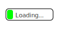

{{SVGRef}}

The **`<discard>`** [SVG](/en-US/docs/Web/SVG) element may be used to specify the time at which a particular element should be removed from the DOM.
This allows an SVG viewer to conserve memory by discarding elements that are no longer needed, such as animated elements that have completed.

The operation removes the target element and all its children, and then the `<discard>` element itself (this happens even if the target element was invalid).

The [`begin`](#begin) attribute is used to specify the trigger point at which the `<discard>` element becomes active, and its associated element is discarded.
This is commonly an [`offset-value`](/en-US/docs/Web/SVG/Attribute/begin#offset-value) relative to when the SVG file was loaded into the DOM, but it may take other values.

The element that is to be removed from the DOM is specified using the [`href`](#href) attribute.
If not specified, the immediate parent of the `<discard>` element is the target.

`<discard>` may be used in all the same places as the {{SVGElement('animate')}} element.
Authors should set the `playbackorder` attribute to `forwardonly` when using this element, as elements are not re-added if the user seeks backwards in the timeline.

## Example

### Loading bar with discard

This example demonstrates how the `<discard>` element might be used with an activation triggered based on the completion of an animation.
The SVG used is based on Erik Dahlström's "Loading bar" SVG at http://xn--dahlstrm-t4a.net/svg/smil/svgt12_discard.svg.

The SVG defines a "Load complete" {{svgelement("text")}} element that is hidden by a {{svgelement("g")}} element.

The `<rect>` is animated to the end of the bar over a duration of 4 seconds by the animation with id "a".
The `<g>` element contains a discard element that is triggered by completion of the "a" animation: `<discard begin="a.end" />`.
When this activates the `<g>` element and all its contents are discarded from the DOM, leaving only the text block that displays "Load complete".

```html
<svg
  xmlns="http://www.w3.org/2000/svg"
  xmlns:xlink="http://www.w3.org/1999/xlink"
  viewBox="0 0 100 50">
  <text
    x="50"
    y="30"
    font-family="sans-serif"
    font-size="10px"
    text-anchor="middle"
    stroke="white"
    stroke-width="0.2">
    Load complete
  </text>
  <g>
    <rect
      rx="5"
      x="10"
      y="15"
      height="20"
      width="80"
      fill="white"
      stroke="black" />
    <rect fill="lime" rx="3" x="12" y="17" height="16.1" width="10">
      <animate id="a" attributeName="width" to="76" dur="4s" />
    </rect>
    <text
      x="50"
      y="30"
      font-family="sans-serif"
      font-size="10px"
      text-anchor="middle"
      stroke="white"
      stroke-width="0.2">
      Loading...
    </text>
    <discard begin="a.end" />
  </g>
</svg>
```

#### Result

The live example below displays the SVG above in the top image, while the second image is the same SVG file but with the `<discard>` elements removed.

On browsers that support the discard element, on the top image, the faster bar will disappear after it reaches the end and is discarded.
When the second bar reaches the end, everything else except the text "Load complete" will disappear as it is discarded.
On browsers that don't support the discard element both images will behave the same: the "Load complete" will never get to display.

```html hidden
<button id="reset" type="button">Reset</button>
```

```js hidden
const reload = document.querySelector("#reset");

reload.addEventListener("click", () => {
  window.location.reload(true);
});
```

```html hidden


```

{{EmbedLiveSample('Result', , '800px')}}

## Attributes

- {{SVGAttr("begin")}}

  - : The trigger that causes the `<discard>` element to become active, at which point the associated element should be discarded.
    This is commonly the time since the SVG was loaded.
    _Value type_: [**\<begin-value-list>**](/en-US/docs/Web/SVG/Attribute/begin#animate_animatemotion_animatetransform_set).
    _Default value_: `0`; _Animatable_: **no**

- {{SVGAttr("href")}}

  - : An URL reference for the target element to discard.
    This has the same requirements as [`href` on animation elements](/en-US/docs/Web/SVG/Attribute/href#animate_animatemotion_animatetransform_set), and can be another `<discard>` element.
    If not defined, the target element is the immediate parent of the `<discard>` element.

    Note that if the target element is not part of the current SVG document fragment, whether or not it is discarded depends on the target language.

    _Default value_: `none`; _Animatable_: **no**

## Usage context

{{svginfo}}

## Specifications

{{Specifications}}

## Browser compatibility

{{Compat}}
