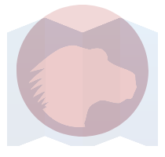

{{SVGRef}}

The **`<feComposite>`** [SVG](/en-US/docs/Web/SVG) filter primitive performs the combination of two input images pixel-wise in image space using one of the Porter-Duff compositing operations: `over`, `in`, `atop`, `out`, `xor`, `lighter`, or `arithmetic`.

The table below shows each of these operations using an image of the MDN logo composited with a red circle:

<table class="no-markdown">
  <tbody>
    <tr>
      <th>Operation</th>
      <th>Description</th>
    </tr>
    <tr>
      <td>
        <p>over </p>
      </td>
      <td>
        The source graphic defined by the {{SVGAttr("in")}} attribute
        (the MDN logo) is placed over the destination graphic defined by the
        {{SVGAttr("in2")}} attribute (the circle).
        <p>
          This is the <em>default operation</em>, which will be used if no
          operation or an unsupported operation is specified.
        </p>
      </td>
    </tr>
    <tr>
      <td>
        <p>in </p>
      </td>
      <td>
        The parts of the source graphic defined by the <code>in</code> attribute
        that overlap the destination graphic defined in the
        <code>in2</code> attribute, replace the destination graphic.
      </td>
    </tr>
    <tr>
      <td>
        <p>out </p>
      </td>
      <td>
        The parts of the source graphic defined by the <code>in</code> attribute
        that fall outside the destination graphic defined in the
        <code>in2</code> attribute, are displayed.
      </td>
    </tr>
    <tr>
      <td>
        <p>atop </p>
      </td>
      <td>
        The parts of the source graphic defined in the
        <code>in</code> attribute, which overlap the destination graphic defined
        in the <code>in2</code> attribute, replace the destination graphic. The
        parts of the destination graphic that do not overlap with the source
        graphic stay untouched.
      </td>
    </tr>
    <tr>
      <td>
        <p>xor </p>
      </td>
      <td>
        The non-overlapping regions of the source graphic defined in the
        <code>in</code> attribute and the destination graphic defined in the
        <code>in2</code> attribute are combined.
      </td>
    </tr>
    <tr>
      <td>
        <p>
          lighter 
        </p>
      </td>
      <td>
        The sum of the source graphic defined in the <code>in</code> attribute
        and the destination graphic defined in the <code>in2</code> attribute is
        displayed.
      </td>
    </tr>
    <tr>
      <td>
        <p>
          arithmetic
          
        </p>
      </td>
      <td>
        <p>
          The <code>arithmetic</code> operation is useful for combining the
          output from the {{SVGElement("feDiffuseLighting")}} and
          {{SVGElement("feSpecularLighting")}} filters with texture
          data. If the <code>arithmetic</code> operation is chosen, each result
          pixel is computed using the following formula:
        </p>
        <pre class="brush: plain">result = k1*i1*i2 + k2*i1 + k3*i2 + k4</pre>
        <p>where:</p>
        <ul>
          <li>
            <code>i1</code> and <code>i2</code> indicate the corresponding pixel
            channel values of the input image, which map to
            {{SVGAttr("in")}} and {{SVGAttr("in2")}} respectively
          </li>
          <li>
            {{SVGAttr("k1")}}, {{SVGAttr("k2")}},
            {{SVGAttr("k3")}}, and {{SVGAttr("k4")}} indicate the
            values of the attributes with the same name.
          </li>
        </ul>
      </td>
    </tr>
  </tbody>
</table>

## Usage context

{{svginfo}}

## Attributes

### Global attributes

- [Core attributes](/en-US/docs/Web/SVG/Attribute#core_attributes)
- [Presentation attributes](/en-US/docs/Web/SVG/Attribute#presentation_attributes)
- [Filter primitive attributes](/en-US/docs/Web/SVG/Attribute#filter_primitive_attributes)
- {{SVGAttr("class")}}
- {{SVGAttr("style")}}

### Specific attributes

- {{SVGAttr("in")}}: First input for the given filter primitive.
- {{SVGAttr("in2")}}: Second input for the given filter primitive (works the same as the `in` attribute).
- {{SVGAttr("operator")}}: `over` | `in` | `out` | `atop` | `xor` | `lighter` | `arithmetic`
- {{SVGAttr("k1")}}, {{SVGAttr("k2")}}, {{SVGAttr("k3")}}, {{SVGAttr("k4")}}: Values used for calculating the result pixel in `arithmetic` {{SVGAttr("operator")}} filter primitives.

## DOM Interface

This element implements the {{domxref("SVGFECompositeElement")}} interface.

## Example

This example defines filters for each of the supported operations (`over`, `atop`, `lighter`, etc.), which composite an input `SourceGraphic` with an image of the MDN logo. The filters are each applied to a circle element, which is then used as the `SourceGraphic`.

> **Note:** `BackgroundImage` cannot be used as a compositing source on modern browsers, so we can't define a filter that composites using whatever pixels happen to be under the filter as one of the sources. The approach taken here is a [workaround because we can't use `BackgroundImage`](/en-US/docs/Web/SVG/Attribute/in#workaround_for_backgroundimage).

### SVG

```html
<svg
  style="width:800px; height:400px; display: inline;"
  xmlns="http://www.w3.org/2000/svg"
  xmlns:xlink="http://www.w3.org/1999/xlink">
  <defs>
    <filter id="imageOver">
      <feImage href="mdn_logo_only_color.png" x="10px" y="10px" width="160px" />
      <feComposite in2="SourceGraphic" operator="over" />
    </filter>
    <filter id="imageIn">
      <feImage href="mdn_logo_only_color.png" x="10px" y="10px" width="160px" />
      <feComposite in2="SourceGraphic" operator="in" />
    </filter>
    <filter id="imageOut">
      <feImage href="mdn_logo_only_color.png" x="10px" y="10px" width="160px" />
      <feComposite in2="SourceGraphic" operator="out" />
    </filter>
    <filter id="imageAtop">
      <feImage href="mdn_logo_only_color.png" x="10px" y="10px" width="160px" />
      <feComposite in2="SourceGraphic" operator="atop" />
    </filter>
    <filter id="imageXor">
      <feImage href="mdn_logo_only_color.png" x="10px" y="10px" width="160px" />
      <feComposite in2="SourceGraphic" operator="xor" />
    </filter>
    <filter id="imageArithmetic">
      <feImage href="mdn_logo_only_color.png" x="10px" y="10px" width="160px" />
      <feComposite
        in2="SourceGraphic"
        operator="arithmetic"
        k1="0.1"
        k2="0.2"
        k3="0.3"
        k4="0.4" />
    </filter>
    <filter id="imageLighter">
      <feImage href="mdn_logo_only_color.png" x="10px" y="10px" width="160px" />
      <feComposite in2="SourceGraphic" operator="lighter" />
    </filter>
  </defs>
  <g transform="translate(0,25)">
    <circle
      cx="90px"
      cy="80px"
      r="70px"
      fill="#c00"
      style="filter:url(#imageOver)" />
    <text x="80" y="-5">over</text>
  </g>
  <g transform="translate(200,25)">
    <circle
      cx="90px"
      cy="80px"
      r="70px"
      fill="#c00"
      style="filter:url(#imageIn)" />
    <text x="80" y="-5">in</text>
  </g>
  <g transform="translate(400,25)">
    <circle
      cx="90px"
      cy="80px"
      r="70px"
      fill="#c00"
      style="filter:url(#imageOut)" />
    <text x="80" y="-5">out</text>
  </g>
  <g transform="translate(600,25)">
    <circle
      cx="90px"
      cy="80px"
      r="70px"
      fill="#c00"
      style="filter:url(#imageAtop)" />
    <text x="80" y="-5">atop</text>
  </g>
  <g transform="translate(0,240)">
    <circle
      cx="90px"
      cy="80px"
      r="70px"
      fill="#c00"
      style="filter:url(#imageXor)" />
    <text x="80" y="-5">xor</text>
  </g>
  <g transform="translate(200,240)">
    <circle
      cx="90px"
      cy="80px"
      r="70px"
      fill="#c00"
      style="filter:url(#imageArithmetic)" />
    <text x="70" y="-5">arithmetic</text>
  </g>
  <g transform="translate(400,240)">
    <circle
      cx="90px"
      cy="80px"
      r="70px"
      fill="#c00"
      style="filter:url(#imageLighter)" />
    <text x="80" y="-5">lighter</text>
  </g>
</svg>
```

### Result

{{EmbedLiveSample("Example", 100, 450)}}

## Specifications

{{Specifications}}

## Browser compatibility

{{Compat}}

## See also

- {{SVGElement("filter")}}
- {{SVGElement("animate")}}
- {{SVGElement("set")}}
- {{SVGElement("feBlend")}}
- {{SVGElement("feColorMatrix")}}
- {{SVGElement("feComponentTransfer")}}
- {{SVGElement("feConvolveMatrix")}}
- {{SVGElement("feDiffuseLighting")}}
- {{SVGElement("feDisplacementMap")}}
- {{SVGElement("feFlood")}}
- {{SVGElement("feGaussianBlur")}}
- {{SVGElement("feImage")}}
- {{SVGElement("feMerge")}}
- {{SVGElement("feMorphology")}}
- {{SVGElement("feOffset")}}
- {{SVGElement("feSpecularLighting")}}
- {{SVGElement("feTile")}}
- {{SVGElement("feTurbulence")}}
- [SVG tutorial: Filter effects](/en-US/docs/Web/SVG/Tutorial/Filter_effects)
