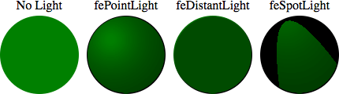

{{SVGRef}}

The **`<feDiffuseLighting>`** [SVG](/en-US/docs/Web/SVG) filter primitive lights an image using the alpha channel as a bump map. The resulting image, which is an RGBA opaque image, depends on the light color, light position and surface geometry of the input bump map.

The light map produced by this filter primitive can be combined with a texture image using the multiply term of the `arithmetic` operator of the {{SVGElement("feComposite")}} filter primitive. Multiple light sources can be simulated by adding several of these light maps together before applying it to the texture image.

## Usage context

{{svginfo}}

## Attributes

### Global attributes

- [Core attributes](/en-US/docs/Web/SVG/Attribute#core_attributes)
- [Presentation attributes](/en-US/docs/Web/SVG/Attribute#presentation_attributes)
- [Filter primitive attributes](/en-US/docs/Web/SVG/Attribute#filter_primitive_attributes)
- {{SVGAttr("class")}}
- {{SVGAttr("style")}}

### Specific attributes

- {{SVGAttr("in")}}
- {{SVGAttr("surfaceScale")}}
- {{SVGAttr("diffuseConstant")}}
- {{SVGAttr("kernelUnitLength")}}

## DOM Interface

This element implements the {{domxref("SVGFEDiffuseLightingElement")}} interface.

## Example

The following example show the effect of the `<feDiffuseLighting>` element on a circle with each light source available. Each time, the light comes from the upper left corner.

```html
<svg width="440" height="140" xmlns="http://www.w3.org/2000/svg">
  <!-- No light is applied -->
  <text text-anchor="middle" x="60" y="22">No Light</text>
  <circle cx="60" cy="80" r="50" fill="green" />

  <!-- the light source is a fePointLight element -->
  <text text-anchor="middle" x="170" y="22">fePointLight</text>
  <filter id="lightMe1">
    <feDiffuseLighting in="SourceGraphic" result="light" lighting-color="white">
      <fePointLight x="150" y="60" z="20" />
    </feDiffuseLighting>

    <feComposite
      in="SourceGraphic"
      in2="light"
      operator="arithmetic"
      k1="1"
      k2="0"
      k3="0"
      k4="0" />
  </filter>

  <circle cx="170" cy="80" r="50" fill="green" filter="url(#lightMe1)" />

  <!-- the light source is a feDistantLight element -->
  <text text-anchor="middle" x="280" y="22">feDistantLight</text>
  <filter id="lightMe2">
    <feDiffuseLighting in="SourceGraphic" result="light" lighting-color="white">
      <feDistantLight azimuth="240" elevation="20" />
    </feDiffuseLighting>

    <feComposite
      in="SourceGraphic"
      in2="light"
      operator="arithmetic"
      k1="1"
      k2="0"
      k3="0"
      k4="0" />
  </filter>

  <circle cx="280" cy="80" r="50" fill="green" filter="url(#lightMe2)" />

  <!-- the light source is a feSpotLight source -->
  <text text-anchor="middle" x="390" y="22">feSpotLight</text>
  <filter id="lightMe3">
    <feDiffuseLighting in="SourceGraphic" result="light" lighting-color="white">
      <feSpotLight
        x="360"
        y="5"
        z="30"
        limitingConeAngle="20"
        pointsAtX="390"
        pointsAtY="80"
        pointsAtZ="0" />
    </feDiffuseLighting>

    <feComposite
      in="SourceGraphic"
      in2="light"
      operator="arithmetic"
      k1="1"
      k2="0"
      k3="0"
      k4="0" />
  </filter>

  <circle cx="390" cy="80" r="50" fill="green" filter="url(#lightMe3)" />
</svg>
```

Expected rendering:



Live rendering:

{{EmbedLiveSample("Example", 470, 170)}}

## Specifications

{{Specifications}}

## Browser compatibility

{{Compat}}

## See also

- {{SVGElement("filter")}}
- {{SVGElement("feBlend")}}
- {{SVGElement("feColorMatrix")}}
- {{SVGElement("feComponentTransfer")}}
- {{SVGElement("feComposite")}}
- {{SVGElement("feConvolveMatrix")}}
- {{SVGElement("feDisplacementMap")}}
- {{SVGElement("feDistantLight")}}
- {{SVGElement("feFlood")}}
- {{SVGElement("feGaussianBlur")}}
- {{SVGElement("feImage")}}
- {{SVGElement("feMerge")}}
- {{SVGElement("feMorphology")}}
- {{SVGElement("feOffset")}}
- {{SVGElement("fePointLight")}}
- {{SVGElement("feSpecularLighting")}}
- {{SVGElement("feSpotLight")}}
- {{SVGElement("feTile")}}
- {{SVGElement("feTurbulence")}}
- [SVG tutorial: Filter effects](/en-US/docs/Web/SVG/Tutorial/Filter_effects)
