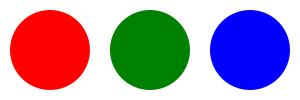

{{SVGRef}}

A view is a defined way to view the image, like a zoom level or a detail view.

## Usage context

{{svginfo}}

## Attributes

### Global attributes

- [Aria attributes](/en-US/docs/Web/SVG/Attribute#aria_attributes)
- [Core attributes](/en-US/docs/Web/SVG/Attribute#core_attributes)
- [Global event attributes](/en-US/docs/Web/SVG/Attribute#global_event_attributes)

### Specific attributes

- {{SVGAttr("viewBox")}}
- {{SVGAttr("preserveAspectRatio")}}
- {{SVGAttr("zoomAndPan")}} {{Deprecated_Inline}} {{Non-standard_Inline}}
- {{SVGAttr("viewTarget")}} {{Deprecated_Inline}}

## Example

### SVG

```svg
<svg viewBox="0 0 300 100" width="300" height="100"
      xmlns="http://www.w3.org/2000/svg">

  <view id="one" viewBox="0 0 100 100" />
  <circle cx="50" cy="50" r="40" fill="red" />

  <view id="two" viewBox="100 0 100 100" />
  <circle cx="150" cy="50" r="40" fill="green" />

  <view id="three" viewBox="200 0 100 100" />
  <circle cx="250" cy="50" r="40" fill="blue" />
</svg>
```

### HTML

```html

<br />

```

### Result

{{EmbedLiveSample("Example", "85ch", "240px")}}

## DOM Interface

This element implements the {{domxref("SVGViewElement")}} interface.

## Specifications

{{Specifications}}

## Browser compatibility

{{Compat}}
