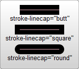
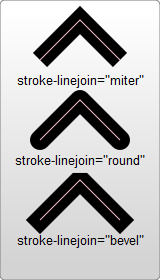
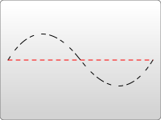

{{SVGRef}}

{{ PreviousNext("Web/SVG/Tutorial/Paths", "Web/SVG/Tutorial/Gradients") }}

There are several ways to color shapes (including specifying attributes on the object) using inline [CSS](/en-US/docs/Glossary/CSS), an embedded CSS section, or an external CSS file. Most [SVG](/en-US/docs/Glossary/SVG) you'll find around the web use inline CSS, but there are advantages and disadvantages associated with each type.

## Fill and Stroke Attributes

### Painting

Basic coloring can be done by setting two attributes on the node: `fill` and `stroke`. Using `fill` sets the color inside the object and `stroke` sets the color of the line drawn around the object. You can use the same CSS color naming schemes that you use in HTML, whether that's color names (like `red`), rgb values (like `rgb(255 0 0)`), hex values, etc.

```html
<?xml version="1.0" standalone="no"?>
<svg width="160" height="140" xmlns="http://www.w3.org/2000/svg" version="1.1">
  <rect
    x="10"
    y="10"
    width="100"
    height="100"
    stroke="blue"
    fill="purple"
    fill-opacity="0.5"
    stroke-opacity="0.8"
    stroke-width="15" />
</svg>
```

{{EmbedLiveSample("Painting", "100%", 150)}}

In addition, you can specify the opacity of either the `fill` or `stroke` separately in SVG. These are controlled by the `fill-opacity` and `stroke-opacity` attributes.

### Stroke

In addition to its color properties, there are a few other attributes available to control the way a stroke is drawn on a line.



```xml
<?xml version="1.0" standalone="no"?>
<svg width="160" height="140" xmlns="http://www.w3.org/2000/svg" version="1.1">
  <line x1="40" x2="120" y1="20" y2="20" stroke="black" stroke-width="20" stroke-linecap="butt"/>
  <line x1="40" x2="120" y1="60" y2="60" stroke="black" stroke-width="20" stroke-linecap="square"/>
  <line x1="40" x2="120" y1="100" y2="100" stroke="black" stroke-width="20" stroke-linecap="round"/>
</svg>
```

The `stroke-width` property defines the width of this stroke. Strokes are drawn centered around the path. In the example above, the path is shown in pink, and the stroke in black.

The second attribute affecting strokes is the `stroke-linecap` property, demonstrated above. This controls the shape of the ends of lines.

There are three possible values for `stroke-linecap`:

- `butt` closes the line off with a straight edge that's normal (at 90 degrees) to the direction of the stroke and crosses its end.
- `square` has essentially the same appearance, but stretches the stroke slightly beyond the actual path. The distance that the stroke goes beyond the path is half the `stroke-width`.
- `round` produces a rounded effect on the end of the stroke. The radius of this curve is also controlled by the `stroke-width`.

Use `stroke-linejoin` to control how the joint between two line segments is drawn.



```xml
<?xml version="1.0" standalone="no"?>
<svg width="160" height="280" xmlns="http://www.w3.org/2000/svg" version="1.1">
  <polyline points="40 60 80 20 120 60" stroke="black" stroke-width="20"
      stroke-linecap="butt" fill="none" stroke-linejoin="miter"/>

  <polyline points="40 140 80 100 120 140" stroke="black" stroke-width="20"
      stroke-linecap="round" fill="none" stroke-linejoin="round"/>

  <polyline points="40 220 80 180 120 220" stroke="black" stroke-width="20"
      stroke-linecap="square" fill="none" stroke-linejoin="bevel"/>
</svg>
```

Each of these polylines has two segments. The joint where the two meet is controlled by the `stroke-linejoin` attribute. There are three possible values for this attribute. `miter` extends the line slightly beyond its normal width to create a square corner where only one angle is used. `round` creates a rounded line segment. `bevel` creates a new angle to aid in the transition between the two segments.

Finally, you can also use dashed line types on a stroke by specifying the `stroke-dasharray` attribute.



```xml
<?xml version="1.0" standalone="no"?>
<svg width="200" height="150" xmlns="http://www.w3.org/2000/svg" version="1.1">
  <path d="M 10 75 Q 50 10 100 75 T 190 75" stroke="black"
    stroke-linecap="round" stroke-dasharray="5,10,5" fill="none"/>
  <path d="M 10 75 L 190 75" stroke="red"
    stroke-linecap="round" stroke-width="1" stroke-dasharray="5,5" fill="none"/>
</svg>
```

The `stroke-dasharray` attribute can take a series of comma and/or whitespace separated numbers as its argument.

The first number specifies a distance for the filled area, and the second a distance for the unfilled area. So in the above example, the second path fills 5 pixel units, with 5 blank units until the next dash of 5 units. You can specify more numbers if you would like a more complicated dash pattern. The first example specifies three numbers, in which case the renderer loops the numbers twice to create an even pattern. So the first path renders 5 filled, 10 empty, 5 filled, and then loops back to create 5 empty, 10 filled, 5 empty. The pattern then repeats.

There are additional `stroke` and `fill` properties available, including `fill-rule`, which specifies how to color in shapes that overlap themselves; [`stroke-miterlimit`](/en-US/docs/Web/SVG/Attribute/stroke-miterlimit), which determines if a stroke should draw miters; and [stroke-dashoffset](/en-US/docs/Web/SVG/Attribute/stroke-dashoffset), which specifies where to start a dasharray on a line.

### Paint order

The order in which fill and stroke are painted can be controlled using the [`paint-order`](/en-US/docs/Web/SVG/Attribute/paint-order) attribute.

```html
<?xml version="1.0" standalone="no"?>
<svg width="400" height="180" xmlns="http://www.w3.org/2000/svg" version="1.1">
  <polyline
    points="40 80 80 40 120 80"
    stroke-width="15"
    stroke="black"
    fill="coral"
    paint-order="fill" />

  <polyline
    points="40 140 80 100 120 140"
    stroke-width="15"
    stroke="black"
    fill="coral"
    paint-order="stroke" />
</svg>
```

{{EmbedLiveSample("Paint order", "100%", 180)}}

In case of the first shape, fill has been rendered before stroke, so the black stroke appears above fill.
In case of second shape, stroke has been rendered before fill.

## Using CSS

In addition to setting attributes on objects, you can also use CSS to style fills and strokes. Not all attributes can be set via CSS. Attributes that deal with painting and filling are usually available, so `fill`, `stroke`, `stroke-dasharray`, etc. can all be set this way, in addition to the gradient and pattern versions of those shown below. Attributes like `width`, `height`, or {{SVGElement("path")}} commands cannot be set through CSS. It's easiest just to test and find out what is available and what isn't.

> [!NOTE]
> The [SVG specification](https://www.w3.org/TR/SVG/propidx.html) decides strictly between attributes that are _properties_ and other attributes. The former can be modified with CSS, the latter not.

CSS can be inserted inline with the element via the `style` attribute:

```xml
 <rect x="10" height="180" y="10" width="180" style="stroke: black; fill: red;"/>
```

Or it can be moved to a special style section that you include. Instead of shoving such a section into a `<head>` section like you do in HTML, though, it's included in an area called {{SVGElement("defs")}}.

{{SVGElement("defs")}} stands for definitions, and it is here that you can create elements that don't appear in the SVG directly, but are used by other elements.

```xml
<?xml version="1.0" standalone="no"?>
<svg width="200" height="200" xmlns="http://www.w3.org/2000/svg" version="1.1">
  <defs>
    <style><![CDATA[
       #MyRect {
         stroke: black;
         fill: red;
         paint-order: stroke;
       }
    ]]></style>
  </defs>
  <rect x="10" height="180" y="10" width="180" id="MyRect"/>
</svg>
```

Moving styles to an area like this can make it easier to adjust properties on large groups of elements. You can also use things like the **`:hover` pseudo class** to create rollover effects:

```css
#MyRect:hover {
  stroke: black;
  fill: blue;
}
```

You can also specify an external stylesheet for your CSS rules through [normal XML-stylesheet syntax](https://www.w3.org/TR/xml-stylesheet/):

```xml
<?xml version="1.0" standalone="no"?>
<?xml-stylesheet type="text/css" href="style.css"?>

<svg width="200" height="150" xmlns="http://www.w3.org/2000/svg" version="1.1">
  <rect height="10" width="10" id="MyRect"/>
</svg>
```

Where `style.css` looks something like:

```css
#MyRect {
  fill: red;
  stroke: black;
}
```

{{ PreviousNext("Web/SVG/Tutorial/Paths", "Web/SVG/Tutorial/Gradients") }}
