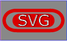

{{SVGRef}}

{{ PreviousNext("Web/SVG/Tutorial/Other_content_in_SVG", "Web/SVG/Tutorial/SVG_Fonts") }}

There are situations where basic shapes do not provide the flexibility you need to achieve a certain effect. Drop shadows, to provide a popular example, cannot be created reasonably with a combination of gradients. Filters are SVG's mechanism to create sophisticated effects.

A basic example is to add a blur effect to SVG content. While basic blurs can be achieved with the help of gradients, the blur filter is needed to do anything beyond.

## Example

Filters are defined by the {{SVGElement('filter')}} element, which should be put in the `<defs>` section of your SVG file. Between the filter tags goes a list of _primitives_: basic operations that build on top of the previous operations (like blurring, adding a lighting effect, etc.). To apply your created filter on a graphic element, you set the {{SVGAttr('filter')}} attribute.

```html
<svg
  width="250"
  viewBox="0 0 200 85"
  xmlns="http://www.w3.org/2000/svg"
  version="1.1">
  <defs>
    <!-- Filter declaration -->
    <filter
      id="MyFilter"
      filterUnits="userSpaceOnUse"
      x="0"
      y="0"
      width="200"
      height="120">
      <!-- offsetBlur -->
      <feGaussianBlur in="SourceAlpha" stdDeviation="4" result="blur" />
      <feOffset in="blur" dx="4" dy="4" result="offsetBlur" />

      <!-- litPaint -->
      <feSpecularLighting
        in="blur"
        surfaceScale="5"
        specularConstant=".75"
        specularExponent="20"
        lighting-color="#bbbbbb"
        result="specOut">
        <fePointLight x="-5000" y="-10000" z="20000" />
      </feSpecularLighting>
      <feComposite
        in="specOut"
        in2="SourceAlpha"
        operator="in"
        result="specOut" />
      <feComposite
        in="SourceGraphic"
        in2="specOut"
        operator="arithmetic"
        k1="0"
        k2="1"
        k3="1"
        k4="0"
        result="litPaint" />

      <!-- merge offsetBlur + litPaint -->
      <feMerge>
        <feMergeNode in="offsetBlur" />
        <feMergeNode in="litPaint" />
      </feMerge>
    </filter>
  </defs>

  <!-- Graphic elements -->
  <g filter="url(#MyFilter)">
    <path
      fill="none"
      stroke="#D90000"
      stroke-width="10"
      d="M50,66 c-50,0 -50,-60 0,-60 h100 c50,0 50,60 0,60z" />
    <path
      fill="#D90000"
      d="M60,56 c-30,0 -30,-40 0,-40 h80 c30,0 30,40 0,40z" />
    <g fill="#FFFFFF" stroke="black" font-size="45" font-family="Verdana">
      <text x="52" y="52">SVG</text>
    </g>
  </g>
</svg>
```

{{ EmbedLiveSample('Example', '100%', 120) }}

### Step 1

```html
<feGaussianBlur in="SourceAlpha" stdDeviation="4" result="blur" />
```

{{SVGElement('feGaussianBlur')}} takes `in` "SourceAlpha", which is the alpha channel of the source graphic; applies a blur of 4; and stores the `result` in a temporary buffer named "blur".

### Step 2

```html
<feOffset in="blur" dx="4" dy="4" result="offsetBlur" />
```

{{SVGElement('feOffset')}} takes `in` "blur", which we previously created; shifts the result "4" to the right and "4" to the bottom; and stores the `result` in the buffer "offsetBlur". The two first primitives just created a drop shadow.

### Step 3

```html
<feSpecularLighting
  in="offsetBlur"
  surfaceScale="5"
  specularConstant=".75"
  specularExponent="20"
  lighting-color="#bbbbbb"
  result="specOut">
  <fePointLight x="-5000" y="-10000" z="20000" />
</feSpecularLighting>
```

{{SVGelement('feSpecularLighting')}} takes `in` "offsetBlur", generates a lighting effect, and stores the `result` in the buffer "specOut".

### Step 4

```html
<feComposite in="specOut" in2="SourceAlpha" operator="in" result="specOut" />
```

The first {{SVGElement('feComposite')}} takes `in` "specOut" and "SourceAlpha", masks out the result of "specOut" so that the result is not bigger than "SourceAlpha" (the original source graphic), and overrides the `result` "specOut".

### Step 5

```html
<feComposite
  in="SourceGraphic"
  in2="specOut"
  operator="arithmetic"
  k1="0"
  k2="1"
  k3="1"
  k4="0"
  result="litPaint" />
```

The second {{SVGElement('feComposite')}} takes `in` "SourceGraphic" and "specOut", adds the result of "specOut" on top of "SourceGraphic", and stores the `result` in "litPaint".

### Step 6

```html
<feMerge>
  <feMergeNode in="offsetBlur" />
  <feMergeNode in="litPaint" />
</feMerge>
```

Finally, {{SVGElement('feMerge')}} merges together "offsetBlur", which is the drop shadow, and "litPaint", which is the original source graphic with a lighting effect.



Source graphic


Primitive 1


Primitive 2


Primitive 3


Primitive 4


Primitive 5


Primitive 6

{{ PreviousNext("Web/SVG/Tutorial/Other_content_in_SVG", "Web/SVG/Tutorial/SVG_Fonts") }}
