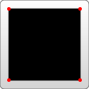
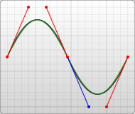
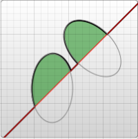
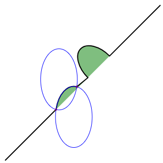
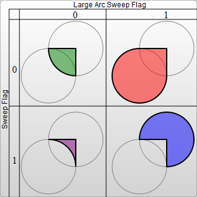

{{ PreviousNext("Web/SVG/Tutorial/Basic_Shapes", "Web/SVG/Tutorial/Fills_and_Strokes") }}

The {{SVGElement('path')}} element is the most powerful element in the SVG library of [basic shapes](/en-US/docs/Web/SVG/Tutorial/Basic_Shapes). It can be used to create lines, curves, arcs, and more.

Paths create complex shapes by combining multiple straight lines or curved lines. Complex shapes composed only of straight lines can be created as [`<polyline>`s](/en-US/docs/Web/SVG/Tutorial/Basic_Shapes#polyline). While `<polyline>`s and `<path>`s can create similar-looking shapes, `<polyline>`s require a lot of small straight lines to simulate curves, and don't scale well to larger sizes.

A good understanding of paths is important when drawing SVGs. While creating complex paths using an XML editor or text editor is not recommended, understanding how they work will allow to identify and repair display issues in SVGs.

The shape of a `<path>` element is defined by one parameter: {{ SVGAttr("d") }}. (See more in [basic shapes](/en-US/docs/Web/SVG/Tutorial/Basic_Shapes).) The `d` attribute contains a series of commands and parameters used by those commands.

Each of the commands is instantiated (for example, creating a class, naming and locating it) by a specific letter. For instance, let's move to the x and y coordinates (`10`, `10`). The "Move to" command is called with the letter `M`. When the parser runs into this letter, it knows it needs to move to a point. So, to move to (`10`,`10`) the command to use would be `M 10 10`. After that, the parser begins reading for the next command.

All of the commands also come in two variants. An **uppercase letter** specifies absolute coordinates on the page, and a **lowercase letter** specifies relative coordinates (e.g., _move 10px up and 7px to the left from the last point_).

Coordinates in the `d` parameter are **always unitless** and hence in the user coordinate system. Later, we will learn how paths can be transformed to suit other needs.

## Line commands

There are five line commands for {{SVGElement("path")}} nodes. The first command is the "Move To" or `M`, which was described above. It takes two parameters, a coordinate (`x`) and coordinate (`y`) to move to. If the cursor was already somewhere on the page, no line is drawn to connect the two positions. The "Move To" command appears at the beginning of paths to specify where the drawing should start. For example:

```
M x y
(or)
m dx dy
```

In the following example there's only a point at (`10`,`10`). Note, though, that it wouldn't show up if a path was just drawn normally. For example:


```xml
<svg width="200" height="200" xmlns="http://www.w3.org/2000/svg">

  <path d="M10 10"/>

  <!-- Points -->
  <circle cx="10" cy="10" r="2" fill="red"/>

</svg>
```

There are three commands that draw lines. The most generic is the "Line To" command, called with `L`. `L` takes two parameters—x and y coordinates—and draws a line from the current position to a new position.

```
 L x y
 (or)
 l dx dy
```

There are two abbreviated forms for drawing horizontal and vertical lines. `H` draws a horizontal line, and `V` draws a vertical line. Both commands only take one parameter since they only move in one direction.

```
 H x
 (or)
 h dx

 V y
 (or)
 v dy
```

An easy place to start is by drawing a shape. We will start with a rectangle (the same type that could be more easily made with a {{SVGElement("rect")}} element). It's composed of horizontal and vertical lines only.



```xml
<svg width="100" height="100" xmlns="http://www.w3.org/2000/svg">

  <path d="M 10 10 H 90 V 90 H 10 L 10 10"/>

  <!-- Points -->
  <circle cx="10" cy="10" r="2" fill="red"/>
  <circle cx="90" cy="90" r="2" fill="red"/>
  <circle cx="90" cy="10" r="2" fill="red"/>
  <circle cx="10" cy="90" r="2" fill="red"/>

</svg>
```

We can shorten the above path declaration a little bit by using the "Close Path" command, called with `Z`. This command draws a straight line from the current position back to the first point of the path. It is often placed at the end of a path node, although not always. There is no difference between the uppercase and lowercase command.

```
 Z
 (or)
 z
```

So our path above could be shortened to:

```xml
 <path d="M 10 10 H 90 V 90 H 10 Z" fill="transparent" stroke="black"/>
```

The relative forms of these commands can also be used to draw the same picture. Relative commands are called by using lowercase letters, and rather than moving the cursor to an exact coordinate, they move it relative to its last position. For instance, since our box is 80×80, the `<path>` element could have been written as:

```xml
 <path d="M 10 10 h 80 v 80 h -80 Z" fill="transparent" stroke="black"/>
```

The path will move to point (`10`,`10`) and then move horizontally 80 points to the right, then 80 points down, then 80 points to the left, and then back to the start.

In these examples, it would probably be simpler to use the {{SVGElement("polygon")}} or {{SVGElement("polyline")}} elements. However, paths are used so often in drawing SVG that developers may be more comfortable using them instead. There is no real performance penalty or bonus for using one or the other.

## Curve commands

There are three different commands that can be used to create smooth curves. Two of those curves are [Bézier curves](/en-US/docs/Glossary/Bezier_curve), and the third is an "arc" or part of a circle. You might have already gained practical experience with Bézier curves using path tools in Inkscape, Illustrator or Photoshop. There are an infinite number of Bézier curves, but only two simple ones are available in `<path>` elements: a cubic one, called with `C`, and a quadratic one, called with `Q`.

### Bézier Curves

The cubic curve, `C`, is the slightly more complex curve. Cubic Béziers take in two control points for each point. Therefore, to create a cubic Bézier, three sets of coordinates need to be specified.

```
 C x1 y1, x2 y2, x y
 (or)
 c dx1 dy1, dx2 dy2, dx dy
```

The last set of coordinates here (`x`,`y`) specify where the line should end. The other two are control points. (`x1`,`y1`) is the control point for the start of the curve, and (`x2`,`y2`) is the control point for the end. The control points essentially describe the slope of the line starting at each point. The Bézier function then creates a smooth curve that transfers from the slope established at the beginning of the line, to the slope at the other end.


```xml
<svg width="190" height="160" xmlns="http://www.w3.org/2000/svg">

  <path d="M 10 10 C 20 20, 40 20, 50 10" stroke="black" fill="transparent"/>
  <path d="M 70 10 C 70 20, 110 20, 110 10" stroke="black" fill="transparent"/>
  <path d="M 130 10 C 120 20, 180 20, 170 10" stroke="black" fill="transparent"/>
  <path d="M 10 60 C 20 80, 40 80, 50 60" stroke="black" fill="transparent"/>
  <path d="M 70 60 C 70 80, 110 80, 110 60" stroke="black" fill="transparent"/>
  <path d="M 130 60 C 120 80, 180 80, 170 60" stroke="black" fill="transparent"/>
  <path d="M 10 110 C 20 140, 40 140, 50 110" stroke="black" fill="transparent"/>
  <path d="M 70 110 C 70 140, 110 140, 110 110" stroke="black" fill="transparent"/>
  <path d="M 130 110 C 120 140, 180 140, 170 110" stroke="black" fill="transparent"/>

</svg>
```

The example above creates nine cubic Bézier curves. As the curves move toward the right, the control points become spread out horizontally. As the curves move downward, they become further separated from the end points. The thing to note here is that the curve starts in the direction of the first control point, and then bends so that it arrives along the direction of the second control point.

Several Bézier curves can be strung together to create extended, smooth shapes. Often, the control point on one side of a point will be a reflection of the control point used on the other side to keep the slope constant. In this case, a shortcut version of the cubic Bézier can be used, designated by the command `S` (or `s`).

```
 S x2 y2, x y
 (or)
 s dx2 dy2, dx dy
```

`S` produces the same type of curve as earlier—but if it follows another `S` command or a `C` command, the first control point is assumed to be a reflection of the one used previously. If the `S` command doesn't follow another `S` or `C` command, then the current position of the cursor is used as the first control point. The result is not the same as what the `Q` command would have produced with the same parameters, but is similar.

An example of this syntax is shown below, and in the figure to the left the specified control points are shown in red, and the inferred control point in blue.



```xml
<svg width="190" height="160" xmlns="http://www.w3.org/2000/svg">
  <path d="M 10 80 C 40 10, 65 10, 95 80 S 150 150, 180 80" stroke="black" fill="transparent"/>
</svg>
```

The other type of Bézier curve, the quadratic curve called with `Q`, is actually a simpler curve than the cubic one. It requires one control point which determines the slope of the curve at both the start point and the end point. It takes two parameters: the control point and the end point of the curve.

> **Note:** The co-ordinate deltas for `q` are both relative to the previous point (that is, `dx` and `dy` are not relative to `dx1` and `dy1`).

```
 Q x1 y1, x y
 (or)
 q dx1 dy1, dx dy
```


```xml
<svg width="190" height="160" xmlns="http://www.w3.org/2000/svg">
  <path d="M 10 80 Q 95 10 180 80" stroke="black" fill="transparent"/>
</svg>
```

As with the cubic Bézier curve, there is a shortcut for stringing together multiple quadratic Béziers, called with `T`.

```
 T x y
 (or)
 t dx dy
```

This shortcut looks at the previous control point used and infers a new one from it. This means that after the first control point, fairly complex shapes can be made by specifying only end points.

This only works if the previous command was a `Q` or a `T` command. If not, then the control point is assumed to be the same as the previous point, and only lines will be drawn.


```xml
<svg width="190" height="160" xmlns="http://www.w3.org/2000/svg">
  <path d="M 10 80 Q 52.5 10, 95 80 T 180 80" stroke="black" fill="transparent"/>
</svg>
```

Both curves produce similar results, although the cubic one allows greater freedom in exactly what the curve looks like. Deciding which curve to use is situational and depends on the amount of symmetry the line has.

### Arcs

The other type of curved line that can be created using SVG is the arc, called with the `A` command. Arcs are sections of circles or ellipses.

For a given x-radius and y-radius, there are two ellipses that can connect any two points (as long as they're within the radius of the circle). Along either of those circles, there are two possible paths that can be taken to connect the points—so in any situation, there are four possible arcs available.

Because of that, arcs require quite a few parameters:

```
 A rx ry x-axis-rotation large-arc-flag sweep-flag x y
 a rx ry x-axis-rotation large-arc-flag sweep-flag dx dy
```

At its start, the arc element takes in two parameters for the x-radius and y-radius. If needed, see {{SVGElement("ellipse")}}s and how they behave. The final two parameters designate the x and y coordinates to end the stroke. Together, these four values define the basic structure of the arc.

The third parameter describes the rotation of the arc. This is best explained with an example:



```xml
<svg width="320" height="320" xmlns="http://www.w3.org/2000/svg">
  <path d="M 10 315
           L 110 215
           A 30 50 0 0 1 162.55 162.45
           L 172.55 152.45
           A 30 50 -45 0 1 215.1 109.9
           L 315 10" stroke="black" fill="green" stroke-width="2" fill-opacity="0.5"/>
</svg>
```

The example shows a `<path>` element that goes diagonally across the page. At its center, two elliptical arcs have been cut out (x radius = `30`, y radius = `50`). In the first one, the x-axis-rotation has been left at `0`, so the ellipse that the arc travels around (shown in gray) is oriented straight up and down. For the second arc, though, the x-axis-rotation is set to `-45` degrees. This rotates the ellipse so that it is aligned with its minor axis along the path direction, as shown by the second ellipse in the example image.

For the unrotated ellipse in the image above, there are only two different arcs and not four to choose from because the line drawn from the start and end of the arc goes through the center of the ellipse. In a slightly modified example the two ellipses that form the four different arcs can be seen:



```xml
<svg xmlns="http://www.w3.org/2000/svg" width="320" height="320">
  <path d="M 10 315
           L 110 215
           A 36 60 0 0 1 150.71 170.29
           L 172.55 152.45
           A 30 50 -45 0 1 215.1 109.9
           L 315 10" stroke="black" fill="green" stroke-width="2" fill-opacity="0.5"/>
  <circle cx="150.71" cy="170.29" r="2" fill="red"/>
  <circle cx="110" cy="215" r="2" fill="red"/>
  <ellipse cx="144.931" cy="229.512" rx="36" ry="60" fill="transparent" stroke="blue"/>
  <ellipse cx="115.779" cy="155.778" rx="36" ry="60" fill="transparent" stroke="blue"/>
</svg>
```

Notice that each of the blue ellipses are formed by two arcs, depending on traveling clockwise or counter-clockwise. Each ellipse has one short arc and one long arc. The two ellipses are just mirror images of each other. They are flipped along the line formed from the start→end points.

If the start→end points are farther than the ellipse's `x` and `y` radius can reach, the ellipse's radii will be minimally expanded so it could reach the start→end points. The interactive codepen at the bottom of this page demonstrates this well. To determine if an ellipse's radii are large enough to require expanding, a system of equations would need to be solved, such as [this on wolfram alpha](https://www.wolframalpha.com/input/?i=solve+\(\(110+-+x\)%5E2%2F36%5E2\)+%2B+\(\(215+-+y\)%5E2%2F60%5E2\)+%3D+1,+\(\(150.71+-+x\)%5E2%2F36%5E2\)+%2B+\(\(170.29+-+y\)%5E2%2F60%5E2\)+%3D+1). This computation is for the non-rotated ellipse with start→end (`110`, `215`)→(`150.71`, `170.29`). The solution, (`x`, `y`), is the center of the ellipse(s). The solution will be [imaginary](https://www.wolframalpha.com/input/?i=solve+\(\(110+-+x\)%5E2%2F30%5E2\)+%2B+\(\(215+-+y\)%5E2%2F50%5E2\)+%3D+1,+\(\(162.55+-+x\)%5E2%2F30%5E2\)+%2B+\(\(162.45+-+y\)%5E2%2F50%5E2\)+%3D+1) if the ellipse's radii are too small. This second computation is for the non-rotated ellipse with start→end (`110`, `215`)→(`162.55`, `162.45`). The solution has a small imaginary component because the ellipse was just barely expanded.

The four different paths mentioned above are determined by the next two parameter flags. As mentioned earlier, there are still two possible ellipses for the path to travel around and two different possible paths on both ellipses, giving four possible paths. The first parameter is the `large-arc-flag`. It determines if the arc should be greater than or less than 180 degrees; in the end, this flag determines which direction the arc will travel around a given circle. The second parameter is the `sweep-flag`. It determines if the arc should begin moving at positive angles or negative ones, which essentially picks which of the two circles will be traveled around. The example below shows all four possible combinations, along with the two circles for each case.



```xml
<svg width="325" height="325" xmlns="http://www.w3.org/2000/svg">
  <path d="M 80 80
           A 45 45, 0, 0, 0, 125 125
           L 125 80 Z" fill="green"/>
  <path d="M 230 80
           A 45 45, 0, 1, 0, 275 125
           L 275 80 Z" fill="red"/>
  <path d="M 80 230
           A 45 45, 0, 0, 1, 125 275
           L 125 230 Z" fill="purple"/>
  <path d="M 230 230
           A 45 45, 0, 1, 1, 275 275
           L 275 230 Z" fill="blue"/>
</svg>
```

Arcs are an easy way to create pieces of circles or ellipses in drawings. For instance, a pie chart would require a different arc for each piece.

If transitioning to SVG from {{HTMLElement("canvas")}}, arcs can be the hardest thing to learn, but are also much more powerful. Complete circles and ellipses are the only shapes that SVG arcs have trouble drawing. Because the start and end points for any path going around a circle are the same point, there are an infinite number of circles that could be chosen, and the actual path is undefined. It's possible to approximate them by making the start and end points of the path slightly askew, and then connecting them with another path segment. For example, it's possible to make a circle with an arc for each semi-circle. At that point, it's often easier to use a real {{SVGElement("circle")}} or {{SVGElement("ellipse")}} node instead. This interactive demo might help understand the concepts behind SVG arcs: <https://codepen.io/lingtalfi/pen/yaLWJG> (tested in Chrome and Firefox only, might not work in your browser)

{{ PreviousNext("Web/SVG/Tutorial/Basic_Shapes", "Web/SVG/Tutorial/Fills_and_Strokes") }}
