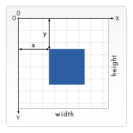

{{ PreviousNext("Web/SVG/Tutorials/SVG_from_scratch/Getting_started", "Web/SVG/Tutorials/SVG_from_scratch/Basic_shapes") }}

In this article, we examine how Scalable Vector Graphics (SVG) represents the positions and sizes of objects within a drawing context, including coordinate system and what a "pixel" measurement means in a scalable context.

## The grid

For all elements, SVG uses a coordinate system or **grid** system similar to the one used by [canvas](/en-US/docs/Web/API/Canvas_API) (and by a whole lot of other computer drawing routines). That is, the top left corner of the document is considered to be the point (0,0), or point of origin. Positions are then measured in pixels from the top left corner, with the positive x direction being to the right, and the positive y direction being to the bottom.



Note that this is slightly different than the way you're taught to graph as a kid (y axis is flipped). However, this is the same way elements in HTML are positioned (By default, LTR documents are considered not the RTL documents which position X from right-to-left).

## Pixels, user units, and the SVG user coordinate system

SVG graphics are drawn using a **user coordinate system**, where positions and lengths are expressed in **user units**. User units are the unitless coordinate values you write in SVG attributes such as `x`, `y`, `width`, and `height`.

When an SVG viewport is first created, one user unit corresponds to one CSS pixel. This is only the initial mapping, however. Features such as the `viewBox` attribute can transform the user coordinate system so that one user unit corresponds to more or fewer CSS pixels.

SVG also supports absolute units such as `cm`, `mm`, and `pt`. These are resolved into the user coordinate system before rendering.

We'll start with the `svg` root element:

```html
<svg width="100" height="100">…</svg>
```

The above element defines an SVG viewport that is 100 by 100 CSS pixels in size. Because no `viewBox` is specified, the initial mapping is used, so one user unit corresponds to one CSS pixel.

```html
<svg width="200" height="200" viewBox="0 0 100 100">
  <rect x="10" y="10" width="40" height="40" fill="royalblue" />
</svg>
```

The SVG viewport is 200 by 200 CSS pixels in size, while the `viewBox` defines a coordinate system spanning from `(0,0)` to `(100,100)` in user units. The browser maps this 100 × 100 user-unit coordinate system to the 200 × 200 CSS pixel viewport, so each user unit is rendered using 2 × 2 CSS pixels.

In this example, the rectangle is positioned at `(10,10)` and is `40 × 40` user units in size. Because each user unit is rendered using 2 × 2 CSS pixels, the rectangle appears as an 80 × 80 CSS pixel square on the screen.

{{ PreviousNext("Web/SVG/Tutorials/SVG_from_scratch/Getting_started", "Web/SVG/Tutorials/SVG_from_scratch/Basic_shapes") }}
