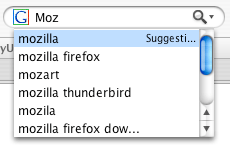

The **[OpenSearch description format](https://github.com/dewitt/opensearch)** can be used to describe the web interface of a search engine. This allows a website to describe a search engine for itself, so that a browser or other client application can use that search engine. OpenSearch is supported by (at least) Firefox, Edge, Safari, and Chrome. (See [Reference Material](#reference_material) for links to other browsers' documentation.)

Firefox also supports additional features not in the OpenSearch standard, such as search suggestions. This article focuses on creating OpenSearch-compatible search engines that support these additional Firefox features.

## Overview

The address bar in browsers has a dual purpose: you can type a URL to directly go to a site, or you can type a search term to query a search engine. The search engine returns a list of results that you can browse directly, or you can open the search engine's full results page.

By default, browsers can connect to a few popular search engines, such as Google, Bing, or Yandex. The OpenSearch protocol allows websites to define their own search engines, enabling users to search those websites directly from the browser's address bar. For example, the MDN website has a site-wide search engine. If MDN registers itself as a search engine, users can search MDN directly from the address bar.

Browsers query a search engine by requesting a URL. The site defines a template for the URL to be requested, and the browser fills in the user's search terms in the specified placeholders. For example, if the search engine URL is `https://example.com/search?q={searchTerms}`, then the browser will request `https://example.com/search?q=foo` when the user types "foo" into the address bar. The search engine then generates a response—either a list of search results or a full search results page.

A site defines its search engine by linking to an XML description file in its HTML. When the user first visits the site, the browser detects this description file and registers the search engine. The browser then uses the registered search engine to handle searches from the address bar.

> [!NOTE]
> Chrome registers site search engines as "inactive" by default. Users must manually activate each site in the search engine settings.

## OpenSearch description file

The XML file that describes a search engine follows the basic template below. Sections in _\[square brackets]_ should be customized for your specific engine.

```xml
<OpenSearchDescription
  xmlns="http://a9.com/-/spec/opensearch/1.1/"
  xmlns:moz="http://www.mozilla.org/2006/browser/search/">
  <ShortName>[SNK]</ShortName>
  <Description>[Search engine full name and summary]</Description>
  <InputEncoding>[UTF-8]</InputEncoding>
  <Image width="16" height="16" type="image/x-icon">[https://example.com/favicon.ico]</Image>
  <Url type="text/html" template="[searchURL]"/>
  <Url type="application/x-suggestions+json" template="[suggestionURL]"/>
</OpenSearchDescription>
```

- ShortName
  - : A short name for the search engine. It must be **16 or fewer character**s of plain text, with no HTML or other markup.
- Description
  - : A brief description of the search engine. It must be **1024 or fewer characters** of plain text, with no HTML or other markup.
- InputEncoding
  - : The [character encoding](/en-US/docs/Glossary/Character_encoding) to use when submitting input to the search engine.
- Image
  - : URL of an icon for the search engine. When possible, include a 16×16 image of type `image/x-icon` (such as `/favicon.ico`) and a 64×64 image of type `image/jpeg` or `image/png`.

    The URL may also use the [`data:` URL scheme](/en-US/docs/Web/URI/Reference/Schemes/data). (You can generate a `data:` URL from an icon file at [The `data:` URL kitchen](https://software.hixie.ch/utilities/cgi/data/data).)

    ```xml
    <Image height="16" width="16" type="image/x-icon">https://example.com/favicon.ico</Image>
      <!-- or -->
    <Image height="16" width="16">data:image/x-icon;base64,AAABAAEAEBAAA…DAAA=</Image>
    ```

    Firefox caches the icon as a [base64](https://en.wikipedia.org/wiki/Base64) `data:` URL (search plug-ins are stored in the [profile](https://support.mozilla.org/en-US/kb/profiles-where-firefox-stores-user-data)'s `searchplugins/` folder). `http:` and `https:` URLs are converted to `data:` URLs when this is done.

    > [!NOTE]
    > For icons loaded remotely (that is, from `https://` URLs as opposed to `data:` URLs), Firefox will reject icons larger than **10 kilobytes**.

    

- Url
  - : Describes the URL or URLs to use for the search. The `template` attribute indicates the base URL for the search query.

    Firefox supports three URL types:
    - `type="text/html"` specifies the URL for the actual search query.
    - `type="application/x-suggestions+json"` specifies the URL for fetching search suggestions. In Firefox 63 onwards, `type="application/json"` is accepted as an alias of this.
    - `type="application/x-moz-keywordsearch"` specifies the URL used when a keyword search is entered in the location bar. This is supported only in Firefox.

    For these URL types, you can use `{searchTerms}` to substitute the search terms entered by the user in the search bar or location bar. Other supported dynamic search parameters are described in [OpenSearch 1.1 parameters](https://github.com/dewitt/opensearch/blob/master/opensearch-1-1-draft-6.md#opensearch-11-parameters).

    For search suggestions, the `application/x-suggestions+json` URL template is used to fetch a suggestion list in [JSON](/en-US/docs/Glossary/JSON) format.

## Linking to the OpenSearch description file

To support autodiscovery, add a `<link>` element for each search engine to the `<head>` of your web page:

```html
<link
  rel="search"
  type="application/opensearchdescription+xml"
  title="[searchTitle]"
  href="[descriptionURL]" />
```

Replace the items in _\[square brackets\]_ as explained below:

- `searchTitle`
  - : The name of the search to perform, such as "Search MDC" or "Yahoo! Search". This must match your plugin file's `<ShortName>`.
- `descriptionURL`
  - : The URL to the XML description file, so the browser can download it.

If your site offers multiple search engines, you can support autodiscovery for them all. For example:

```html
<link
  rel="search"
  type="application/opensearchdescription+xml"
  title="MySite: By Author"
  href="http://example.com/mysiteauthor.xml" />

<link
  rel="search"
  type="application/opensearchdescription+xml"
  title="MySite: By Title"
  href="http://example.com/mysitetitle.xml" />
```

This way, your site can offer two engines to search: one by author and another by title.

> [!NOTE]
> In Firefox, an icon change in the search box indicates there's a provided search plugin. (See image, the green plus sign.) Thus if a search box is not shown in the user's UI, they will receive _no_ indication. _In general, behavior varies among browsers_.

## Supporting automatic updates for OpenSearch description

The OpenSearch description file can update automatically. To support this, include an extra `Url` element with `type="application/opensearchdescription+xml"` and `rel="self"`. The `template` attribute should be the URL of the OpenSearch document to automatically update to.

For example:

```xml
<Url
  type="application/opensearchdescription+xml"
  rel="self"
  template="https://example.com/mysearchdescription.xml" />
```

## Troubleshooting tips

If there is a mistake in your XML description file, you could run into errors when adding the search engine. If the error message isn't helpful, use the following tips to troubleshoot the problem:

- Check that your server serves OpenSearch descriptions with `Content-Type: application/opensearchdescription+xml`.
- Make sure that your XML description file is well-formed. You can check by loading the file directly into a browser. Ampersands (`&`) in the `template` URL must be escaped as `&amp;`, and tags must be closed with a trailing slash or a matching end tag.
- Make sure to include the `xmlns` attribute—without it, you could get the error message like "Firefox could not download the search plugin".
- You **must** include a `text/html` URL — search engines including only Atom or [RSS](/en-US/docs/Glossary/RSS) URL types (which is valid, but Firefox doesn't support) will also generate the "could not download the search plugin" error.
- Remotely fetched favicons must not be larger than 10KB (see [Firefox bug 361923](https://bugzil.la/361923)).
- As mentioned earlier, browsers may not activate site search shortcuts by default. Check the browser's settings and make sure the search engine is activated.

In addition, the search plugin service provides a logging mechanism that may be useful to plugin developers. Use `about:config` to set the pref `browser.search.log` to `true`. Then, logging information will appear in Firefox's [Browser Console](https://firefox-source-docs.mozilla.org/devtools-user/browser_console/index.html) (Tools ➤ Browser Tools ➤ Browser Console) when search plugins are added.

## Reference Material

- [OpenSearch Documentation](https://github.com/dewitt/opensearch)
- [Safari 8.0 Release Notes: Quick Website Search](https://developer.apple.com/library/archive/releasenotes/General/WhatsNewInSafari/Articles/Safari_8_0.html)
- [Microsoft Edge Dev Guide: Search provider discovery](https://learn.microsoft.com/en-us/archive/microsoft-edge/legacy/developer/)
- [The Chromium Projects: Tab to Search](https://www.chromium.org/tab-to-search/)
- imdb.com has a [working `osd.xml`](https://m.media-amazon.com/images/G/01/imdb/images/imdbsearch-3349468880._CB470047351_.xml)
- [Ready2Search](https://ready.to/search/en/) - create OpenSearch plugins. [Customized Search through Ready2Search](https://ready.to/search/make/en_make_plugin.htm)
