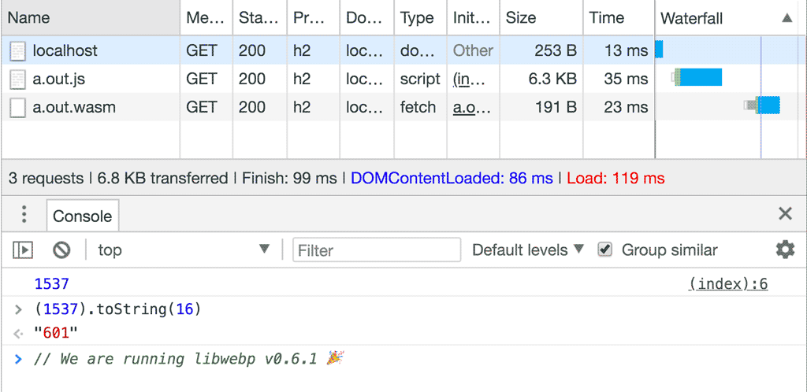
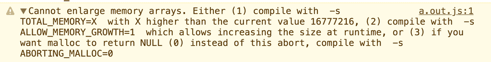
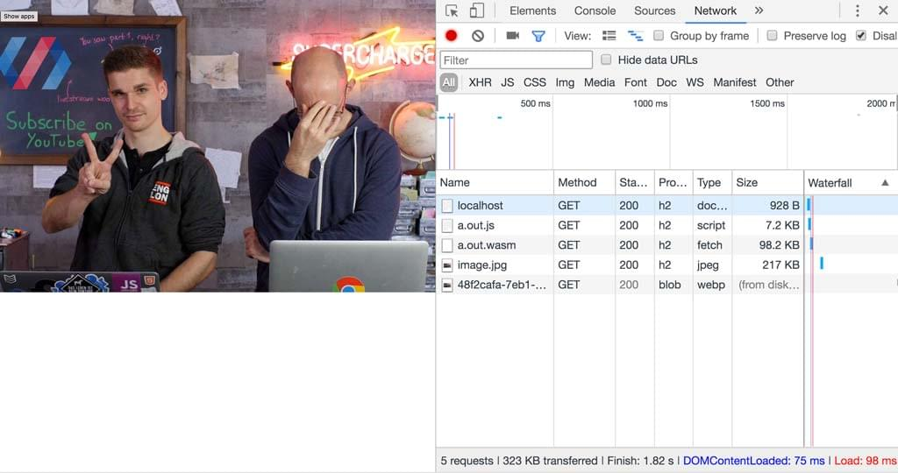

{{WebAssemblySidebar}}

A core use-case for WebAssembly is to take the existing ecosystem of C libraries and allow developers to use them on the web.

These libraries often rely on C's standard library, an operating system, a file system and other things. Emscripten provides most of these features, although there are some [limitations](https://emscripten.org/docs/porting/guidelines/api_limitations.html).

As an example, let's compile an encoder for WebP to Wasm. The source for the WebP codec is written in C and [available on GitHub](https://github.com/webmproject/libwebp) as well as some extensive [API documentation](https://developers.google.com/speed/webp/docs/api). That's a pretty good starting point.

```bash
git clone https://github.com/webmproject/libwebp
```

To start off simple, expose `WebPGetEncoderVersion()` from `encode.h` to JavaScript by writing a C file called `webp.c`:

```cpp
#include "emscripten.h"
#include "src/webp/encode.h"

EMSCRIPTEN_KEEPALIVE
int version() {
  return WebPGetEncoderVersion();
}
```

This is a good simple program to test whether you can get the source code of libwebp to compile, as it doesn't require any parameters or complex data structures to invoke this function.

To compile this program, you need to tell the compiler where it can find libwebp's header files using the `-I` flag and also pass it all the C files of libwebp that it needs. A useful strategy is to just give it **all** the C files and rely on the compiler to strip out everything that is unnecessary. It seems to work brilliantly for this library:

```bash
$ emcc -O3 -s WASM=1 -s EXPORTED_RUNTIME_METHODS='["cwrap"]' \
    -I libwebp \
    webp.c \
    libwebp/src/{dec,dsp,demux,enc,mux,utils}/*.c \
    libwebp/sharpyuv/*.c
```

> **Note:** This strategy will not work with every C project. Many projects rely on autoconf/automake to generate system-specific code before compilation. Emscripten provides `emconfigure` and `emmake` to wrap these commands and inject the appropriate parameters. You can find more in the [Emscripten documentation](https://emscripten.org/docs/compiling/Building-Projects.html).

Now you only need some HTML and JavaScript to load your new module:

```html
<script src="./a.out.js"></script>
<script>
  Module.onRuntimeInitialized = async () => {
    const api = {
      version: Module.cwrap("version", "number", []),
    };
    console.log(api.version());
  };
</script>
```

And you will see the correct version number in the [output](https://googlechrome.github.io/samples/webassembly/version.html):



> **Note:** libwebp returns the current version a.b.c as a hexadecimal number 0xabc. For example, v0.6.1 is encoded as 0x000601 = 1537.

### Get an image from JavaScript into Wasm

Getting the encoder's version number is great, but encoding an actual image would be more impressive. How do we do that?

The first question you need to answer is: how do I get the image into Wasm? Looking at the [encoding API of libwebp](https://developers.google.com/speed/webp/docs/api#simple_encoding_api), you'll find that it expects an array of bytes in RGB, RGBA, BGR or BGRA. Luckily, the Canvas API has {{domxref("CanvasRenderingContext2D.getImageData")}} — that gives you a {{jsxref("Uint8ClampedArray")}} containing the image data in RGBA:

```js
async function loadImage(src) {
  // Load image
  const imgBlob = await fetch(src).then((resp) => resp.blob());
  const img = await createImageBitmap(imgBlob);
  // Make canvas same size as image
  const canvas = document.createElement("canvas");
  canvas.width = img.width;
  canvas.height = img.height;
  // Draw image onto canvas
  const ctx = canvas.getContext("2d");
  ctx.drawImage(img, 0, 0);
  return ctx.getImageData(0, 0, img.width, img.height);
}
```

Now it's "only" a matter of copying the data from JavaScript into Wasm. For that, you need to expose two additional functions — one that allocates memory for the image inside Wasm and one that frees it up again:

```cpp
#include <stdlib.h> // required for malloc definition

EMSCRIPTEN_KEEPALIVE
uint8_t* create_buffer(int width, int height) {
  return malloc(width * height * 4 * sizeof(uint8_t));
}

EMSCRIPTEN_KEEPALIVE
void destroy_buffer(uint8_t* p) {
  free(p);
}
```

The `create_buffer()` function allocates a buffer for the RGBA image — hence 4 bytes per pixel. The pointer returned by `malloc()` is the address of the first memory cell of that buffer. When the pointer is returned to JavaScript land, it is treated as just a number. After exposing the function to JavaScript using cwrap, you can use that number to find the start of our buffer and copy the image data:

```js
const api = {
  version: Module.cwrap("version", "number", []),
  create_buffer: Module.cwrap("create_buffer", "number", ["number", "number"]),
  destroy_buffer: Module.cwrap("destroy_buffer", "", ["number"]),
  encode: Module.cwrap("encode", "", ["number", "number", "number", "number"]),
  free_result: Module.cwrap("free_result", "", ["number"]),
  get_result_pointer: Module.cwrap("get_result_pointer", "number", []),
  get_result_size: Module.cwrap("get_result_size", "number", []),
};

const image = await loadImage("./image.jpg");
const p = api.create_buffer(image.width, image.height);
Module.HEAP8.set(image.data, p);
// ... call encoder ...
api.destroy_buffer(p);
```

### Encode the Image

The image is now available in Wasm. It is time to call the WebP encoder to do its job. Looking at the [WebP documentation](https://developers.google.com/speed/webp/docs/api#simple_encoding_api), you'll find that `WebPEncodeRGBA` seems like a perfect fit. The function takes a pointer to the input image and its dimensions, as well as a quality option between 0 and 100. It also allocates an output buffer for us that we need to free using `WebPFree()` once we are done with the WebP image.

The result of the encoding operation is an output buffer and its length. Because functions in C can't have arrays as return types (unless you allocate memory dynamically), this example resorts to a static global array. This may not be clean C. In fact, it relies on Wasm pointers being 32 bits wide. But this is a fair shortcut for keeping things simple:

```cpp
int result[2];
EMSCRIPTEN_KEEPALIVE
void encode(uint8_t* img_in, int width, int height, float quality) {
  uint8_t* img_out;
  size_t size;

  size = WebPEncodeRGBA(img_in, width, height, width * 4, quality, &img_out);

  result[0] = (int)img_out;
  result[1] = size;
}

EMSCRIPTEN_KEEPALIVE
void free_result(uint8_t* result) {
  WebPFree(result);
}

EMSCRIPTEN_KEEPALIVE
int get_result_pointer() {
  return result[0];
}

EMSCRIPTEN_KEEPALIVE
int get_result_size() {
  return result[1];
}
```

Now with all of that in place, you can call the encoding function, grab the pointer and image size, put it in a JavaScript buffer of your own, and release all the Wasm buffers allocated in the process:

```js
api.encode(p, image.width, image.height, 100);
const resultPointer = api.get_result_pointer();
const resultSize = api.get_result_size();
const resultView = new Uint8Array(
  Module.HEAP8.buffer,
  resultPointer,
  resultSize,
);
const result = new Uint8Array(resultView);
api.free_result(resultPointer);
```

> **Note:** `new Uint8Array(someBuffer)` will create a new view onto the same memory chunk, while `new Uint8Array(someTypedArray)` will copy the data.

Depending on the size of your image, you might run into an error where Wasm can't grow the memory enough to accommodate both the input and the output image:



Luckily, the solution to this problem is in the error message. You just need to add `-s ALLOW_MEMORY_GROWTH=1` to your compilation command.

And there you have it. You have compiled a WebP encoder and transcoded a JPEG image to WebP. To prove that it worked, turn your result buffer into a blob and use it on an `` element:

```js
const blob = new Blob([result], { type: "image/webp" });
const blobURL = URL.createObjectURL(blob);
const img = document.createElement("img");
img.src = blobURL;
img.alt = "a useful description";
document.body.appendChild(img);
```

Behold, the glory of a new WebP image.

[Demo](https://googlechrome.github.io/samples/webassembly/image.html) | [Original Article](https://web.dev/emscripting-a-c-library/)


