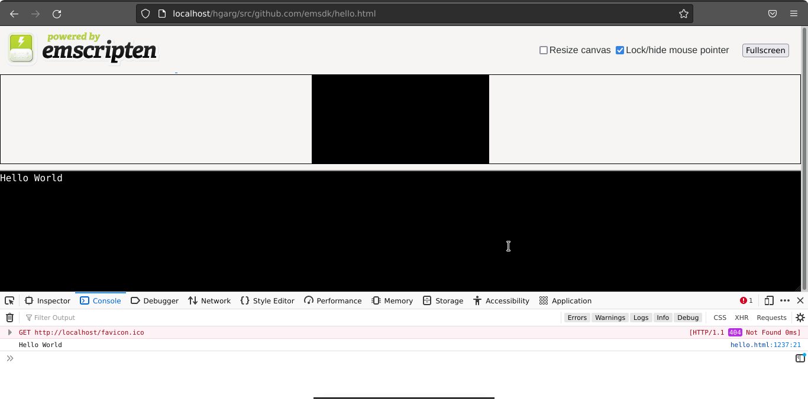

When you've written a new code module in a language like C/C++, you can compile it into WebAssembly using a tool like [Emscripten](https://emscripten.org/). Let's look at how it works.

## Emscripten Environment Setup

First, let's set up the required development environment.

### Prerequisites

Get the Emscripten SDK, using these instructions: <https://emscripten.org/docs/getting_started/downloads.html>

## Compiling an example

With the environment set up, let's look at how to use it to compile a C example to Wasm. There are a number of options available when compiling with Emscripten, but the main two scenarios we'll cover are:

- Compiling to Wasm and creating HTML to run our code in, plus all the JavaScript "glue" code needed to run the Wasm in the web environment.
- Compiling to Wasm and just creating the JavaScript.

We will look at both below.

### Creating HTML and JavaScript

This is the simplest case we'll look at, whereby you get emscripten to generate everything you need to run your code, as WebAssembly, in the browser.

1. First we need an example to compile. Take a copy of the following simple C example, and save it in a file called `hello.c` in a new directory on your local drive:

   ```c
   #include <stdio.h>

   int main() {
       printf("Hello World\n");
       return 0;
   }
   ```

2. Now, using the terminal window you used to enter the Emscripten compiler environment, navigate to the same directory as your `hello.c` file, and run the following command:

   ```bash
   emcc hello.c -o hello.html
   ```

The options we've passed in with the command are as follows:

- `-o hello.html` — Specifies that we want Emscripten to generate an HTML page to run our code in (and a filename to use), as well as the Wasm module and the JavaScript "glue" code to compile and instantiate the Wasm so it can be used in the web environment.

At this point in your source directory you should have:

- The binary Wasm module code (`hello.wasm`)
- A JavaScript file containing glue code to translate between the native C functions, and JavaScript/Wasm (`hello.js`)
- An HTML file to load, compile, and instantiate your Wasm code, and display its output in the browser (`hello.html`)

### Running your example

Now all that remains is for you to load the resulting `hello.html` in a browser that supports WebAssembly. It is enabled by default from Firefox 52, Chrome 57, Edge 57, Opera 44.

> [!NOTE]
> If you try to open generated HTML file (`hello.html`) directly from your local hard drive (e.g., `file://your_path/hello.html`), you will end up with an error message along the lines of _`both async and sync fetching of the wasm failed`._ You need to run your HTML file through an HTTP server (`http://`) — see [How do you set up a local testing server?](/en-US/docs/Learn_web_development/Howto/Tools_and_setup/set_up_a_local_testing_server) for more information.

If everything has worked as planned, you should see "Hello world" output in the Emscripten console appearing on the web page, and your browser's JavaScript console. Congratulations, you've just compiled C to WebAssembly and run it in your browser!


### Using a custom HTML template

Sometimes you will want to use a custom HTML template. Let's look at how we can do this.

1. First of all, save the following C code in a file called `hello2.c`, in a new directory:

   ```c
   #include <stdio.h>

   int main() {
       printf("Hello World\n");
       return 0;
   }
   ```

2. Search for the file `shell_minimal.html` in your emsdk repo. Copy it into a subdirectory called `html_template` inside your previous new directory.
3. Now navigate into your new directory (again, in your Emscripten compiler environment terminal window), and run the following command:

   ```bash
   emcc -o hello2.html hello2.c -O3 --shell-file html_template/shell_minimal.html
   ```

   The options we've passed are slightly different this time:

   - We've specified `-o hello2.html`, meaning that the compiler will still output the JavaScript glue code and `.html`.
   - We've specified `-O3`, which is used to optimize the code. Emcc has optimization levels like any other C compiler, including: `-O0` (no optimization), `-O1`, `-O2`, `-Os`, `-Oz`, `-Og`, and `-O3`. `-O3` is a good setting for release builds.
   - We've also specified `--shell-file html_template/shell_minimal.html` — this provides the path to the HTML template you want to use to create the HTML you will run your example through.

4. Now let's run this example. The above command will have generated `hello2.html`, which will have much the same content as the template with some glue code added into load the generated Wasm, run it, etc. Open it in your browser and you'll see much the same output as the last example.

> [!NOTE]
> You could specify outputting just the JavaScript "glue" file\* rather than the full HTML by specifying a .js file instead of an HTML file in the `-o` flag, e.g., `emcc -o hello2.js hello2.c -O3`. You could then build your custom HTML completely from scratch, although this is an advanced approach; it is usually easier to use the provided HTML template.
>
> - Emscripten requires a large variety of JavaScript "glue" code to handle memory allocation, memory leaks, and a host of other problems

### Calling a custom function defined in C

If you want to call a function defined in your C code from JavaScript, you can use the Emscripten `ccall()` function and the `EMSCRIPTEN_KEEPALIVE` declaration, which adds your functions to the exported functions list (see [Why do functions in my C/C++ source code vanish when I compile to JavaScript, and/or I get No functions to process?](https://emscripten.org/docs/getting_started/FAQ.html#why-do-functions-in-my-c-c-source-code-vanish-when-i-compile-to-webassembly)). Let's look at how this works.

1. To start with, save the following code as `hello3.c` in a new directory:

   ```c
   #include <stdio.h>
   #include <emscripten/emscripten.h>

   int main() {
       printf("Hello World\n");
       return 0;
   }

   #ifdef __cplusplus
   #define EXTERN extern "C"
   #else
   #define EXTERN
   #endif

   EXTERN EMSCRIPTEN_KEEPALIVE void myFunction(int argc, char ** argv) {
       printf("MyFunction Called\n");
   }
   ```

   By default, Emscripten-generated code always just calls the `main()` function, and other functions are eliminated as dead code. Putting `EMSCRIPTEN_KEEPALIVE` before a function name stops this from happening. You also need to import the `emscripten.h` library to use `EMSCRIPTEN_KEEPALIVE`.

   > [!NOTE]
   > We are including the `#ifdef` blocks so that if you are trying to include this in C++ code, the example will still work. Due to C versus C++ name mangling rules, this would otherwise break, but here we are setting it so that it treats it as an external C function if you are using C++.

2. Now add `html_template/shell_minimal.html` with `\{\{{ SCRIPT }}}` as content into this new directory too, just for convenience (you'd obviously put this in a central place in your real dev environment).
3. Now let's run the compilation step again. From inside your latest directory (and while inside your Emscripten compiler environment terminal window), compile your C code with the following command. Note that we need to compile with `NO_EXIT_RUNTIME`: otherwise, when `main()` exits, the runtime would be shut down and it wouldn't be valid to call compiled code. This is necessary for proper C emulation: for example, to ensure that [`atexit()`](https://en.cppreference.com/w/c/program/atexit) functions are called.

   ```bash
   emcc -o hello3.html hello3.c --shell-file html_template/shell_minimal.html -s NO_EXIT_RUNTIME=1 -s "EXPORTED_RUNTIME_METHODS=['ccall']"
   ```

4. If you load the example in your browser again, you'll see the same thing as before!
5. Now we need to run our new `myFunction()` function from JavaScript. First of all, open up your hello3.html file in a text editor.
6. Add a {{HTMLElement("button")}} element as shown below, just above the first opening `<script type="text/javascript">` tag.

   ```html
   <button id="my-button">Run myFunction</button>
   ```

7. Now add the following code at the end of the first {{HTMLElement("script")}} element:

   ```js
   document.getElementById("my-button").addEventListener("click", () => {
     alert("check console");
     const result = Module.ccall(
       "myFunction", // name of C function
       null, // return type
       null, // argument types
       null, // arguments
     );
   });
   ```

This illustrates how `ccall()` is used to call the exported function.

## See also

- [emscripten.org](https://emscripten.org/) — learn more about Emscripten and its large variety of options.
- [Calling compiled C functions from JavaScript using ccall/cwrap](https://emscripten.org/docs/porting/connecting_cpp_and_javascript/Interacting-with-code.html#calling-compiled-c-functions-from-javascript-using-ccall-cwrap)
- [Why do functions in my C/C++ source code vanish when I compile to JavaScript, and/or I get No functions to process?](https://emscripten.org/docs/getting_started/FAQ.html#why-do-functions-in-my-c-c-source-code-vanish-when-i-compile-to-javascript-and-or-i-get-no-functions-to-process)
- [Compiling an Existing C Module to WebAssembly](/en-US/docs/WebAssembly/Guides/Existing_C_to_Wasm)
