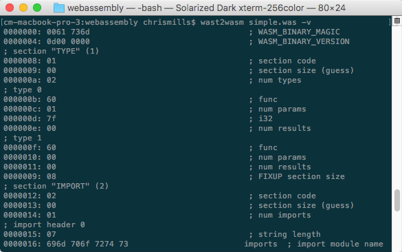

{{WebAssemblySidebar}}

WebAssembly has an S-expression-based textual representation, an intermediate form designed to be exposed in text editors, browser developer tools, etc. This article explains a little bit about how it works, and how to use available tools to convert text format files to the `.wasm` assembly format.

> **Note:** Text format files are usually saved with a `.wat` extension. Historically, a `.wast` extension was also used, however that's now used for the scripting language used by the WebAssembly test suite.

## A first look at the text format

Let's look at a simple example of this — the following program imports a function called `imported_func` from a module called `imports`, and exports a function called `exported_func`:

```wasm
(module
  (func $i (import "imports" "imported_func") (param i32))
  (func (export "exported_func")
    i32.const 42
    call $i
  )
)
```

The WebAssembly function `exported_func` is exported for use in our environment (e.g. the web app in which we are using our WebAssembly module). When it is called, it calls an imported JavaScript function called `imported_func`, which is run with the value (42) provided as a parameter.

## Converting the text .wat into a binary .wasm file

Let's have a go at converting the above `.wat` text representation example into `.wasm` assembly format.

1. To start with, make a copy of the above listing inside a text file; call it `simple.wat`.
2. We need to assemble this textual representation into the assembly language the browser actually reads before we can use it. To do this, we can use the wabt tool, which includes compilers to convert between WebAssembly's text representation and wasm, and vice versa, plus more besides. Go to <https://github.com/webassembly/wabt> — follow the instructions on this page to set up the tool.
3. Once you've got the tool built, add the `/wabt/out/clang/Debug` directory to your system `PATH`.
4. Next, execute the wat2wasm program, passing it the path to the input file, followed by an `-o` parameter, followed by the path to the output file:

    ```bash
    wat2wasm simple.wat -o simple.wasm
    ```

This will convert the wasm into a file called `simple.wasm`, which contains the `.wasm` assembly code.

> **Note:** You can also convert the assembly back into the text representation using the wasm2wat tool; for example `wasm2wat simple.wasm -o text.wat`.

## Viewing the assembly output

Because the output file is assembly-based, it can't be viewed in a normal text editor. However, you can view it using the wat2wasm tool's `-v` option. Try this:

```bash
wat2wasm simple.wat -v
```

This will give you an output in your terminal in the following way:



## See also

- [Understanding WebAssembly text format](/en-US/docs/WebAssembly/Understanding_the_text_format) — a detailed explanation of the text format syntax.
- [Compiling from C/C++ to WebAssembly](/en-US/docs/WebAssembly/C_to_wasm) — tools like Binaryen/Emscripten both compile your source code to wasm, and create the API code needed to run the module in a JavaScript context. Find out more about how to use them.
- [Using the WebAssembly JavaScript API](/en-US/docs/WebAssembly/Using_the_JavaScript_API) — read this if you want to find out more about how the WebAssembly API code works.
- [Text format](https://webassembly.github.io/spec/core/text/index.html) — more explanation of the text format, on the WebAssembly GitHub repo.
- [wast-loader](https://github.com/xtuc/webassemblyjs/tree/master/packages/wast-loader) — a loader for webpack that takes care of all of this for you.
