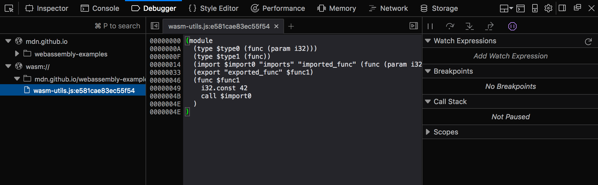

{{WebAssemblySidebar}}

If you have already [compiled a module from another language using tools like Emscripten](/en-US/docs/WebAssembly/C_to_Wasm), or [loaded and run the code yourself](/en-US/docs/WebAssembly/Loading_and_running), the next step is to learn more about using the other features of the WebAssembly JavaScript API. This article teaches you what you'll need to know.

> **Note:** If you are unfamiliar with the basic concepts mentioned in this article and need more explanation, read [WebAssembly concepts](/en-US/docs/WebAssembly/Concepts) first, then come back.

## Some simple examples

Let's run through some examples that explain how to use the WebAssembly JavaScript API, and how to use it to load a Wasm module in a web page.

> **Note:** You can find the sample code in our [webassembly-examples](https://github.com/mdn/webassembly-examples) GitHub repo.

### Preparing the example

1. First we need a Wasm module! Grab our [`simple.wasm`](https://raw.githubusercontent.com/mdn/webassembly-examples/master/js-api-examples/simple.wasm) file and save a copy in a new directory on your local machine.
2. Next, let's create a simple HTML file called `index.html` in the same directory as your Wasm file (can use our [simple template](https://github.com/mdn/webassembly-examples/blob/main/template/template.html) if you haven't got one easily available).
3. Now, to help us understand what is going on here, let's look at the text representation of our Wasm module (which we also meet in [Converting WebAssembly format to Wasm](/en-US/docs/WebAssembly/Text_format_to_Wasm#a_first_look_at_the_text_format)):

   ```wasm
   (module
     (func $i (import "my_namespace" "imported_func") (param i32))
     (func (export "exported_func")
       i32.const 42
       call $i))
   ```

4. In the second line, you will see that the import has a two-level namespace — the internal function `$i` is imported from `my_namespace.imported_func`. We need to reflect this two-level namespace in JavaScript when writing the object to be imported into the Wasm module. Create a `<script></script>` element in your HTML file, and add the following code to it:

   ```js
   const importObject = {
     my_namespace: { imported_func: (arg) => console.log(arg) },
   };
   ```

### Streaming the WebAssembly module

New in Firefox 58 is the ability to compile and instantiate WebAssembly modules directly from underlying sources. This is achieved using the [`WebAssembly.compileStreaming()`](/en-US/docs/WebAssembly/JavaScript_interface/compileStreaming_static) and [`WebAssembly.instantiateStreaming()`](/en-US/docs/WebAssembly/JavaScript_interface/instantiateStreaming_static) methods. These methods are easier than their non-streaming counterparts, because they can turn the byte code directly into `Module`/`Instance` instances, cutting out the need to separately put the {{domxref("Response")}} into an {{jsxref("ArrayBuffer")}}.

This example (see our [instantiate-streaming.html](https://github.com/mdn/webassembly-examples/blob/main/js-api-examples/instantiate-streaming.html) demo on GitHub, and [view it live](https://mdn.github.io/webassembly-examples/js-api-examples/instantiate-streaming.html) also) shows how to use `instantiateStreaming()` to fetch a Wasm module, import a JavaScript function into it, compile and instantiate it, and access its exported function — all in one step.

Add the following to your script, below the first block:

```js
WebAssembly.instantiateStreaming(fetch("simple.wasm"), importObject).then(
  (obj) => obj.instance.exports.exported_func(),
);
```

The net result of this is that we call our exported WebAssembly function `exported_func`, which in turn calls our imported JavaScript function `imported_func`, which logs the value provided inside the WebAssembly instance (42) to the console. If you save your example code now and load it a browser that supports WebAssembly, you'll see this in action!

> **Note:** This is a convoluted, long-winded example that achieves very little, but it does serve to illustrate what is possible — using WebAssembly code alongside JavaScript in your web applications. As we've said elsewhere, WebAssembly doesn't aim to replace JavaScript; the two instead can work together, drawing on each other's strengths.

### Loading our Wasm module without streaming

If you can't or don't want to use the streaming methods as described above, you can use the non-streaming methods [`WebAssembly.compile()`](/en-US/docs/WebAssembly/JavaScript_interface/compile_static) / [`WebAssembly.instantiate()`](/en-US/docs/WebAssembly/JavaScript_interface/instantiate_static) instead.

These methods don't directly access the byte code, so require an extra step to turn the response into an {{jsxref("ArrayBuffer")}} before compiling/instantiating the Wasm module.

The equivalent code would look like this:

```js
fetch("simple.wasm")
  .then((response) => response.arrayBuffer())
  .then((bytes) => WebAssembly.instantiate(bytes, importObject))
  .then((results) => {
    results.instance.exports.exported_func();
  });
```

### Viewing Wasm in developer tools

In Firefox 54+, the Developer Tool Debugger Panel has functionality to expose the text representation of any Wasm code included in a web page. To view it, you can go to the Debugger Panel and click on the "wasm://" entry.



In addition to viewing WebAssembly as text, developers are able to debug (place breakpoints, inspect the callstack, single-step, etc.) WebAssembly using the text format.

## Memory

In the low-level memory model of WebAssembly, memory is represented as a contiguous range of untyped bytes called [Linear Memory](https://webassembly.github.io/spec/core/exec/index.html) that are read and written by [load and store instructions](https://webassembly.github.io/spec/core/exec/instructions.html#memory-instructions) inside the module. In this memory model, any load or store can access any byte in the entire linear memory, which is necessary to faithfully represent C/C++ concepts like pointers.

Unlike a native C/C++ program, however, where the available memory range spans the entire process, the memory accessible by a particular WebAssembly Instance is confined to one specific — potentially very small — range contained by a WebAssembly Memory object. This allows a single web app to use multiple independent libraries — each of which are using WebAssembly internally — to have separate memories that are fully isolated from each other. In addition, newer implementations can also create [shared memories](/en-US/docs/WebAssembly/Understanding_the_text_format#shared_memories), which can be transferred between Window and Worker contexts using [`postMessage()`](/en-US/docs/Web/API/Window/postMessage), and used in multiple places.

In JavaScript, a Memory instance can be thought of as a resizable [`ArrayBuffer`](/en-US/docs/Web/JavaScript/Reference/Global_Objects/ArrayBuffer) (or [`SharedArrayBuffer`](/en-US/docs/Web/JavaScript/Reference/Global_Objects/SharedArrayBuffer), in the case of shared memories) and, just as with `ArrayBuffers`, a single web app can create many independent Memory objects. You can create one using the [`WebAssembly.Memory()`](/en-US/docs/WebAssembly/JavaScript_interface/Memory) constructor, which takes as arguments an initial size and (optionally) a maximum size and a `shared` property that states whether it is a shared memory or not.

Let's start exploring this by looking at a quick example.

1. Create another new simple HTML page (copy our [simple template](https://github.com/mdn/webassembly-examples/blob/main/template/template.html)) and call it `memory.html`. Add a `<script></script>` element to the page.
2. Now add the following line to the top of your script, to create a memory instance:

   ```js
   const memory = new WebAssembly.Memory({ initial: 10, maximum: 100 });
   ```

   The unit of `initial` and `maximum` is WebAssembly pages — these are fixed to 64KB in size. This means that the above memory instance has an initial size of 640KB, and a maximum size of 6.4MB.

   WebAssembly memory exposes its bytes by providing a buffer getter/setter that returns an ArrayBuffer. For example, to write 42 directly into the first word of linear memory, you can do this:

   ```js
   const data = new DataView(memory.buffer);
   data.setUint32(0, 42, true);
   ```

   Note the use of `true`, which enforces little-endian read and write, since WebAssembly memory is always little-endian. You can then return the same value using:

   ```js
   data.getUint32(0, true);
   ```

3. Try this now in your demo — save what you've added so far, load it in your browser, then try entering the above two lines in your JavaScript console.

### Growing memory

A memory instance can be grown by calls to [`Memory.prototype.grow()`](/en-US/docs/WebAssembly/JavaScript_interface/Memory/grow), where again the argument is specified in units of WebAssembly pages:

```js
memory.grow(1);
```

If a maximum value was supplied upon creation of the memory instance, attempts to grow past this maximum will throw a {{jsxref("RangeError")}} exception. The engine takes advantage of this supplied upper-bounds to reserve memory ahead of time, which can make resizing more efficient.

Note: Since an {{jsxref("ArrayBuffer")}}'s byteLength is immutable, after a successful [`Memory.prototype.grow()`](/en-US/docs/WebAssembly/JavaScript_interface/Memory/grow) operation the buffer getter will return a new ArrayBuffer object (with the new byteLength) and any previous ArrayBuffer objects become "detached", or disconnected from the underlying memory they previously pointed to.

Just like functions, linear memories can be defined inside a module or imported. Similarly, a module may also optionally export its memory. This means that JavaScript can get access to the memory of a WebAssembly instance either by creating a new `WebAssembly.Memory` and passing it in as an import or by receiving a Memory export (via [`Instance.prototype.exports`](/en-US/docs/WebAssembly/JavaScript_interface/Instance/exports)).

### More involved memory example

Let's make the above assertions clearer by looking at a more involved memory example — a WebAssembly module that imports the memory instance we defined earlier, populates it with an array of integers, then sums them. You can find this at [memory.wasm.](https://raw.githubusercontent.com/mdn/webassembly-examples/master/js-api-examples/memory.wasm)

1. make a local copy of `memory.wasm` in the same directory as before.

   > **Note:** You can see the module's text representation at [memory.wat](https://github.com/mdn/webassembly-examples/blob/main/js-api-examples/memory.wat).

2. Go back to your `memory.html` sample file, and fetch, compile, and instantiate your Wasm module as before — add the following to the bottom of your script:

   ```js
   WebAssembly.instantiateStreaming(fetch("memory.wasm"), {
     js: { mem: memory },
   }).then((results) => {
     // add code here
   });
   ```

3. Since this module exports its memory, given an Instance of this module called instance we can use an exported function `accumulate()` to create and populate an input array directly in the module instance's linear memory (`mem`). Add the following into your code, where indicated:

   ```js
   const summands = new DataView(memory.buffer);
   for (let i = 0; i < 10; i++) {
     summands.setUint32(i * 4, i, true);
   }
   const sum = results.instance.exports.accumulate(0, 10);
   console.log(sum);
   ```

Note how we create the {{jsxref("DataView")}} view on the Memory object's buffer ([`Memory.prototype.buffer`](/en-US/docs/WebAssembly/JavaScript_interface/Memory/buffer)), not on the Memory itself.

Memory imports work just like function imports, only Memory objects are passed as values instead of JavaScript functions. Memory imports are useful for two reasons:

- They allow JavaScript to fetch and create the initial contents of memory before or concurrently with module compilation.
- They allow a single Memory object to be imported by multiple module instances, which is a critical building block for implementing dynamic linking in WebAssembly.

> **Note:** You can find our complete demo at [memory.html](https://github.com/mdn/webassembly-examples/blob/main/js-api-examples/memory.html) ([see it live also](https://mdn.github.io/webassembly-examples/js-api-examples/memory.html)) .

## Tables

A WebAssembly Table is a resizable typed array of [references](<https://en.wikipedia.org/wiki/Reference_(computer_science)>) that can be accessed by both JavaScript and WebAssembly code. While Memory provides a resizable typed array of raw bytes, it is unsafe for references to be stored in a Memory since a reference is an engine-trusted value whose bytes must not be read or written directly by content for safety, portability, and stability reasons.

Tables have an element type, which limits the types of reference that can be stored in the table. In the current iteration of WebAssembly, there is only one type of reference needed by WebAssembly code — functions — and thus only one valid element type. In future iterations, more element types will be added.

Function references are necessary to compile languages like C/C++ that have function pointers. In a native implementation of C/C++, a function pointer is represented by the raw address of the function's code in the process's virtual address space and so, for the safety reasons mentioned above, cannot be stored directly in linear memory. Instead, function references are stored in a table and their indexes, which are integers and can be stored in linear memory, are passed around instead.

When the time comes to call a function pointer, the WebAssembly caller supplies the index, which can then be safety bounds checked against the table before indexing and calling the indexed function reference. Thus, tables are currently a rather low-level primitive used to compile low-level programming language features safely and portably.

Tables can be mutated via [`Table.prototype.set()`](/en-US/docs/WebAssembly/JavaScript_interface/Table/set), which updates one of the values in a table, and [`Table.prototype.grow()`](/en-US/docs/WebAssembly/JavaScript_interface/Table/grow), which increases the number of values that can be stored in a table. This allows the indirectly-callable set of functions to change over time, which is necessary for [dynamic linking techniques](https://github.com/WebAssembly/tool-conventions/blob/main/DynamicLinking.md). The mutations are immediately accessible via [`Table.prototype.get()`](/en-US/docs/WebAssembly/JavaScript_interface/Table/get) in JavaScript, and to Wasm modules.

### A table example

Let's look at a simple table example — a WebAssembly module that creates and exports a table with two elements: element 0 returns 13 and element 1 returns 42. You can find this at [table.wasm](https://raw.githubusercontent.com/mdn/webassembly-examples/master/js-api-examples/table.wasm).

1. Make a local copy of `table.wasm` in a new directory.

   > **Note:** You can see the module's text representation at [table.wat](https://github.com/mdn/webassembly-examples/blob/main/js-api-examples/table.wat).

2. Create a new copy of our [HTML template](https://github.com/mdn/webassembly-examples/blob/main/template/template.html) in the same directory and call it `table.html`.
3. As before, fetch, compile, and instantiate your Wasm module — add the following into a {{htmlelement("script")}} element at the bottom of your HTML body:

   ```js
   WebAssembly.instantiateStreaming(fetch("table.wasm")).then((results) => {
     // add code here
   });
   ```

4. Now let's access the data in the tables — add the following lines to your code in the indicated place:

   ```js
   const tbl = results.instance.exports.tbl;
   console.log(tbl.get(0)()); // 13
   console.log(tbl.get(1)()); // 42
   ```

This code accesses each function reference stored in the table in turn, and instantiates them to print the values they hold to the console — note how each function reference is retrieved with a [`Table.prototype.get()`](/en-US/docs/WebAssembly/JavaScript_interface/Table/get) call, then we add an extra set of parentheses on the end to actually invoke the function.

> **Note:** You can find our complete demo at [table.html](https://github.com/mdn/webassembly-examples/blob/main/js-api-examples/table.html) ([see it live also](https://mdn.github.io/webassembly-examples/js-api-examples/table.html)).

## Globals

WebAssembly has the ability to create global variable instances, accessible from both JavaScript and importable/exportable across one or more [`WebAssembly.Module`](/en-US/docs/WebAssembly/JavaScript_interface/Module) instances. This is very useful, as it allows dynamic linking of multiple modules.

To create a WebAssembly global instance from inside your JavaScript, you use the [`WebAssembly.Global()`](/en-US/docs/WebAssembly/JavaScript_interface/Global) constructor, which looks like this:

```js
const global = new WebAssembly.Global({ value: "i32", mutable: true }, 0);
```

You can see that this takes two parameters:

- An object that contains two properties describing the global variable:

  - `value`: its data type, which can be any data type accepted within WebAssembly modules — `i32`, `i64`, `f32`, or `f64`.
  - `mutable`: a boolean defining whether the value is mutable or not.

- A value containing the variable's actual value. This can be any value, as long as its type matches the specified data type.

So how do we use this? In the following example we define a global as a mutable `i32` type, with a value of 0.

The value of the global is then changed, first to `42` using the `Global.value` property, and then to 43 using the `incGlobal()` function exported out of the `global.wasm` module (this adds 1 to whatever value is given to it and then returns the new value).

```js
const output = document.getElementById("output");

function assertEq(msg, got, expected) {
  const result =
    got === expected
      ? `SUCCESS! Got: ${got}\n`
      : `FAIL!\nGot: ${got}\nExpected: ${expected}\n`;
  output.innerText += `Testing ${msg}: ${result}`;
}

assertEq("WebAssembly.Global exists", typeof WebAssembly.Global, "function");

const global = new WebAssembly.Global({ value: "i32", mutable: true }, 0);

WebAssembly.instantiateStreaming(fetch("global.wasm"), { js: { global } }).then(
  ({ instance }) => {
    assertEq(
      "getting initial value from wasm",
      instance.exports.getGlobal(),
      0,
    );
    global.value = 42;
    assertEq(
      "getting JS-updated value from wasm",
      instance.exports.getGlobal(),
      42,
    );
    instance.exports.incGlobal();
    assertEq("getting wasm-updated value from JS", global.value, 43);
  },
);
```

> **Note:** You can see the example [running live on GitHub](https://mdn.github.io/webassembly-examples/js-api-examples/global.html); see also the [source code](https://github.com/mdn/webassembly-examples/blob/main/js-api-examples/global.html).

## Multiplicity

Now we've demonstrated usage of the main key WebAssembly building blocks, this is a good place to mention the concept of multiplicity. This provides WebAssembly with a multitude of advances in terms of architectural efficiency:

- One module can have N Instances, in the same way that one function literal can produce N closure values.
- One module instance can use 0–1 memory instances, which provide the "address space" of the instance. Future versions of WebAssembly may allow 0–N memory instances per module instance (see [Multiple Memories](https://webassembly.org/roadmap/)).
- One module instance can use 0–1 table instances — this is the "function address space" of the instance, used to implement C function pointers. Future versions of WebAssembly may allow 0–N table instances per module instance.
- One memory or table instance can be used by 0–N module instances — these instances all share the same address space, allowing [dynamic linking](https://github.com/WebAssembly/tool-conventions/blob/main/DynamicLinking.md).

You can see multiplicity in action in our Understanding text format article — see the [Mutating tables and dynamic linking section](/en-US/docs/WebAssembly/Understanding_the_text_format#mutating_tables_and_dynamic_linking).

## Summary

This article has taken you through the basics of using the WebAssembly JavaScript API to include a WebAssembly module in a JavaScript context and make use of its functions, and how to use WebAssembly memory and tables in JavaScript. We also touched on the concept of multiplicity.

## See also

- [webassembly.org](https://webassembly.org/)
- [WebAssembly concepts](/en-US/docs/WebAssembly/Concepts)
- [WebAssembly on Mozilla Research](https://research.mozilla.org/)
